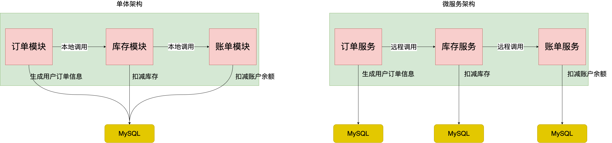
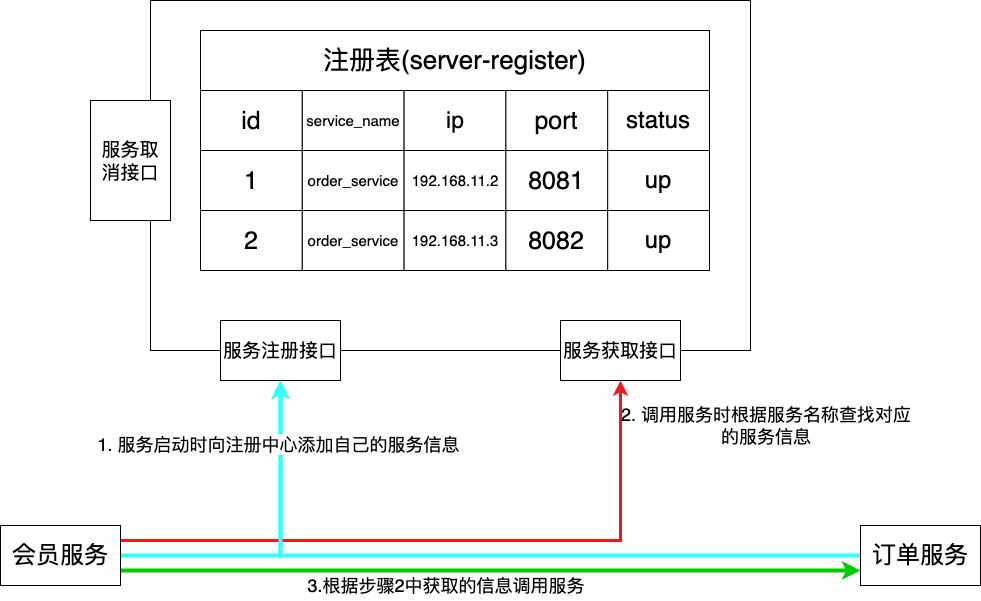
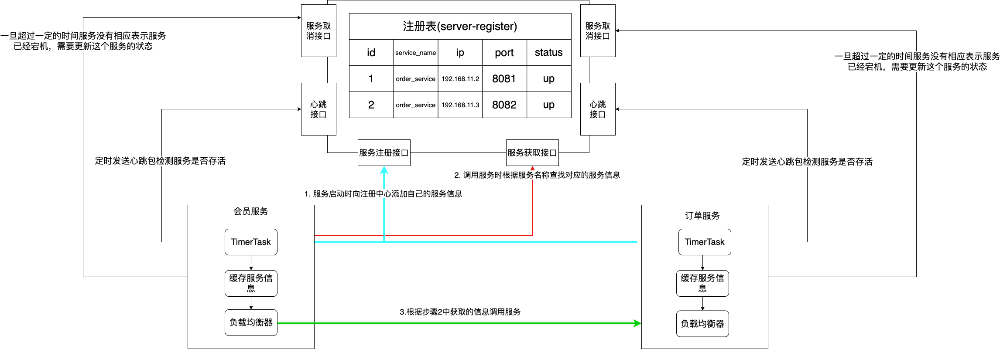
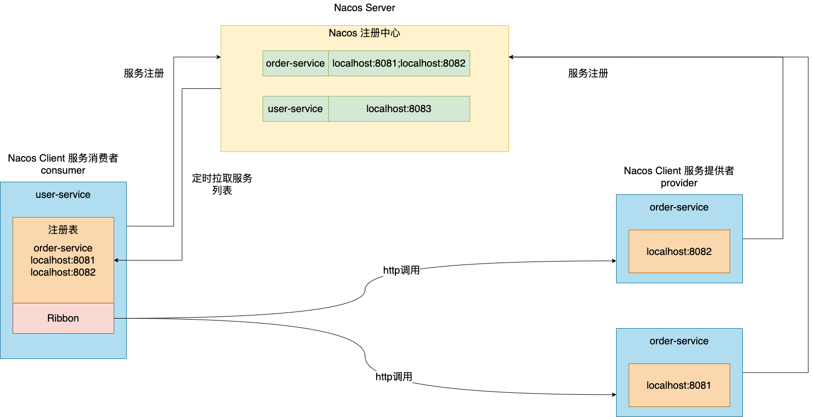
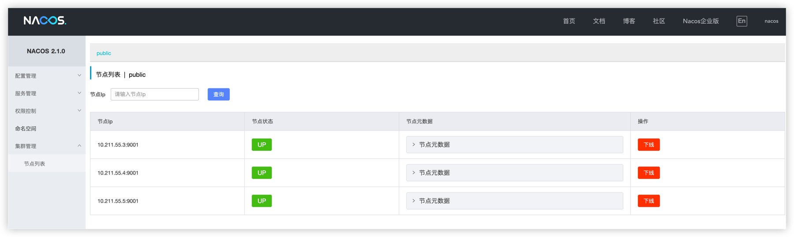

# Alibaba微服务组件 Nacos 注册中心实战
## 单体架构 VS 微服务架构
**单体架构**：单体架构是将所有的业务模块整合到一起，集成到一个系统中实现公司业务需要的所有功能。在公司初期，业务量较小的时候，单体架构便于发布，
维护。能够很好的承载公司业务。但是随着公司的发展，业务功能不断扩展，代码库越来越大，各个功能之间相互影响，可维护性、灵活性降低。而且单体应用变
得越来越臃肿，因为部署的多台机器都是一模一样的工程，成本越来越高。

**微服务架构**：为了解决单体架构的问题，微服务架构产生了。其理念就是根据公司业务功能将单体应用拆分成为一个个单元模块，每个模块都是单独的服务应用，
互不影响，单独运作。模块之间相互协作共同实现公司业务功能。这样实现的好处就是系统解耦、单独应用易于扩展、维护。可以根据每个模块业务量的大小部署相应
的服务器。

用一个用户下单流程来说明一下单体架构和微服务架构的不同：


## 服务注册中心
虽然微服务架构相较于单体架构有很大优势。但是也同时带来了很多问题需要我们去解决。

第一个问题：微服务之间如何完成相互调用？第一个想到的应该是使用 RestTemplate 框架，通过服务的 url 链接调用服务，那么问题来了，当部署多个节点的
时候，又该怎么调用其他相同的节点呢？这个是急需要解决的问题。

针对于上述问题，需要引入服务注册中心，其核心思想就是将扩容的节点信息维护起来，外部服务通过这个注册中心进行其他服务的调用。 如图：


1. 使用本地文件进行服务维护：服务器宕机，服务文件容易丢失，需要手动重新维护；其次需要在业务代码中添加监控调用端服务是否存活的代码，这是不合适的；
因此不推荐使用这种办法；
2. 使用 Nginx：同理需要在 nginx 的配置文件中添加服务信息，所以也不合适；
3. 利用 MySQL 实现服务注册中心，如图：

利用 MySQL 作为存储实现的注册中心同样也存在弊端：注册中心挂了，导致整个系统远程调用都无法打通；调用者每次都需要去注册中心拉去服务信息，影响
执行效率；
4. 因此针对上述问题，改良一下，如图：


以上基本是一个服务注册中心实现的大体思路。一起看一下几款服务注册中的比较：

|                | Nacos                      | Eureka        | Consul            | CoreDns    | Zookeeper  |
|:---------------|:---------------------------|:--------------|:------------------|:-----------|:-----------|
| 一致性协议          | CP+AP                      | AP            | CP                | ---        | CP         |
| 将康检查           | TCP/HTTP/MySQL/Client Beat | APClient Beat | TCP/HTTP/gRPC/Cmd | ---        | Keep Alive |
| 负载均衡策略         | 权重/metadata/Selector       | Ribbon        | Fabio             | RoundRobin | ——         |
| 雪崩保护           | 有                          | 有             | 无                 | 无          | 无          |
| 自动注销实例         | 支持                         | 支持            | 支持                | 不支持        | 支持         |
| 访问协议           | HTTP/DNS                   | HTTP          | HTTP/DNS          | DNS        | TCP        |
| 监听支持           | 支持                         | 支持            | 支持                | 不支持        | 支持         |
| 多数据中心          | 支持                         | 支持            | 支持                | 不支持        | 不支持        |
| 跨注册中心同步        | 支持                         | 不支持           | 支持                | 不支持        | 不支持        |
| Spring Cloud集成 | 支持                         | 支持            | 支持                | 不支持        | 支持         |
| Dubble集成       | 支持                         | 不支持           | 支持                | 不支持        | 支持         |
| K8S集成          | 支持                         | 不支持           | 支持                | 支持         | 不支持        |

# Nacos 定义
Nacos 是 Dynamic Naming and Configuration Service 的首字母简称；一个更易于构建云原生应用的动态服务发现、配置管理和服务管理平台。
Nacos 致力于帮助您发现、配置和管理微服务。Nacos 提供了一组简单易用的特性集，帮助您快速实现动态服务发现、服务配置、服务元数据及流量管理。

Nacos 的关键特性包括:
1. 服务发现和服务健康监测
2. 动态配置服务
3. 动态 DNS 服务
4. 服务及其元数据管理

Nacos 优势：
1. 易用：简单的数据模型，标准的 restfulAPI，易用的控制台，丰富的使用文档。
2. 稳定：99.9% 高可用，脱胎于历经阿里巴巴 10 年生产验证的内部产品，支持具有数百万服务的大规模场景，具备企业级 SLA 的开源产品。
3. 实时：数据变更毫秒级推送生效；1w 级，SLA 承诺 1w 实例上下线 1s，99.9% 推送完成；10w 级，SLA 承诺 1w 实例上下线 3s，99.9% 推送完成；100w 级别，
   SLA 承诺 1w 实例上下线 9s 99.9% 推送完成。
4. 规模：十万级服务/配置，百万级连接，具备强大扩展性。

# Nacos 注册中心架构和基本概念

## 服务(Service)
服务是指一个或一组软件功能（例如特定信息的检索或一组操作的执行），其目的是不同的。客户端可以为不同的目的重用（例如通过跨进程的网络调用）。
Nacos 支持主流的服务生态，如 Kubernetes Service、gRPC|Dubbo RPC Service 或者 Spring Cloud RESTful Service。
## 服务注册中心 (Service Registry)
服务注册中心，它是服务及其实例和元数据的数据库。服务实例在启动时注册到服务注册表，并在关闭时注销。服务和路由器的客户端通过查询服务注册表以查找
服务的可用实例。服务注册中心可能会调用服务实例的健康检查 API 来验证它是否能够处理请求。
## 服务元数据 (Service Metadata)
服务元数据是指包括服务端点(endpoints)、服务标签、服务版本号、服务实例权重、路由规则、安全策略等描述服务的数据。
## 服务提供方 (Service Provider)
是指提供可复用和可调用服务的应用方。
## 服务消费方 (Service Consumer)
是指会发起对某个服务调用的应用方。
# Nacos 注册中心核心功能
## 服务注册
Nacos Client会通过发送REST请求的方式向Nacos Server注册自己的服务，提供自身的元数据，比如ip地址、端口等信息。Nacos Server接收到注册
请求后，就会把这些元数据信息存储在一个双层的内存Map中。
## 服务心跳
在服务注册后，Nacos Client会维护一个定时心跳来持续通知Nacos Server，说明服务一直处于可用状态，防止被剔除。默认5s发送一次心跳。
## 服务同步
Nacos Server集群之间会互相同步服务实例，用来保证服务信息的一致性。
## 服务发现
服务消费者（Nacos Client）在调用服务提供者的服务时，会发送一个REST请求给Nacos Server，获取上面注册的服务清单，并且缓存在Nacos Client本地，
同时会在Nacos Client本地开启一个定时任务定时拉取服务端最新的注册表信息更新到本地缓存。
## 服务健康检查
Nacos Server会开启一个定时任务用来检查注册服务实例的健康情况，对于超过15s没有收到客户端心跳的实例会将它的healthy属性置为false(客户端服务
发现服务时不会发现这个服务)，如果某个实例超过30秒没有收到心跳，直接剔除该实例(被剔除的实例如果恢复发送心跳则会重新注册)
# Nacos 注册环境搭建
1. 下载 nacos 压缩包：[2.1.0](https://github.com/alibaba/nacos/releases/download/2.1.0/nacos-server-2.1.0.tar.gz)
2. 下载完成后解压 `tar -zxvf nacos-server-2.1.0.tar.gz`;
3. 进入nacos目录，修改启动方式，进入 bin 目录：/root/Dev_Azh/nacos/bin，修改启动脚本：vim startup.sh
```shell
export SERVER="nacos-server"
export FUNCTION_MODE="all"
#export MODE="cluster"
export MODE="standalone"
export MEMBER_LIST=""
export EMBEDDED_STORAGE=""
```
将启动模式修改为单机启动。也可以通过启动的时间添加命令解决：
```shell
bin/startup.sh ‐m standalone
```
启动后，日志输出在该`/root/Dev_Azh/nacos/logs`目录下的 start.out 文件中：
```text

|   :  :  | |                      '   ,'\   .--.--.    Port: 8848
:   |   \ | :  ,--.--.     ,---.  /   /   | /  /    '   Pid: 21053
|   : '  '; | /       \   /     \.   ; ,. :|  :  /`./   Console: http://10.211.55.3:8848/nacos/index.html
'   ' ;.    ;.--.  .-. | /    / ''   | |: :|  :  ;_
|   | | \   | \__\/: . ..    ' / '   | .; : \  \    `.      https://nacos.io
'   : |  ; .' ," .--.; |'   ; :__|   :    |  `----.   \
|   | '`--'  /  /  ,.  |'   | '.'|\   \  /  /  /`--'  /
'   : |     ;  :   .'   \   :    : `----'  '--'.     /
;   |.'     |  ,     .-./\   \  /            `--'---'
'---'        `--`---'     `----'

2023-03-08 00:23:42,579 INFO Bean 'org.springframework.security.access.expression.method.DefaultMethodSecurityExpressionHandler@48e64352' of type [org.springframework.security.access.expression.method.DefaultMethodSecurityExpressionHandler] is not eligible for getting processed by all BeanPostProcessors (for example: not eligible for auto-proxying)

2023-03-08 00:23:42,583 INFO Bean 'methodSecurityMetadataSource' of type [org.springframework.security.access.method.DelegatingMethodSecurityMetadataSource] is not eligible for getting processed by all BeanPostProcessors (for example: not eligible for auto-proxying)

2023-03-08 00:23:42,873 INFO Tomcat initialized with port(s): 8848 (http)

2023-03-08 00:23:43,167 INFO Root WebApplicationContext: initialization completed in 3882 ms

```
然后通过日志中给出的链接访问控制台：http://10.211.55.3:8848/nacos/index.htm。初始密码是：nacos/nacos

# Nacos 集群模式配置
自己搭建三台虚拟服务器。Dev_Server_01、Dev_Server_02、Dev_Server_03。先配置 Dev_Server_01 。

## 文件配置
```shell
# 在 /root/Dev_Azh/nacos/conf 目录下，修改application.properties文件, 配置外部数据源
### If use MySQL as datasource:
spring.datasource.platform=mysql
### Count of DB:
db.num=1
### Connect URL of DB:
db.url.0=jdbc:mysql://10.211.55.3:3306/nacos?characterEncoding=utf8&connectTimeout=1000&socketTimeout=3000&autoReconnect=true&useUnicode=true&useSSL=false&serverTimezone=UTC
db.user.0=root
db.password.0=An123456

# 将conf/cluster.conf.example改为cluster.conf, 添加节点配置
cp cluster.conf.example cluster.conf
vim cluster.conf
# 配置如下：
#it is ip
#example
10.211.55.3:9001
10.211.55.4:9001
10.211.55.5:9001
```
到这儿基本就配置完成了。剩余的了解下：
```shell
# 多网卡选择
# ip‐address参数可以直接设置nacos的ip
#该参数设置后，将会使用这个IP去cluster.conf里进行匹配，请确保这个IP的值在cluster.conf里是存在的
nacos.inetutils.ip‐address=10.211.55.3
#use‐only‐site‐local‐interfaces参数可以让nacos使用局域网ip，这个在nacos部署的机器有多网卡时很有用，可以让nacos选择局域网网卡
nacos.inetutils.use‐only‐site‐local‐interfaces=true
#ignored‐interfaces支持网卡数组，可以让nacos忽略多个网卡
nacos.inetutils.ignored‐interfaces[0]=eth0
nacos.inetutils.ignored‐interfaces[1]=eth1
#preferred‐networks参数可以让nacos优先选择匹配的ip，支持正则匹配和前缀匹配
nacos.inetutils.preferred‐networks[0]=30.5.124.
```

Dev_Server_02 Dev_Server_03 配置和Dev_Server_01相同。

## mysql中创建nacos数据库
向数据库中建表插入数据, sql 语句在`/root/Dev_Azh/nacos/nacos/conf` 的 nacos-mysql.sql 文件中。

> note: 需要注意连接好外置数据库后，user 表中存储的是用户名称和密码，密码是加密的。初始密码还是 nacos/nacos。后面可以修改。

然后分别启动三个 nacos，然后通过 [控制台页面](http://10.211.55.3:8848/nacos/index.htm) 访问，进入页面后查看集群管理，如图所示：


可以看到有三个 nacos 实例。说明 nacos 集群搭建成功了。

## 使用 Nginx 代理 nacos
编辑目录下 nginx.conf 文件
```shell
vim /root/Dev_Azh/nginx/nginx-1.18.0/conf/nginx.conf


# 添加 nacos 服务器ip
    upstream nacos-cluster {
        server 10.211.55.3:9001 weight=1;
        server 10.211.55.4:9001 weight=1;
        server 10.211.55.5:9001 weight=1;
    }
    
# 代理
    server {
        listen       80;
        server_name  localhost;
        
        location /nacos {
            proxy_pass http://nacos-cluster;
        }
```

然后通过 http://10.211.55.3:80/nacos 访问控制台。

# Spring Cloud 整合 Nacos
建立 nacos 工程，添加父类的 pom.xml 依赖。
```xml
<?xml version="1.0" encoding="UTF-8"?>
<project xmlns="http://maven.apache.org/POM/4.0.0"
         xmlns:xsi="http://www.w3.org/2001/XMLSchema-instance"
         xsi:schemaLocation="http://maven.apache.org/POM/4.0.0 http://maven.apache.org/xsd/maven-4.0.0.xsd">
    <modelVersion>4.0.0</modelVersion>

    <groupId>org.com.anzhi</groupId>
    <artifactId>nacos</artifactId>
    <packaging>pom</packaging>
    <version>1.0-SNAPSHOT</version>
    
    <modules>
        <module>mall-user</module>
        <module>mall-order</module>
        <module>mall-common</module>
    </modules>

    <parent>
        <groupId>org.springframework.boot</groupId>
        <artifactId>spring-boot-starter-parent</artifactId>
        <version>2.3.9.RELEASE</version>
        <relativePath/> <!-- lookup parent from repository -->
    </parent>
    
    <dependencies>
        <dependency>
            <groupId>org.springframework.boot</groupId>
            <artifactId>spring-boot-starter</artifactId>
        </dependency>

        <dependency>
            <groupId>org.springframework.boot</groupId>
            <artifactId>spring-boot-starter-test</artifactId>
            <scope>test</scope>
        </dependency>
    </dependencies>

    <dependencyManagement>
        <dependencies>
            <dependency>
                <groupId>org.springframework.cloud</groupId>
                <artifactId>spring-cloud-dependencies</artifactId>
                <version>${spring-cloud.version}</version>
                <type>pom</type>
                <scope>import</scope>
            </dependency>
            <dependency>
                <groupId>com.alibaba.cloud</groupId>
                <artifactId>spring-cloud-alibaba-dependencies</artifactId>
                <version>${spring-cloud-alibaba.version}</version>
                <type>pom</type>
                <scope>import</scope>
            </dependency>

        </dependencies>
    </dependencyManagement>

    <properties>
        <maven.compiler.source>8</maven.compiler.source>
        <maven.compiler.target>8</maven.compiler.target>
        <spring-cloud.version>Hoxton.SR12</spring-cloud.version>
        <spring-cloud-alibaba.version>2.2.8.RELEASE</spring-cloud-alibaba.version>
    </properties>
</project>
```
建立 module 工程 mall-user 会员微服务、mall-order 订单微服务、mall-common 每个微服务的公共依赖工程

## mall-user 工程代码
pom.xml 依赖
```xml
<?xml version="1.0" encoding="UTF-8"?>
<project xmlns="http://maven.apache.org/POM/4.0.0"
         xmlns:xsi="http://www.w3.org/2001/XMLSchema-instance"
         xsi:schemaLocation="http://maven.apache.org/POM/4.0.0 http://maven.apache.org/xsd/maven-4.0.0.xsd">
    <parent>
        <artifactId>nacos</artifactId>
        <groupId>org.com.anzhi</groupId>
        <version>1.0-SNAPSHOT</version>
    </parent>
    <modelVersion>4.0.0</modelVersion>

    <groupId>org.com.anzhi</groupId>
    <artifactId>mall-user</artifactId>
    <version>1.0-SNAPSHOT</version>
    <name>mall-user</name>
    <description>会员微服务</description>

    <dependencies>
        <!-- nacos服务注册与发现 -->
        <dependency>
            <groupId>com.alibaba.cloud</groupId>
            <artifactId>spring-cloud-starter-alibaba-nacos-discovery</artifactId>
        </dependency>

        <dependency>
            <groupId>com.mall</groupId>
            <artifactId>mall-common</artifactId>
            <version>1.0-SNAPSHOT</version>
        </dependency>
    </dependencies>
    <properties>
        <maven.compiler.source>8</maven.compiler.source>
        <maven.compiler.target>8</maven.compiler.target>
    </properties>

</project>
```
yml 文件配置：
```yaml
server:
  port: 8040

spring:
  application:
    name: mall-user  #微服务名称

  #配置nacos注册中心地址
  cloud:
    nacos:
      discovery:
        server-addr: 10.211.55.3:9001
        #namespace: 5ac81613-77c1-4839-99ce-2fd17f1de7f3
        #cluster-name: BJ
        group: azhshop
        #ephemeral: false


management:
  endpoints:
    web:
      exposure:
        include: '*'
```

controller 层代码
```java
package com.anzhi.controller;

import com.anzhi.utils.R;
import lombok.extern.slf4j.Slf4j;
import org.springframework.web.bind.annotation.PathVariable;
import org.springframework.web.bind.annotation.RequestMapping;
import org.springframework.web.bind.annotation.RestController;
import org.springframework.web.client.RestTemplate;

import javax.annotation.Resource;

@RestController
@RequestMapping("/mall_user")
@Slf4j
public class UserController {

    @Resource
    private RestTemplate restTemplate;
    
    @RequestMapping(value = "/findOrderByUserId/{id}")
    public R findOrderByUserId(@PathVariable("id") Integer id) {
        log.info("根据userId:"+id+"查询订单信息");
        // restTemplate调用,url写死
        //String url = "http://localhost:8020/order/findOrderByUserId/"+id;
        // ribbon实现，restTemplate需要添加@LoadBalanced注解
        // mall-order  ip:port
        String url = "http://mall-order/mallorder/findOrderByUserId/"+id;

        R result = restTemplate.getForObject(url,R.class);
        return result;
    }
}
```
配置类代码
```java
@Configuration
public class RestConfig {
    @Bean
    @LoadBalanced  // 微服务名替换为具体的ip:port
    public RestTemplate restTemplate() {
        return new RestTemplate();
    }
}
```
启动类代码：
```java
@SpringBootApplication
public class MallUserApplication {
    public static void main(String[] args) {
        SpringApplication.run(MallUserApplication.class, args);
    }
}
```

## mall-order 工程代码
pom 依赖
```xml
<?xml version="1.0" encoding="UTF-8"?>
<project xmlns="http://maven.apache.org/POM/4.0.0"
         xmlns:xsi="http://www.w3.org/2001/XMLSchema-instance"
         xsi:schemaLocation="http://maven.apache.org/POM/4.0.0 http://maven.apache.org/xsd/maven-4.0.0.xsd">
    <parent>
        <artifactId>nacos</artifactId>
        <groupId>org.com.anzhi</groupId>
        <version>1.0-SNAPSHOT</version>
    </parent>
    <modelVersion>4.0.0</modelVersion>

    <groupId>org.com.anzhi</groupId>
    <artifactId>mall-order</artifactId>
    <version>1.0-SNAPSHOT</version>
    <name>mall-order</name>
    <description>订单微服务</description>

    <dependencies>
        <!-- nacos服务注册与发现 -->
        <dependency>
            <groupId>com.alibaba.cloud</groupId>
            <artifactId>spring-cloud-starter-alibaba-nacos-discovery</artifactId>
        </dependency>

        <dependency>
            <groupId>mysql</groupId>
            <artifactId>mysql-connector-java</artifactId>
            <version>8.0.17</version>
        </dependency>

        <dependency>
            <groupId>com.alibaba</groupId>
            <artifactId>druid-spring-boot-starter</artifactId>
            <version>1.1.21</version>
        </dependency>

        <!-- mybatis自动配置依赖-->
        <dependency>
            <groupId>org.mybatis.spring.boot</groupId>
            <artifactId>mybatis-spring-boot-starter</artifactId>
            <version>2.0.0</version>
        </dependency>

        <dependency>
            <groupId>com.mall</groupId>
            <artifactId>mall-common</artifactId>
            <version>1.0-SNAPSHOT</version>
        </dependency>
    </dependencies>
    
    <properties>
        <maven.compiler.source>8</maven.compiler.source>
        <maven.compiler.target>8</maven.compiler.target>
    </properties>

    <build>
        <plugins>
            <plugin>
                <groupId>org.springframework.boot</groupId>
                <artifactId>spring-boot-maven-plugin</artifactId>
            </plugin>
        </plugins>
    </build>
</project>
```
yml 文件配置
```yaml
server:
  port: 8030

spring:
  application:
    name: mall-order  #微服务名称

  #配置nacos注册中心地址
  cloud:
    nacos:
      discovery:
        server-addr: 10.211.55.3:9001
        #namespace: bc50d386-8870-4a26-8803-0187486c57be
        #cluster-name: SH
        group: azhshop

  #数据库配置
  datasource:
    type: com.alibaba.druid.pool.DruidDataSource
    druid:
      driver-class-name: com.mysql.cj.jdbc.Driver
      url: jdbc:mysql://10.211.55.3:3306/nacos_config?useUnicode=true&characterEncoding=UTF-8&serverTimezone=Asia/Shanghai
      username: root
      password: An123456
      initial-size: 10
      max-active: 100
      min-idle: 10
      max-wait: 60000
      pool-prepared-statements: true
      max-pool-prepared-statement-per-connection-size: 20
      time-between-eviction-runs-millis: 60000
      min-evictable-idle-time-millis: 300000
      test-while-idle: true
      test-on-borrow: false
      test-on-return: false
      stat-view-servlet:
        enabled: true
        url-pattern: /druid/*
      filter:
        stat:
          log-slow-sql: true
          slow-sql-millis: 1000
          merge-sql: false
        wall:
          config:
            multi-statement-allow: true

#暴露actuator端点
management:
  endpoints:
    web:
      exposure:
        include: '*'
```
controller 层代码
```java
package com.anzhi.controller;

import com.anzhi.entity.OrderEntity;
import com.anzhi.service.OrderService;
import com.anzhi.utils.R;
import lombok.extern.slf4j.Slf4j;
import org.springframework.web.bind.annotation.PathVariable;
import org.springframework.web.bind.annotation.RequestMapping;
import org.springframework.web.bind.annotation.RestController;

import javax.annotation.Resource;
import java.util.List;

@RestController
@Slf4j@RequestMapping("/mallorder")
public class OrderController {
    @Resource
    private OrderService orderService;

    /**
     * 根据用户id查询订单信息
     * @param userId
     * @return
     */
    @RequestMapping("/findOrderByUserId/{userId}")
    public R findOrderByUserId(@PathVariable("userId") Long userId) {

        //模拟异常
        if(userId == 5){
            throw new IllegalArgumentException("非法参数异常");
        }
        //模拟超时
        if(userId == 6){
            try {
                Thread.sleep(5000);
            } catch (InterruptedException e) {
                e.printStackTrace();
            }
        }
        log.info("根据userId:"+userId+"查询订单信息");
        List<OrderEntity> orderEntities = orderService.listByUserId(userId);
        return R.ok().put("orders", orderEntities);
    }
}
```
service 层代码
```java
/*接口定义*/
package com.anzhi.service;

import com.anzhi.entity.OrderEntity;

import java.util.List;

public interface OrderService {
    List<OrderEntity> listByUserId(Long userId);
}
```
接口实现
```java
package com.anzhi.service.impl;

import com.anzhi.dao.OrderMapper;
import com.anzhi.entity.OrderEntity;
import com.anzhi.service.OrderService;
import org.springframework.stereotype.Service;

import javax.annotation.Resource;
import java.util.List;

@Service
public class OrderServiceImpl implements OrderService {
    
    @Resource
    private OrderMapper orderMapper;
    
    @Override
    public List<OrderEntity> listByUserId(Long userId) {
        return orderMapper.getOrderInfoByUserId(userId);
    }
}
```
dao 层代码，没有连接数据库，填充数据模拟了一下
```java
@Mapper
public interface OrderMapper {
    
    default List<OrderEntity> getOrderInfoByUserId(Long userId){
        OrderEntity orderEntity = OrderEntity.builder().amount(10).id(1234L).count(9)
                .userId("1234567").commodityCode("315315")
                .build();

        List<OrderEntity> orderEntityList = new ArrayList<>();
        orderEntityList.add(orderEntity);

        return orderEntityList;
    }
}
```
订单信息实例定义
```java
package com.anzhi.entity;

import lombok.Builder;
import lombok.Data;

@Data
@Builder
public class OrderEntity {
    private static final long serialVersionUID = 1L;

    private Long id;

    private String userId;
    /**
     * 商品编号
     */
    private String commodityCode;

    private Integer count;

    private Integer amount;
}
```
启动类代码
```java
@SpringBootApplication
public class MallOrderApplication {
    public static void main(String[] args) {
        SpringApplication.run(MallOrderApplication.class,args);
    }
}
```

## mall-common 工程
pom 依赖
```xml
<?xml version="1.0" encoding="UTF-8"?>
<project xmlns="http://maven.apache.org/POM/4.0.0"
         xmlns:xsi="http://www.w3.org/2001/XMLSchema-instance"
         xsi:schemaLocation="http://maven.apache.org/POM/4.0.0 http://maven.apache.org/xsd/maven-4.0.0.xsd">
    <parent>
        <artifactId>nacos</artifactId>
        <groupId>org.com.anzhi</groupId>
        <version>1.0-SNAPSHOT</version>
    </parent>
    
    <modelVersion>4.0.0</modelVersion>
    <groupId>com.mall</groupId>
    <artifactId>mall-common</artifactId>
    <name>mall-common</name>
    <version>1.0-SNAPSHOT</version>
    <description>每一个微服务的公共依赖,bean,工具类等</description>

    <dependencies>
        <dependency>
            <groupId>org.projectlombok</groupId>
            <artifactId>lombok</artifactId>
            <version>1.18.10</version>
        </dependency>

        <dependency>
            <groupId>org.apache.httpcomponents</groupId>
            <artifactId>httpcore</artifactId>
            <version>4.4.12</version>
        </dependency>

        <dependency>
            <groupId>commons-lang</groupId>
            <artifactId>commons-lang</artifactId>
            <version>2.6</version>
        </dependency>

        <dependency>
            <groupId>commons-io</groupId>
            <artifactId>commons-io</artifactId>
            <version>2.2</version>
        </dependency>

        <dependency>
            <groupId>org.springframework.boot</groupId>
            <artifactId>spring-boot-starter-web</artifactId>
        </dependency>

        <dependency>
            <groupId>org.springframework.boot</groupId>
            <artifactId>spring-boot-starter-actuator</artifactId>
        </dependency>
    </dependencies>
    
    <properties>
        <maven.compiler.source>8</maven.compiler.source>
        <maven.compiler.target>8</maven.compiler.target>
    </properties>
</project>
```
返回数据统一封装
```java
/**
 * 返回数据
 */
public class R extends HashMap<String,Object> {
    private static final long serialVersionUID = 1L;

    public R() {
        put("code", 0);
        put("msg", "success");
    }

    public static R error() {
        return error(HttpStatus.SC_INTERNAL_SERVER_ERROR, "未知异常，请联系管理员");
    }

    public static R error(String msg) {
        return error(HttpStatus.SC_INTERNAL_SERVER_ERROR, msg);
    }

    public static R error(int code, String msg) {
        R r = new R();
        r.put("code", code);
        r.put("msg", msg);
        return r;
    }

    public static R ok(String msg) {
        R r = new R();
        r.put("msg", msg);
        return r;
    }

    public static R ok(Map<String, Object> map) {
        R r = new R();
        r.putAll(map);
        return r;
    }

    public static R ok() {
        return new R();
    }

    public R put(String key, Object value) {
        super.put(key, value);
        return this;
    }
}
```

然后启动两个服务进，通过 mall-user 调用 mall-order 微服务。数据返回表明调用成功

调用链接：http://localhost:8040/mall_user/findOrderByUserId/0；返回结果：
```text
{
  "msg": "success",
  "code": 0,
  "orders": [
    {
      "id": 1234,
      "userId": "1234567",
      "commodityCode": "315315",
      "count": 9,
      "amount": 10
    }
  ]
}
```
> notes: 有个问题没解决，mall-order 多节点部署，会分别部署到不同 nacos 节点上，导致服务调用失败。
