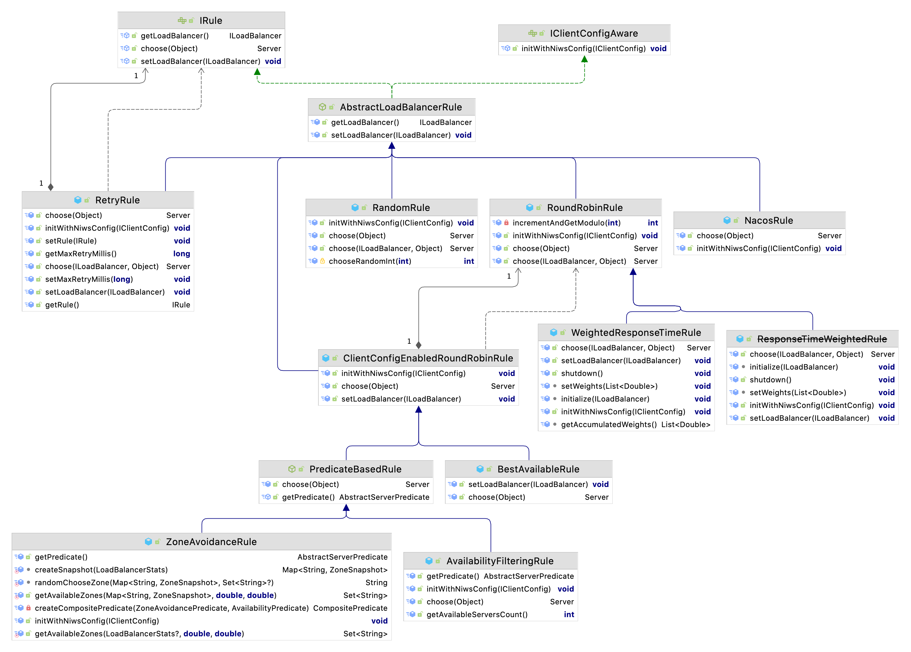

目录
=================

* [负载均衡](#负载均衡)
   * [客户端负载均衡](#客户端负载均衡)
   * [服务端的负载均衡](#服务端的负载均衡)
   * [常见的负载均衡算法](#常见的负载均衡算法)
* [什么是 Ribbon](#什么是-ribbon)
   * [Ribbon 工作模型](#ribbon-工作模型)
   * [如何使用 Ribbon](#如何使用-ribbon)
   * [自定义实现负载均衡的注解](#自定义实现负载均衡的注解)
   * [Ribbon 扩展功能](#ribbon-扩展功能)
      * [Ribbon 相关接口](#ribbon-相关接口)
      * [Ribbon 的负载均衡策略](#ribbon-的负载均衡策略)
   * [修改默认的负载均衡策略](#修改默认的负载均衡策略)
* [饥饿加载](#饥饿加载)
* [什么是LoadBalancer](#什么是loadbalancer)
   * [RestTemplate](#resttemplate)
   * [WebClient](#webclient)
   * [RestTemplate整合LoadBalancer](#resttemplate整合loadbalancer)
   * [WebClient整合LoadBalancer](#webclient整合loadbalancer)

# 负载均衡
负载均衡(Load Balance)，其含义就是指将负载（工作任务）进行平衡、分摊到多个操作单元上进行运行，例如 FTP 服务器、Web 服务器、企业核心应
用服务器和其它主要任务服务器等，从而协同完成工作任务。

> 目前主流的负载均衡方案分为以下两种：
> 
> 1. 集中式负载均衡，在消费者和服务提供方中间使用独立的代理方式进行负载，有硬件的(比如 F5)，也有软件的（比如 Nginx）
> 
> 2. 客户端根据自己的请求情况做负载均衡，Ribbon 就属于客户端自己做负载均衡。

## 客户端负载均衡
例如spring cloud中的ribbon，客户端会有一个服务器地址列表，在发送请求前通过负载
均衡算法选择一个服务器，然后进行访问，这是客户端负载均衡;即在客户端就进行负载均 衡算法分配。


## 服务端的负载均衡
例如Nginx，通过Nginx进行负载均衡，先发送请求，然后通过负载均衡算法，在多个服务 器之间选择一个进行访问;即在服务器端再进行负载均衡算法分配。


## 常见的负载均衡算法
1. 随机：通过随机选择服务进行执行，一般这种方式使用较少;
2. 轮询：负载均衡默认实现方式，请求来之后排队处理;
3. 加权轮询法：通过对服务器性能的分型，给高配置，低负载的服务器分配更高的权重，均衡各个服务器的压力;
4. 加权随机法：与加权轮询法一样，加权随机法也根据后端机器的配置，系统的负载分配不同的权重。不同的是，它是按照权重随机请求后端服务器，而非顺序。
5. 源地址哈希法：源地址哈希的思想是根据获取客户端的IP地址，通过哈希函数计算得到的一个数值，用该数值对服务器列表的大小进行取模运算，得到的结果
便是客服端要访问服务器的序号。采用源地址哈希法进行负载均衡，同一IP地址的客户端，当后端服务器列表不变时，它每次都会映射到同一台后端服务器进行访问。
6. 最小连接数法：最小连接数算法比较灵活和智能，由于后端服务器的配置不尽相同，对于请求的处理有快有慢，它是根据后端服务器当前的连接情况，动态地选取其中当前。
   积压连接数最少的一台服务器来处理当前的请求，尽可能地提高后端服务的利用效率，将负责合理地分流到每一台服务器。

# 什么是 Ribbon
Spring Cloud Ribbon 是基于 Netflix Ribbon 实现的一套客户端的负载均衡工具，Ribbon 客户端组件提供一系列的完善的配置，如超时，重试等。
通过 Load Balancer 获取到服务提供的所有机器实例，Ribbon会自动基于某种规则(轮询，随机)去调用这些服务。Ribbon也 可以实现我们自己的负载均衡算法。

## Ribbon 工作模型


## 如何使用 Ribbon
Ribbon 组件集成在 `spring‐cloud‐starter‐netflix‐ribbon` jar 包中，添加依赖：
```xml
<dependency>
   <groupId>org.springframework.cloud</groupId>
   <artifactId>spring‐cloud‐starter‐netflix‐ribbon</artifactId>
</dependency>
```
nacos-discovery依赖了ribbon，可以不用再引入ribbon依赖。我们可以通过注解`@LoadBalanced`使用负载均衡。代码如下：
```java
@Configuration
public class RestConfig {
    @Bean
    @LoadBalanced  // 微服务名替换为具体的ip:port
    public RestTemplate restTemplate() {
        return new RestTemplate();
    }
}
```
@LoadBalanced 注解可以让 RestTemplate 具备负载均衡的能力。如下是 @LoadBalance 注解：
```java
@Target({ ElementType.FIELD, ElementType.PARAMETER, ElementType.METHOD })
@Retention(RetentionPolicy.RUNTIME)
@Documented
@Inherited
@Qualifier
public @interface LoadBalanced {
}
```
@Qualifier 注解起到一个筛选限定的作用，表示只有添加了 @LoadBalanced 注解的 RestTemplate 才具有负载均衡的功能。

这些添加了 @LoadBalanced RestTemplate对象是通过 LoadBalancerAutoConfiguration 进行管理的
```java
public class LoadBalancerAutoConfiguration {
   @LoadBalanced
   @Autowired(required = false)
   private List<RestTemplate> restTemplates = Collections.emptyList();
}
```
只有被添加了 @LoadBalanced 才会被放入 restTemplates 集合中。然后对 restTemplate 进行定制化开发
```java
public class LoadBalancerAutoConfiguration {
   @Bean
   public SmartInitializingSingleton loadBalancedRestTemplateInitializerDeprecated(
           final ObjectProvider<List<RestTemplateCustomizer>> restTemplateCustomizers) {
       return () -> restTemplateCustomizers.ifAvailable(customizers -> {
         for (RestTemplate restTemplate : LoadBalancerAutoConfiguration.this.restTemplates) {
            for (RestTemplateCustomizer customizer : customizers) {
               customizer.customize(restTemplate);
            }
         }
      });
   }

   @Bean
   @ConditionalOnMissingBean
   public RestTemplateCustomizer restTemplateCustomizer(
           final LoadBalancerInterceptor loadBalancerInterceptor) {
      return restTemplate -> {
         List<ClientHttpRequestInterceptor> list = new ArrayList<>(
                 restTemplate.getInterceptors());
         // 添加 loadBalancer 拦截器
         list.add(loadBalancerInterceptor);
         restTemplate.setInterceptors(list);
      };
   }
}
```
RestTemplate 定制化有特定的定制器 RestTemplateCustomizer，在定制器中添加 loadBalancerInterceptor 拦截器。

RestTemplate 定制化的时机：在单例预实例化阶段结束时立即调用。也就意味这在初始化实例之前 RestTemplate 是不具备负载均衡的功能的。如果想要
在初始化之前就想让 RestTemplate 具备负载功能，就需要我们自己定制了。代码如下：
```java
@Configuration
public class RestConfig {
   @Bean
   public RestTemplate restTemplate1(LoadBalancerInterceptor loadBalancerInterceptor) {
      RestTemplate restTemplate = new RestTemplate();
      //注入loadBalancerInterceptor拦截器
      restTemplate.setInterceptors(Arrays.asList(loadBalancerInterceptor));
      return restTemplate;
   }
}
```

## 自定义实现负载均衡的注解
可以根据上述实现流程，实现我们自己定义的负载均衡的注解。注解类实现：
```java
@Target({ ElementType.FIELD, ElementType.PARAMETER, ElementType.METHOD })
@Retention(RetentionPolicy.RUNTIME)
@Documented
@Inherited
@Qualifier  // 限定符,用于筛选限定注入的Bean
public @interface MyLoadBalanced {
}
```
```java
@Configuration
public class MyLoadBalancerAutoConfiguration {
    
    @MyLoadBalanced
    @Autowired(required = false) // 限定注入到list的RestTemplate
    private List<RestTemplate> restTemplates = Collections.emptyList();
    
    @Bean
    public MyLoadBalancerInterceptor myLoadBalancerInterceptor(LoadBalancerClient loadBalancerClient) {
        return new MyLoadBalancerInterceptor(loadBalancerClient);
    }
    
    
    @Bean
    public SmartInitializingSingleton myLoadBalancedRestTemplateInitializer(
            MyLoadBalancerInterceptor myLoadBalancerInterceptor) {
        //  spring的扩展点
        return new SmartInitializingSingleton() {
            @Override
            public void afterSingletonsInstantiated() {
                for (RestTemplate restTemplate : MyLoadBalancerAutoConfiguration.this.restTemplates) {
                    List<ClientHttpRequestInterceptor> list = new ArrayList<>(restTemplate.getInterceptors());
                    // 填充拦截器
                    list.add(myLoadBalancerInterceptor);
                    restTemplate.setInterceptors(list);
                }
            }
        };
    }
}
```
```java
@Slf4j
public class MyLoadBalancerInterceptor implements ClientHttpRequestInterceptor {

    private LoadBalancerClient loadBalancer;
    private LoadBalancerRequestFactory requestFactory;

    public MyLoadBalancerInterceptor(LoadBalancerClient loadBalancer, LoadBalancerRequestFactory requestFactory) {
        this.loadBalancer = loadBalancer;
        this.requestFactory = requestFactory;
    }

    public MyLoadBalancerInterceptor(LoadBalancerClient loadBalancer) {
        this(loadBalancer,new LoadBalancerRequestFactory(loadBalancer));
    }

    @Override
    public ClientHttpResponse intercept(HttpRequest request, byte[] body, ClientHttpRequestExecution execution) throws IOException {
        final URI originalUri = request.getURI();
        String serviceName = originalUri.getHost();
        log.info("进入自定义的请求拦截器中" + serviceName);
        Assert.state(serviceName != null, "Request URI does not contain a valid hostname: " + originalUri);
        return this.loadBalancer.execute(serviceName, requestFactory.createRequest(request, body, execution));
    }
}
```

然后将 RestConfig 配置类代码修改为我们自定义的注解
```java
@Configuration
public class RestConfig {
    @Bean
    @MyLoadBalanced// 微服务名替换为具体的ip:port
    public RestTemplate restTemplate() {
        return new RestTemplate();
    }
}
```

启动观察终端输出情况，基本每个服务端会输出一次结果。轮询算法。

## Ribbon 扩展功能
### Ribbon 相关接口
参考: org.springframework.cloud.netflix.ribbon.RibbonClientConfiguration IClientConfig:Ribbon的客户端配置，默认采用DefaultClientConfigImpl实现。

1. IRule:Ribbon的负载均衡策略，默认采用ZoneAvoidanceRule实现，该策略能够在多区域环境下选出最佳区域的实例进行访问。 
2. IPing:Ribbon的实例检查策略，默认采用DummyPing实现，该检查策略是一个特殊的 实现，实际上它并不会检查实例是否可用，而是始终返回true，默认认为所有服务实例都是 可用的。 
3. ServerList:服务实例清单的维护机制，默认采用ConfigurationBasedServerList实现。 
4. ServerListFilter:服务实例清单过滤机制，默认采ZonePreferenceServerListFilter，该策略能够优先过滤出与请求方处于同区域的服务实例。
5. ILoadBalancer:负载均衡器，默认采用ZoneAwareLoadBalancer实现，它具备了区域感知的能力。

如图是负载均衡实现的接口关系图


### Ribbon 的负载均衡策略
1. RandomRule: 随机选择一个Server。
2. RetryRule: 对选定的负载均衡策略机上重试机制，在一个配置时间段内当选择 Server不成功，则一直尝试使用subRule的方式选择一个可用的server。
3. RoundRobinRule: 轮询选择， 轮询index，选择index对应位置的Server。
4. AvailabilityFilteringRule: 过滤掉一直连接失败的被标记为circuit tripped的 后端Server，并过滤掉那些高并发的后端Server或者使用一个
AvailabilityPredicate 来包含过滤server的逻辑，其实就是检查status里记录的各个Server的运行状态。
5. BestAvailableRule: 选择一个最小的并发请求的Server，逐个考察Server，如 果Server被tripped了，则跳过。
6. WeightedResponseTimeRule: 根据响应时间加权，响应时间越长，权重越小，被选中的可能性越低。
7. ZoneAvoidanceRule: 默认的负载均衡策略，即复合判断Server所在区域的性 能和Server的可用性选择Server，在没有区域的环境下，类似于轮询。
8. NacosRule: 优先调用同一集群的实例，基于随机权重

## 修改默认的负载均衡策略
配置类：
```java
/**
 * 全局配置，指定负载均衡策略
 */
@Configuration
public class RibbonConfig {
    
    @Bean
    public IRule ibbonRule(){
        // 指定使用Nacos提供的负载均衡策略(优先调用同一集群的实例，基于随机权重)
        return new NacosRule();
    }
}
```

测试一下，设置不同区域，观察调用请况; 然后在相同区域设置节点服务权重测试。权重越高，服务被调用的机率就越大，为 0 不会被调用。

在 RibbonClientConfiguration 类中，下面这段代码制定了生效方式
```java
@Configuration(
        proxyBeanMethods = false
)
@EnableConfigurationProperties
@Import({HttpClientConfiguration.class, OkHttpRibbonConfiguration.class, RestClientRibbonConfiguration.class, HttpClientRibbonConfiguration.class})
public class RibbonClientConfiguration {
   @Bean
   @ConditionalOnMissingBean
   public IRule ribbonRule(IClientConfig config) {
      if (this.propertiesFactory.isSet(IRule.class, this.name)) {
         return (IRule)this.propertiesFactory.get(IRule.class, config, this.name);
      } else {
         ZoneAvoidanceRule rule = new ZoneAvoidanceRule();
         rule.initWithNiwsConfig(config);
         return rule;
      }
   }
}
```
有一个 @ConditionalOnMissingBean 条件注解，优先于文件配置。所以上面配置的是全局配置。配置文件配置源码在 PropertiesFactory 中。
```java
public class PropertiesFactory {
   public PropertiesFactory() {
      this.classToProperty.put(ILoadBalancer.class, "NFLoadBalancerClassName");
      this.classToProperty.put(IPing.class, "NFLoadBalancerPingClassName");
      this.classToProperty.put(IRule.class, "NFLoadBalancerRuleClassName");
      this.classToProperty.put(ServerList.class, "NIWSServerListClassName");
      this.classToProperty.put(ServerListFilter.class, "NIWSServerListFilterClassName");
   }
}
```
可以在配置文件中进行指定，选择那种策略。 配置文件配置属于局部策略配置。如下：
```yaml
# 被调用的微服务名
mall-order:
   ribbon:
      NFLoadBalancerRuleClassName: com.alibaba.cloud.nacos.ribbon.NacosRule
```
可以指定阿里实现的负载均衡策略，也可以指定自己实现的负载均衡策略。写法参考 NacosRule。实例如下：
```java
@Slf4j
public class NacosRandomWithWeightRule extends AbstractLoadBalancerRule {

    @Autowired
    private NacosDiscoveryProperties nacosDiscoveryProperties;

    @Override
    public Server choose(Object key) {
        DynamicServerListLoadBalancer loadBalancer = (DynamicServerListLoadBalancer) getLoadBalancer();
        String serviceName = loadBalancer.getName();
        NamingService namingService = nacosDiscoveryProperties.namingServiceInstance();

        try {
            //nacos基于随机权重的算法
            Instance instance = namingService.selectOneHealthyInstance(serviceName);
            log.info(instance.getIp()+":"+instance.getPort());
            return new NacosServer(instance);
        } catch (NacosException e) {
            log.error("获取服务实例异常：{}", e.getMessage());
            e.printStackTrace();
        }

        return null;
    }

    @Override
    public void initWithNiwsConfig(IClientConfig clientConfig) {

    }

}
```

# 饥饿加载
在进行服务调用的时候，如果网络情况不好，第一次调用会超时。Ribbon默认懒加载，意味着只有在发起调用的时候才会创建客户端。

开启饥饿加载，解决第一次调用慢的问题
```yaml
ribbon:
  eager-load:
    enabled: true
    clients: mall-order
```
配置成功后，服务启动的时候会先主动拉取服务信息。
```text
DynamicServerListLoadBalancer for client mall-order initialized: DynamicServerListLoadBalancer:{NFLoadBalancer:name=mall-order,current list of Servers=[192.168.0.200:8020],Load balancer stats=Zone stats: {unknown=[Zone:unknown;	Instance count:1;	Active connections count: 0;	Circuit breaker tripped count: 0;	Active connections per server: 0.0;]
},Server stats: [[Server:192.168.0.200:8020;	Zone:UNKNOWN;	Total Requests:0;	Successive connection failure:0;	Total blackout seconds:0;	Last connection made:Thu Jan 01 08:00:00 CST 1970;	First connection made: Thu Jan 01 08:00:00 CST 1970;	Active Connections:0;	total failure count in last (1000) msecs:0;	average resp time:0.0;	90 percentile resp time:0.0;	95 percentile resp time:0.0;	min resp time:0.0;	max resp time:0.0;	stddev resp time:0.0]
]}ServerList:com.alibaba.cloud.nacos.ribbon.NacosServerList@203765b2
```

# 什么是LoadBalancer
Spring Cloud LoadBalancer是Spring Cloud官方自己提供的客户端负载均衡器, 用来替代 Ribbon。

Spring官方提供了两种客户端都可以使用loadbalancer:

## RestTemplate 

RestTemplate是Spring提供的用于访问Rest服务的客户端，RestTemplate提供了多种便 捷访问远程Http服务的方法，能够大大提高客户端的编写效率。默认情况下， RestTemplate默认依赖jdk的HTTP连接工具。

## WebClient
WebClient是从Spring WebFlux 5.0版本开始提供的一个非阻塞的基于响应式编程的进行 Http请求的客户端工具。它的响应式编程的基于Reactor的。WebClient中提供了标准Http 请求方式对应的get、post、put、delete等方法，可以用来发起相应的请求。

## RestTemplate整合LoadBalancer
需要引入依赖：
```text
<dependencies>
<!--loadbalance 依赖-->  
<dependency>
   <groupId>org.springframework.cloud</groupId>
   <artifactId>spring-cloud-starter-loadbalancer</artifactId>
</dependency>

<!--restTemplate 注解-->
<dependency>
    <groupId>org.springframework.boot</groupId>
    <artifactId>spring-boot-starter-web</artifactId>
</dependency>

<!-- nacos服务注册与发现 -->
<dependency>
   <groupId>com.alibaba.cloud</groupId>
   <artifactId>spring-cloud-starter-alibaba-nacos-discovery</artifactId>
   <exclusions>
       <exclusion>
           <groupId>org.springframework.cloud</groupId>
           <artifactId>spring‐cloud‐starter‐netflix‐ribbon</artifactId>
       </exclusion>
   </exclusions>
</dependency>
```

注意: nacos-discovery中引入了ribbon，需要移除ribbon的包 如果不移除，也可以在yml中配置不使用ribbon。默认情况下，如果同时拥有 
RibbonLoadBalancerClient和BlockingLoadBalancerClient，为了保持向后兼容性，将使 用RibbonLoadBalancerClient。要覆盖它，可以设置 
spring.cloud.loadbalancer.ribbon.enabled属性为false。

```yaml
  #配置nacos注册中心地址
  cloud:
    nacos:
      discovery:
        server-addr: 10.211.55.3:80
        cluster-name: SH
        enabled: true
    loadbalancer:
      ribbon:
        enabled: false
```
上面两种方式二选一。然后使用方式就是最开始使用的 @LoadBalanced 注解修饰 RestTemplate。

##  WebClient整合LoadBalancer
pom依赖
```xml
<!--webflux-->
<dependency>
   <groupId>org.springframework.boot</groupId>
   <artifactId>spring-boot-starter-webflux</artifactId>
</dependency>
```
同样需要排除 spring‐cloud‐starter‐netflix‐ribbon
```xml
<!-- nacos服务注册与发现 -->
<dependency>
   <groupId>com.alibaba.cloud</groupId>
   <artifactId>spring-cloud-starter-alibaba-nacos-discovery</artifactId>
   <exclusions>
       <exclusion>
           <groupId>org.springframework.cloud</groupId>
           <artifactId>spring‐cloud‐starter‐netflix‐ribbon</artifactId>
       </exclusion>
   </exclusions>
</dependency>
```
配置WebClient作为负载均衡器的client
```java

```


