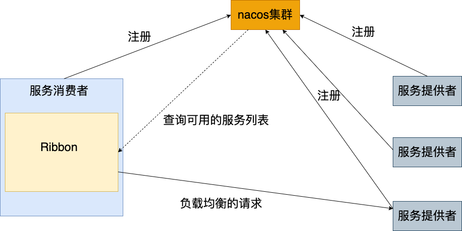
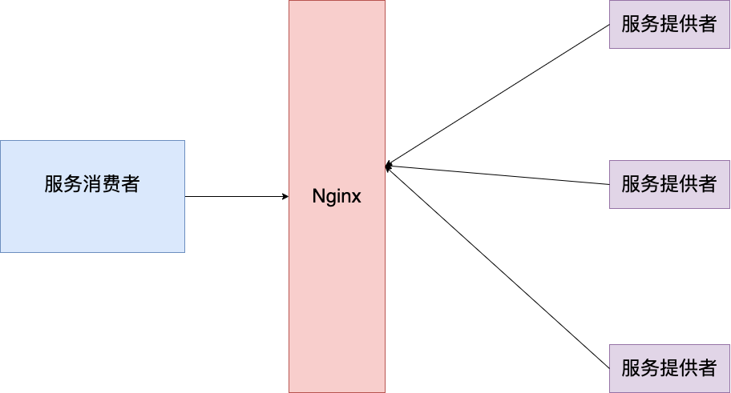
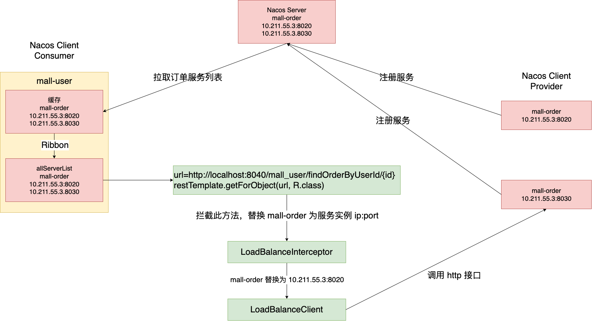

# 负载均衡
负载均衡(Load Balance)，其含义就是指将负载（工作任务）进行平衡、分摊到多个操作单元上进行运行，例如 FTP 服务器、Web 服务器、企业核心应
用服务器和其它主要任务服务器等，从而协同完成工作任务。

> 目前主流的负载均衡方案分为以下两种：
> 
> 1. 集中式负载均衡，在消费者和服务提供方中间使用独立的代理方式进行负载，有硬件的(比如 F5)，也有软件的（比如 Nginx）
> 
> 2. 客户端根据自己的请求情况做负载均衡，Ribbon 就属于客户端自己做负载均衡。

## 客户端负载均衡
例如spring cloud中的ribbon，客户端会有一个服务器地址列表，在发送请求前通过负载
均衡算法选择一个服务器，然后进行访问，这是客户端负载均衡;即在客户端就进行负载均 衡算法分配。


## 服务端的负载均衡
例如Nginx，通过Nginx进行负载均衡，先发送请求，然后通过负载均衡算法，在多个服务 器之间选择一个进行访问;即在服务器端再进行负载均衡算法分配。


## 常见的负载均衡算法
1. 随机：通过随机选择服务进行执行，一般这种方式使用较少;
2. 轮询：负载均衡默认实现方式，请求来之后排队处理;
3. 加权轮询法：通过对服务器性能的分型，给高配置，低负载的服务器分配更高的权重，均衡各个服务器的压力;
4. 加权随机法：与加权轮询法一样，加权随机法也根据后端机器的配置，系统的负载分配不同的权重。不同的是，它是按照权重随机请求后端服务器，而非顺序。
5. 源地址哈希法：源地址哈希的思想是根据获取客户端的IP地址，通过哈希函数计算得到的一个数值，用该数值对服务器列表的大小进行取模运算，得到的结果
便是客服端要访问服务器的序号。采用源地址哈希法进行负载均衡，同一IP地址的客户端，当后端服务器列表不变时，它每次都会映射到同一台后端服务器进行访问。
6. 最小连接数法：最小连接数算法比较灵活和智能，由于后端服务器的配置不尽相同，对于请求的处理有快有慢，它是根据后端服务器当前的连接情况，动态地选取其中当前。
   积压连接数最少的一台服务器来处理当前的请求，尽可能地提高后端服务的利用效率，将负责合理地分流到每一台服务器。

# 什么是 Ribbon
Spring Cloud Ribbon 是基于 Netflix Ribbon 实现的一套客户端的负载均衡工具，Ribbon 客户端组件提供一系列的完善的配置，如超时，重试等。
通过 Load Balancer 获取到服务提供的所有机器实例，Ribbon会自动基于某种规则(轮询，随机)去调用这些服务。Ribbon也 可以实现我们自己的负载均衡算法。

## Ribbon 工作模型


## 如何使用 Ribbon
Ribbon 组件集成在 `spring‐cloud‐starter‐netflix‐ribbon` jar 包中，添加依赖：
```xml
<dependency>
   <groupId>org.springframework.cloud</groupId>
   <artifactId>spring‐cloud‐starter‐netflix‐ribbon</artifactId>
</dependency>
```
nacos-discovery依赖了ribbon，可以不用再引入ribbon依赖。我们可以通过注解`@LoadBalanced`使用负载均衡。代码如下：
```java
@Configuration
public class RestConfig {
    @Bean
    @LoadBalanced  // 微服务名替换为具体的ip:port
    public RestTemplate restTemplate() {
        return new RestTemplate();
    }
}
```
@LoadBalanced 注解可以让 RestTemplate 具备负载均衡的能力。如下是 @LoadBalance 注解：
```java
@Target({ ElementType.FIELD, ElementType.PARAMETER, ElementType.METHOD })
@Retention(RetentionPolicy.RUNTIME)
@Documented
@Inherited
@Qualifier
public @interface LoadBalanced {
}
```
@Qualifier 注解起到一个筛选限定的作用，表示只有添加了 @LoadBalanced 注解的 RestTemplate 才具有负载均衡的功能。

这些添加了 @LoadBalanced RestTemplate对象是通过 LoadBalancerAutoConfiguration 进行管理的
```java
public class LoadBalancerAutoConfiguration {
   @LoadBalanced
   @Autowired(required = false)
   private List<RestTemplate> restTemplates = Collections.emptyList();
}
```
只有被添加了 @LoadBalanced 才会被放入 restTemplates 集合中。然后对 restTemplate 进行定制化开发
```java
public class LoadBalancerAutoConfiguration {
   @Bean
   public SmartInitializingSingleton loadBalancedRestTemplateInitializerDeprecated(
           final ObjectProvider<List<RestTemplateCustomizer>> restTemplateCustomizers) {
       return () -> restTemplateCustomizers.ifAvailable(customizers -> {
         for (RestTemplate restTemplate : LoadBalancerAutoConfiguration.this.restTemplates) {
            for (RestTemplateCustomizer customizer : customizers) {
               customizer.customize(restTemplate);
            }
         }
      });
   }

   @Bean
   @ConditionalOnMissingBean
   public RestTemplateCustomizer restTemplateCustomizer(
           final LoadBalancerInterceptor loadBalancerInterceptor) {
      return restTemplate -> {
         List<ClientHttpRequestInterceptor> list = new ArrayList<>(
                 restTemplate.getInterceptors());
         // 添加 loadBalancer 拦截器
         list.add(loadBalancerInterceptor);
         restTemplate.setInterceptors(list);
      };
   }
}
```
RestTemplate 定制化有特定的定制器 RestTemplateCustomizer，在定制器中添加 loadBalancerInterceptor 拦截器。

RestTemplate 定制化的时机：在单例预实例化阶段结束时立即调用。也就意味这在初始化实例之前 RestTemplate 是不具备负载均衡的功能的。

## 自定义实现负载均衡的注解
可以根据上述实现流程，实现我们自己定义的负载均衡的注解。注解类实现：
```java
@Target({ ElementType.FIELD, ElementType.PARAMETER, ElementType.METHOD })
@Retention(RetentionPolicy.RUNTIME)
@Documented
@Inherited
@Qualifier  // 限定符,用于筛选限定注入的Bean
public @interface MyLoadBalanced {
}
```
```java
@Configuration
public class MyLoadBalancerAutoConfiguration {
    
    @MyLoadBalanced
    @Autowired(required = false) // 限定注入到list的RestTemplate
    private List<RestTemplate> restTemplates = Collections.emptyList();
    
    @Bean
    public MyLoadBalancerInterceptor myLoadBalancerInterceptor(LoadBalancerClient loadBalancerClient) {
        return new MyLoadBalancerInterceptor(loadBalancerClient);
    }
    
    
    @Bean
    public SmartInitializingSingleton myLoadBalancedRestTemplateInitializer(
            MyLoadBalancerInterceptor myLoadBalancerInterceptor) {
        //  spring的扩展点
        return new SmartInitializingSingleton() {
            @Override
            public void afterSingletonsInstantiated() {
                for (RestTemplate restTemplate : MyLoadBalancerAutoConfiguration.this.restTemplates) {
                    List<ClientHttpRequestInterceptor> list = new ArrayList<>(restTemplate.getInterceptors());
                    // 填充拦截器
                    list.add(myLoadBalancerInterceptor);
                    restTemplate.setInterceptors(list);
                }
            }
        };
    }
}
```
```java
@Slf4j
public class MyLoadBalancerInterceptor implements ClientHttpRequestInterceptor {

    private LoadBalancerClient loadBalancer;
    private LoadBalancerRequestFactory requestFactory;

    public MyLoadBalancerInterceptor(LoadBalancerClient loadBalancer, LoadBalancerRequestFactory requestFactory) {
        this.loadBalancer = loadBalancer;
        this.requestFactory = requestFactory;
    }

    public MyLoadBalancerInterceptor(LoadBalancerClient loadBalancer) {
        this(loadBalancer,new LoadBalancerRequestFactory(loadBalancer));
    }

    @Override
    public ClientHttpResponse intercept(HttpRequest request, byte[] body, ClientHttpRequestExecution execution) throws IOException {
        final URI originalUri = request.getURI();
        String serviceName = originalUri.getHost();
        log.info("进入自定义的请求拦截器中" + serviceName);
        Assert.state(serviceName != null, "Request URI does not contain a valid hostname: " + originalUri);
        return this.loadBalancer.execute(serviceName, requestFactory.createRequest(request, body, execution));
    }
}
```

然后将 RestConfig 配置类代码修改为我们自定义的注解
```java
@Configuration
public class RestConfig {
    @Bean
    @MyLoadBalanced// 微服务名替换为具体的ip:port
    public RestTemplate restTemplate() {
        return new RestTemplate();
    }
}
```

启动观察终端输出情况，基本每个服务端会输出一次结果。轮询算法。


