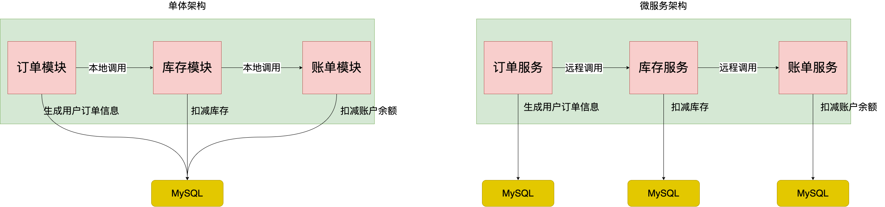
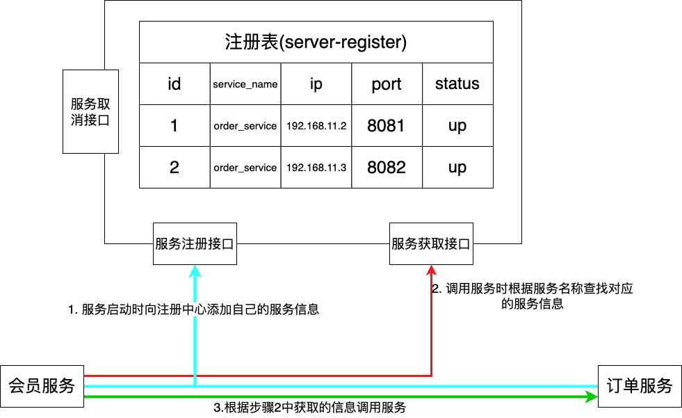

# Alibaba微服务组件 Nacos 注册中心实战
## 单体架构 VS 微服务架构
**单体架构**：单体架构是将所有的业务模块整合到一起，集成到一个系统中实现公司业务需要的所有功能。在公司初期，业务量较小的时候，单体架构便于发布，
维护。能够很好的承载公司业务。但是随着公司的发展，业务功能不断扩展，代码库越来越大，各个功能之间相互影响，可维护性、灵活性降低。而且单体应用变
得越来越臃肿，因为部署的多台机器都是一模一样的工程，成本越来越高。

**微服务架构**：为了解决单体架构的问题，微服务架构产生了。其理念就是根据公司业务功能将单体应用拆分成为一个个单元模块，每个模块都是单独的服务应用，
互不影响，单独运作。模块之间相互协作共同实现公司业务功能。这样实现的好处就是系统解耦、单独应用易于扩展、维护。可以根据每个模块业务量的大小部署相应
的服务器。

用一个用户下单流程来说明一下单体架构和微服务架构的不同：

## 服务注册中心
虽然微服务架构相较于单体架构有很大优势。但是也同时带来了很多问题需要我们去解决。

第一个问题：微服务之间如何完成相互调用？第一个想到的应该是使用 RestTemplate 框架，通过服务的 url 链接调用服务，那么问题来了，当部署多个节点的
时候，又该怎么调用其他相同的节点呢？这个是急需要解决的问题。

针对于上述问题，需要引入服务注册中心，其核心思想就是将扩容的节点信息维护起来，外部服务通过这个注册中心进行其他服务的调用。 如图：

1. 使用本地文件进行服务维护：服务器宕机，服务文件容易丢失，需要手动重新维护；其次需要在业务代码中添加监控调用端服务是否存活的代码，这是不合适的；
因此不推荐使用这种办法；
2. 使用 Nginx：同理需要在 nginx 的配置文件中添加服务信息，所以也不合适；
3. 利用 MySQL 实现服务注册中心，如图：

