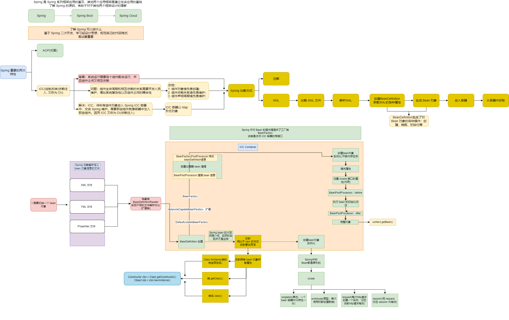
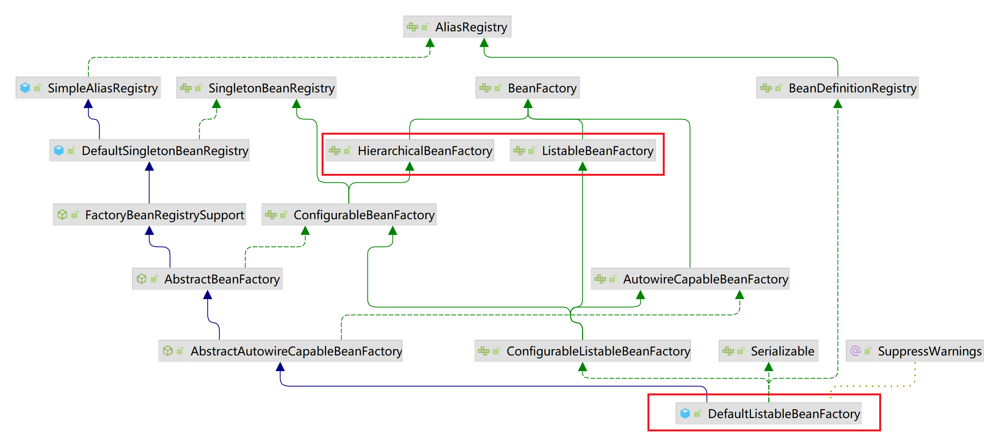
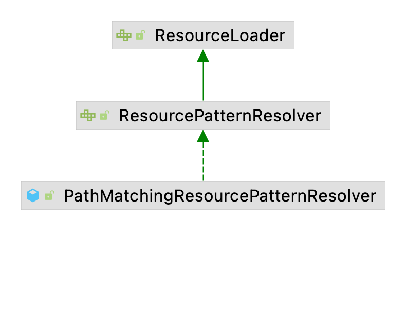

# Spring-IOC 流程图

Spring-IOC bean 的创建大致执行流程如下：



上图可以拆分为3个板块：

1. Spring 是什么；
2. Spring IOC简介以；
3. Spring bean 的创建；

## Spring 是什么

Spring 是一款开源的轻量级的开发框架。该框架的核心是 IOC (控制反转) 和 AOP (切面)。

## IOC

IOC (控制反转)：即研发不用关心对象或者组件的创建，销毁时机。将这些全部交由 Spring IOC 容器管理。IOC 理论实现了对象/组件之间的解耦，降低了代码的
维护成本，只使用简单的依赖注入即可完成对象/组件的创建，不用再关心对象/组件 之间的依赖关系，生命周期，只需要专注业务开发。

## AOP

AOP (切面)：


## bean 对象的创建 (读取文件配置)

先看下以 XML 文件配置 bean 属性， Spirng 是如何创建对象的，销毁流程后续再讲。

1. 在文件中自定义 bean 信息；
2. 加载文件并解析：BeanDefinitionReader；
3. 创建 beanDefinition 对象；
4. BeanFactoryPostProcessor 处理器：更改 bean 属性：比如 singleton 改为 prototype
5. 实例化 bean 对象：给对象分配内存空间；
6. 填充 bean 属性；
7. 设置 Aware 属性：获取 Spring 的一些属性
8. BeanPostProcessor 处理器 前置方法：设置 bean 属性；
9. 执行 bean 的初始化方法；
10. BeanPostProcessor 处理器 后置方法：设置 bean 属性

注意：7,9 步骤需要具体方法看是否实现了 BeanPostProcessor 接口；

# BeanFactoryPostProcessor 测试

实现该接口的方法会在 bean 实例化之前执行。即在 IOC 容器实例化任何 bean 之前, 允许 BeanFactoryPostProcessor 读取配置元数据。比如修改 singleton
属性为 prototype。并且可以同时配置多个 BeanFactoryPostProcessor, 并通过设置 order 来控制各个 BeanFactoryPostProcessor 执行次序。

创建 bean 类：

```java
public class MyJavaBeanDto implements InitializingBean {
	/**
	 * 姓名
	 */
	private String name;

	/**
	 * 备注
	 */
	private String remark;

	public MyJavaBeanDto() {
	}

	public MyJavaBeanDto(String name, String remark) {
		this.name = name;
		this.remark = remark;
	}

	public String getName() {
		return name;
	}

	public void setName(String name) {
		this.name = name;
	}

	public String getRemark() {
		return remark;
	}

	public void setRemark(String remark) {
		this.remark = remark;
	}

	/**
	 * 实例化后，在bean的属性初始化后执行
	 * @throws Exception
	 */
	@Override
	public void afterPropertiesSet() throws Exception {
		System.out.println("MyJavaBeanDto.afterPropertiesSet 实例化后，在bean的属性初始化后执行");
		this.remark = "MyJavaBeanDto.afterPropertiesSet 实例化后，在bean的属性初始化后执行";
	}

	/**
	 * bean 类的初始化方法
	 */
	public void MyJavaBeanDtoInitMethod (){
		System.out.println("MyJavaBeanDto.MyJavaBeanDtoInitMethod 执行指定的初始化方法");
	}
}
```

实现 BeanFactoryPostProcessor 接口：

```java
public class MyBeanFactoryPostProcessor implements BeanFactoryPostProcessor, InitializingBean {

	@Override
	public void postProcessBeanFactory(ConfigurableListableBeanFactory beanFactory) throws BeansException {
		System.out.println("MyBeanFactoryPostProcessor.postProcessBeanFactory 调用 MyBeanFactoryPostProcessor 的 postProcessBeanFactory ");
		BeanDefinition bd = beanFactory.getBeanDefinition("myJavaBeanDto");
		System.out.println("MyBeanFactoryPostProcessor.postProcessBeanFactory 属性值==========" + bd.getPropertyValues());
	}

	@Override
	public void afterPropertiesSet() throws Exception {
		System.out.println("MyBeanFactoryPostProcessor->" + Class.forName("com.azh.springpostprocessor.service.MyBeanFactoryPostProcessor").getClass());
	}
}
```

定义 bean 属性：

```xml
<?xml version="1.0" encoding="UTF-8"?>
<beans xmlns="http://www.springframework.org/schema/beans"
       xmlns:xsi="http://www.w3.org/2001/XMLSchema-instance"
       xsi:schemaLocation="http://www.springframework.org/schema/beans https://www.springframework.org/schema/beans/spring-beans-3.0.xsd">
    <!--测试解析 XML 文件获取 bean-->
    <bean id="userService" class="com.azh.springxmlparsebean.service.impl.UserServiceImpl"></bean>
    <!--测试 BeanFactoryPostProcessor-->
    	<bean id="myJavaBeanFactoryPostProcessorDto" class="com.azh.springpostprocessor.dto.MyJavaBeanFactoryPostProcessorDto" init-method="MyJavaBeanFactoryPostProcessorDtoMethod">
    		<property name="name" value="测试 BeanFactoryPostProcessor"/>
    		<property name="remark" value="备注信息：运行BeanFactoryPostProcessor"/>
    	</bean>
    	<bean id="myBeanFactoryPostProcessor" class="com.azh.springpostprocessor.service.MyBeanFactoryPostProcessor"/>

    <!--测试 BeanPostProcessor-->
    <bean id="myJavaBeanPostProcessorDto" class="com.azh.springpostprocessor.dto.MyJavaBeanPostProcessorDto" init-method="MyJavaBeanPostProcessorDtoMethod">
        <property name="name" value="测试 BeanPostProcessor"/>
        <property name="remark" value="备注信息：运行 BeanPostProcessor"/>
    </bean>
    <bean id="myBeanPostProcessor" class="com.azh.springpostprocessor.service.MyBeanPostProcessor"/>

</beans>

```

创建测试类：

```java
public class SpringBeanFactoryPostProcessorTest {

	public static void main(String[] args) {
		ApplicationContext context = new ClassPathXmlApplicationContext("classpath:spring-config.xml");
		MyJavaBeanDto myJavaBeanDto = (MyJavaBeanDto) context.getBean("myJavaBeanDto");
		System.out.println("==================输出结果========================");
		System.out.println("SpringBeanFactoryPostProcessorTest.main 名称" + myJavaBeanDto.getName());
		System.out.println("SpringBeanFactoryPostProcessorTest.main 备注" + myJavaBeanDto.getRemark());
	}
}
```

执行程序输出结果为: 

```text
MyBeanFactoryPostProcessor->class java.lang.Class
MyBeanFactoryPostProcessor.postProcessBeanFactory 调用 MyBeanFactoryPostProcessor 的 postProcessBeanFactory 
MyBeanFactoryPostProcessor.postProcessBeanFactory 属性值==========PropertyValues: length=2; bean property 'name'; bean property 'remark'
MyJavaBeanDto.afterPropertiesSet 实例化后，在bean的属性初始化后执行
MyJavaBeanDto.MyJavaBeanDtoInitMethod 执行指定的初始化方法
==================输出结果========================
SpringBeanFactoryPostProcessorTest.main 名称测试 BeanFactoryPostProcessor
SpringBeanFactoryPostProcessorTest.main 备注MyJavaBeanDto.afterPropertiesSet 实例化后，在bean的属性初始化后执行
```
# BeanPostProcessor 测试

BeanPostProcessor 有两个方法：

1. postProcessBeforeInitialization() 在初始化方法之前执行；
2. postProcessAfterInitialization() 在初始化方法之后执行；

源码中对该类的描述是：允许自定义修改新的 bean 实例对象；另一方面也说明了该类的使拥范围，需要在 bean 被实例化之后使用。

1,2 中描述的初始化方法是指在定义 bean 的时候，通过 init-method 设置的方法。

创建 bean 类：

```java
public class MyJavaBeanPostProcessorDto implements InitializingBean {
	/**
	 * 姓名
	 */
	private String name;

	/**
	 * 备注
	 */
	private String remark;

	public MyJavaBeanPostProcessorDto() {
	}

	public MyJavaBeanPostProcessorDto(String name, String remark) {
		this.name = name;
		this.remark = remark;
	}

	public String getName() {
		return name;
	}

	public void setName(String name) {
		this.name = name;
	}

	public String getRemark() {
		return remark;
	}

	public void setRemark(String remark) {
		this.remark = remark;
	}

    /**
     * 实例化后，在bean的属性初始化后执行
	 * @throws Exception
	 */
	@Override
	public void afterPropertiesSet() throws Exception {
		System.out.println("2. MyJavaBeanPostProcessorDto.afterPropertiesSet 实例化后，在bean的属性初始化后执行");
		this.remark = "MyJavaBeanPostProcessorDto.afterPropertiesSet 实例化后，在bean的属性初始化后执行";
	}

	/**
	 * bean 类的初始化方法
	 */
	public void MyJavaBeanPostProcessorDtoMethod (){
		System.out.println("3. MyJavaBeanPostProcessorDto.MyJavaBeanPostProcessorDtoMethod 执行指定的初始化方法");
	}
}
```

创建服务类：

```java
public class MyBeanPostProcessor implements BeanPostProcessor {

	@Override
	public Object postProcessBeforeInitialization(Object bean, String beanName) throws BeansException {
		if (bean instanceof MyJavaBeanPostProcessorDto) {
			System.out.println("1. BeanPostProcessor，对象" + beanName + "调用初始化方法之前的数据： " + bean.toString());
		}
		return bean;
	}

	@Override
	public Object postProcessAfterInitialization(Object bean, String beanName) throws BeansException {
		if (bean instanceof MyJavaBeanPostProcessorDto) {
			System.out.println("4. BeanPostProcessor，对象" + beanName + "调用初始化方法之后的数据：" + bean.toString());
		}
		return bean;
	}
}
```

定义 bean 属性：

```xml
<?xml version="1.0" encoding="UTF-8"?>
<beans xmlns="http://www.springframework.org/schema/beans"
	   xmlns:xsi="http://www.w3.org/2001/XMLSchema-instance"
	   xsi:schemaLocation="http://www.springframework.org/schema/beans https://www.springframework.org/schema/beans/spring-beans-3.0.xsd">
	<!--测试解析 XML 文件获取 bean-->
	<bean id="userService" class="com.azh.springxmlparsebean.service.impl.UserServiceImpl"></bean>
	<!--测试 BeanFactoryPostProcessor-->
<!--	<bean id="myJavaBeanFactoryPostProcessorDto" class="com.azh.springpostprocessor.dto.MyJavaBeanFactoryPostProcessorDto" init-method="MyJavaBeanFactoryPostProcessorDtoMethod">-->
<!--		<property name="name" value="测试 BeanFactoryPostProcessor"/>-->
<!--		<property name="remark" value="备注信息：运行BeanFactoryPostProcessor"/>-->
<!--	</bean>-->
<!--	<bean id="myBeanFactoryPostProcessor" class="com.azh.springpostprocessor.service.MyBeanFactoryPostProcessor"/>-->

	<!--测试 BeanPostProcessor-->
	<bean id="myJavaBeanPostProcessorDto" class="com.azh.springpostprocessor.dto.MyJavaBeanPostProcessorDto" init-method="MyJavaBeanPostProcessorDtoMethod">
		<property name="name" value="测试 BeanPostProcessor"/>
		<property name="remark" value="备注信息：运行 BeanPostProcessor"/>
	</bean>
	<bean id="myBeanPostProcessor" class="com.azh.springpostprocessor.service.MyBeanPostProcessor"/>
	
</beans>
```

创建测试类

```java
public class SpringBeanPostProcessorTest {

	public static void main(String[] args) {
		ApplicationContext context = new ClassPathXmlApplicationContext("classpath:spring-config.xml");
		MyJavaBeanPostProcessorDto myJavaBeanPostProcessorDto = (MyJavaBeanPostProcessorDto) context.getBean("myJavaBeanPostProcessorDto");
		System.out.println("==================输出结果========================");
		System.out.println("SpringBeanPostProcessorTest.main 名称" + myJavaBeanPostProcessorDto.getName());
		System.out.println("SpringBeanPostProcessorTest.main 备注" + myJavaBeanPostProcessorDto.getRemark());
	}
}
```

输出结果：

```text
1. BeanPostProcessor，对象myJavaBeanPostProcessorDto调用初始化方法之前的数据： com.azh.springpostprocessor.dto.MyJavaBeanPostProcessorDto@431cd9b2
2. MyJavaBeanPostProcessorDto.afterPropertiesSet 实例化后，在bean的属性初始化后执行
3. MyJavaBeanPostProcessorDto.MyJavaBeanPostProcessorDtoMethod 执行指定的初始化方法
4. BeanPostProcessor，对象myJavaBeanPostProcessorDto调用初始化方法之后的数据：com.azh.springpostprocessor.dto.MyJavaBeanPostProcessorDto@431cd9b2
==================输出结果========================
SpringBeanPostProcessorTest.main 名称测试 BeanPostProcessor
SpringBeanPostProcessorTest.main 备注MyJavaBeanPostProcessorDto.afterPropertiesSet 实例化后，在bean的属性初始化后执行
```

根据输出结果：按照我们预想的输出顺序执行了。

# Aware 接口的作用

bean 通过实现 Aware 的相关接口可以获取到 IOC 容器其他属性。

# BeanFactory 和 FactoryBean

BeanFactory 接口创建对象是由 Spring IOC 创建管理的，需要遵循 Spring 的 bean 的生命周期；

FactoryBean 不需要经过 Spring bean 的创建流程，通过 getObject() 这个方法创建对象；

## FactoryBean 获取对象

创建对象类：

```java
public class FactoryBeanDto {
	private String desc;
	private String remark;

	public FactoryBeanDto() {
	}

	public FactoryBeanDto(String desc, String remark) {
		this.desc = desc;
		this.remark = remark;
	}

	public String getDesc() {
		return desc;
	}

	public void setDesc(String desc) {
		this.desc = desc;
	}

	public String getRemark() {
		return remark;
	}

	public void setRemark(String remark) {
		this.remark = remark;
	}
}

public class SpringFactoryBeanDto implements FactoryBean<FactoryBeanDto> {
    @Override
    public FactoryBeanDto getObject() throws Exception {
        return new FactoryBeanDto();
    }

    @Override
    public Class<?> getObjectType() {
        return null;
    }
}
```
创建测试类：

```java
public class SpringFactoryBeanTest {
	public static void main(String[] args) {
		ApplicationContext context = new ClassPathXmlApplicationContext("classpath:spring-config.xml");
		Object factoryBeanDto = context.getBean("springFactoryBeanDto");
		if (factoryBeanDto instanceof  FactoryBeanDto){
			System.out.println("使用 beanFactory 创建对象");
		}
	}
}
```

输出结果:

```text
使用 beanFactory 创建对象
```
证明获取到的对象是 FactoryBeanDto。

# 验证 Spring bean 的创建流程

对于 Spring 来说在创建 BeanFactory 工厂之前还做了一些前置的工作。下面通过测试用例来 Debug 一下。

首先创建用于测试的 demo：

创建 bean 类 (接口类)：
```java
public interface UserService {
	String getName(String firstName, String lastName);
}

public class BaseInfoDto {
   private int code;

   private String desc;

   private String remark;

   public BaseInfoDto() {
   }

   public int getCode() {
      return code;
   }

   public void setCode(int code) {
      this.code = code;
   }

   public String getDesc() {
      return desc;
   }

   public void setDesc(String desc) {
      this.desc = desc;
   }

   public String getRemark() {
      return remark;
   }

   public void setRemark(String remark) {
      this.remark = remark;
   }
}

public class UserInfoDto extends BaseInfoDto implements BeanFactoryPostProcessor, BeanPostProcessor {

   private String userRemark;

   private String userDesc;

   public UserInfoDto() {
   }

   public String getUserRemark() {
      return userRemark;
   }

   public void setUserRemark(String userRemark) {
      this.userRemark = userRemark;
   }

   public String getUserDesc() {
      return userDesc;
   }

   public void setUserDesc(String userDesc) {
      this.userDesc = userDesc;
   }

   @Override
   public void postProcessBeanFactory(ConfigurableListableBeanFactory beanFactory) throws BeansException {
      System.out.println("UserInfoDto.postProcessBeanFactory start execute");
   }
}
```
创建实现类
```java
public class UserServiceImpl implements UserService {
	@Override
	public String getName(String firstName, String lastName) {
		return String.format("I am %s %s", firstName, lastName);
	}
}
```

定义 bean 信息：

```xml
<?xml version="1.0" encoding="UTF-8"?>
<beans xmlns="http://www.springframework.org/schema/beans"
       xmlns:xsi="http://www.w3.org/2001/XMLSchema-instance"
       xsi:schemaLocation="http://www.springframework.org/schema/beans https://www.springframework.org/schema/beans/spring-beans-3.0.xsd">
   <!--测试解析 XML 文件获取 bean-->
   <bean id="userService" class="com.azh.springxmlparsebean.service.impl.UserServiceImpl"></bean>
   <bean id="userInfoDto" class="com.azh.springxmlparsebean.dto.UserInfoDto">
      <property name="userRemark" value="我是 userInfoDto 的 userRemark"/>
      <property name="userDesc" value="我是 userInfoDto 的 userDesc"/>
      <property name="remark" value="我是 userInfoDto 的 remark"/>
   </bean>
</beans>

```
创建运行类:
```java
public class SpringXmlParseApplication {
	public static void main(String[] args) {
		ApplicationContext context = new ClassPathXmlApplicationContext("classpath:spring-config.xml");
		UserService service = (UserService) context.getBean("userService");

		System.out.println(service.getName("An", "ZH"));
	}
}
```

由于整个调用链路是很长的，所以下面 Debug 的时候就只介绍一些比较重要的点来说下，不会按照执行顺序将每个调用函数列出来。

## 创建 BeanFactory 工厂

程序启动需要准备 Spring 的运行环境，解析定义的 XML 路径，setConfigLocations(configLocations) 就干了这个事儿。

bean 整个的创建流程入口在 refresh():

在准备工作之后执行obtainFreshBeanFactory()方法：创建 beanFactory 工厂；这个方法主的核心是内容是：销毁容器中的 bean，关闭所有工厂；接着再创建
新的 beanFactory 工厂，并设置工厂属性，并将定义好的 bean 信息加载到工厂中。创建工厂之后，需要对工厂的一些属性进行初始化，prepareBeanFactory(beanFactory)
这个方法就干了这件事。具体设置了那些属性，就不详细看了。下面是执行完上述过程后 beanFactory 的信息：

填充属性前：
```json
{
	"accessControlContext": {},
	"allowBeanDefinitionOverriding": true,
	"allowEagerClassLoading": true,
	"autowireCandidateResolver": {},
	"beanDefinitionCount": 1,
	"beanDefinitionNames": ["userService"],
	"beanNamesIterator": ["userService"],
	"beanPostProcessorCount": 0,
	"beanPostProcessors": [],
	"cacheBeanMetadata": true,
	"configurationFrozen": false,
	"customEditors": {},
	"propertyEditorRegistrars": [],
	"registeredScopeNames": [],
	"serializationId": "org.springframework.context.support.ClassPathXmlApplicationContext@215be6bb",
	"singletonCount": 0,
	"singletonMutex": {},
	"singletonNames": [],
	"typeConverter": {}
}
```

填充后:
```json
{
   "accessControlContext": {},
   "allowBeanDefinitionOverriding": true,
   "allowEagerClassLoading": true,
   "autowireCandidateResolver": {},
   "beanDefinitionCount": 1,
   "beanDefinitionNames": ["userService"],
   "beanExpressionResolver": {},
   "beanNamesIterator": ["userService", "environment", "systemProperties", "systemEnvironment"],
   "beanPostProcessorCount": 2,
   "beanPostProcessors": [{}, {}],
   "cacheBeanMetadata": true,
   "configurationFrozen": false,
   "customEditors": {},
   "propertyEditorRegistrars": [{}],
   "registeredScopeNames": [],
   "serializationId": "org.springframework.context.support.ClassPathXmlApplicationContext@215be6bb",
   "singletonCount": 3,
   "singletonMutex": {
   },
   "singletonNames": ["environment", "systemProperties", "systemEnvironment"],
   "typeConverter": {}
}
```
很明显的对比。(填充后我删除了 singletonMutex 的内容，太多了)

了解下 DefaultListableBeanFactory 类图：


其中标红的几个类注意下，在源码中出现的频率比较高。暂且搁置一下：ToDo，具体后面了解下。

## BeanFactoryPostProcessor->bean 增强处理器

接着开始加载增强处理器 BeanFactoryPostProcessor, 并执行 BeanFactoryPostProcessor;
postProcessBeanFactory(beanFactory), invokeBeanFactoryPostProcessors(beanFactory);

在源码中添加打印信息：在执行完：invokeBeanFactoryPostProcessors(beanFactory) 确实打印了：

```text
UserInfoDto.postProcessBeanFactory start execute
```
接着开始注册 BeanPostProcessor。添加打印信息，看是否将 UserInfoDto 这个 Bean 注入。

在 beanFactory 的 JSON 串中  "beanPostProcessors" 数组中包含了 UserInfoDto 的信息

```json
{
   "beanPostProcessors": [{}, {}, {
      "code": 0,
      "remark": "我是 userInfoDto 的 remark",
      "userDesc": "我是 userInfoDto 的 userDesc",
      "userRemark": "我是 userInfoDto 的 userRemark"
   }, {}]
}
```

其余的方法不用太过关心，直接到实例化方法的入口：finishBeanFactoryInitialization(beanFactory);

## bean 实例化

之前在图中提到过，Spring 中 bean 的实例化采用的是反射的机制。来 Debug 验证下：

在 finishBeanFactoryInitialization 中还有很多前置工作，下面是我认为比较重要的方法：

1. beanFactory.addEmbeddedValueResolver(strVal -> getEnvironment().resolvePlaceholders(strVal)); 内置解析类：解析给定文本的占位符；
2. String[] weaverAwareNames = beanFactory.getBeanNamesForType(LoadTimeWeaverAware.class, false, false); : 是否有代码织入，aop；

其余代码可以忽略，然后找到 beanFactory.preInstantiateSingletons(); 这段代码，根据函数名称可以知道 bean 函数的创建逻辑在这段代码中。
同样只谈下自己认为比较重要的逻辑：

1. RootBeanDefinition bd = getMergedLocalBeanDefinition(beanName); 将 Spring bean 工厂中的子类 bean 属性合并到 RootBeanDefinition；
2. isFactoryBean(beanName) 判断 bean 是否实现了 FactoryBean 接口, 实现了则会最终通过代理执行 getObject() 方法获取 bean 对象; 后续详细介绍这个代理；

下面以 bean 没有实现 FactoryBean 接口为列：

preInstantiateSingletons 最终会调用 getBean(beanName) 方法, 这个方法比较简单，转手就调用了 doGetBean() 方法。在该方法中要了解的逻辑如下:

1. Object sharedInstance = getSingleton(beanName); 从一级缓存中获取 bean 实例；获取到之后经过一系列逻辑处理正常后返回；

以没有为列继续 Debug

1. isPrototypeCurrentlyInCreation(beanName) 该方法判断是 bean 是否有循环依赖，有的话抛出异常；

接着找到 lambda 表达式中调用的 createBean(beanName, mbd, args) 方法执行 bean 对象的创建逻辑。在该方法中：

1. Object bean = resolveBeforeInstantiation(beanName, mbdToUse); 其次让实现 BeanPostProcessor 的 bean 对象返回一个代理类，而不是目标类；有则返回 bean 对象

以没有实现 BeanPostProcessor 为列，最终 createBean 会执行方法：Object beanInstance = doCreateBean(beanName, mbdToUse, args); 实现 bean 的实例化逻辑；

进入方法中找到：instanceWrapper = createBeanInstance(beanName, mbd, args); doCreateBean(beanName, mbdToUse, args) 调用 
createBeanInstance(beanName, mbd, args) 该方法完成 bean 的实例化逻辑；

在 createBeanInstance(beanName, mbd, args) 方法中， 找到 return instantiateBean(beanName, mbd); 这个方法，在这方法中完成了 bean 创建。进入该方法找到 beanInstance = getInstantiationStrategy().instantiate(mbd, beanName, this);
getInstantiationStrategy().instantiate(mbd, beanName, this) 该方法完成了 bean 对象的创建。

1. constructorToUse = (Constructor<?>) bd.resolvedConstructorOrFactoryMethod; 获取 bean 的构造方法

接着找到 BeanUtils.instantiateClass(constructorToUse); 在这个方法中最终完成了 bean 对象的实例化。

进入 BeanUtils.instantiateClass(constructorToUse) 方法，最终执行了 return ctor.newInstance(argsWithDefaultValues); 方法。
至此完成了 bean 对象的 实例化。

对象实例化之后还需要填充属性。接着往下看。

## 填充属性

继 Object beanInstance = doCreateBean(beanName, mbdToUse, args) 创建实例方法之后，继续向下 Debug，主要了解这这段逻辑：
解决循环依赖:

1. boolean earlySingletonExposure = (mbd.isSingleton() && this.allowCircularReferences && isSingletonCurrentlyInCreation(beanName)); 判断是否有循环依赖；
2. addSingletonFactory(beanName, () -> getEarlyBeanReference(beanName, mbd, bean)); 将 bean 对象放入 三级缓存中；

这块儿逻辑后续详解。

找到该方法：populateBean(beanName, mbd, instanceWrapper); 填充 bean 属性；
方法;

接着执行exposedObject = initializeBean(beanName, exposedObject, mbd); 方法; 该方法完成了初始化给定的 bean 实例，应用工厂回调 
BeanPostProcessor:before 以及 init 方法和 BeanPostProcessor:after  处理器。

1. invokeAwareMethods(beanName, bean); // Aware 属性填充
2. wrappedBean = applyBeanPostProcessorsBeforeInitialization(wrappedBean, beanName); // 前置方法执行
3. wrappedBean = applyBeanPostProcessorsAfterInitialization(wrappedBean, beanName);  // 后置方法执行

至此一个完整的对象创建完成。

# Spring 细节

上面 Debug 代码验证了 Bean 的创建流程是否如我们所画的 Bean 的创建流程图。这次详细的看下其中的代码。

```java
public class SpringXmlParseApplication {
    public static void main(String[] args) {
        ApplicationContext context = new ClassPathXmlApplicationContext("classpath:spring-config.xml");
        // ....
    }
}
```

进入 new ClassPathXmlApplicationContext("classpath:spring-config.xml"); 的构造方法

```java
public class ClassPathXmlApplicationContext extends AbstractXmlApplicationContext {
    public ClassPathXmlApplicationContext(
            String[] configLocations, boolean refresh, @Nullable ApplicationContext parent)
            throws BeansException {
        // 调用父类构造方法，进行相关对象的创建等操作；
        super(parent);
        // 1.设置配置文件路径，并准备 Spring 的运行环境：customizePropertySources
        setConfigLocations(configLocations);
        if (refresh) {
            // 刷新环境，创建 bean
            refresh();
        }
    }
}
```
## supper(parent)
super(parent) 调用了很多父类的方法 最终调用了父类 AbstractApplicationContext 方法

```java
public abstract class AbstractApplicationContext extends DefaultResourceLoader implements ConfigurableApplicationContext {
    /** Unique id for this context, if any. 
     * 创建应用的唯一 id
     * */
    private String id = ObjectUtils.identityToString(this);

    /** Environment used by this context.
     *  应用环境
     * */
    @Nullable
    private ConfigurableEnvironment environment;

    /** BeanFactoryPostProcessors to apply on refresh.
     *  处理器
     * */
    private final List<BeanFactoryPostProcessor> beanFactoryPostProcessors = new ArrayList<>();

    /** System time in milliseconds when this context started. 
     *  Spring 启动时间
     * */
    private long startupDate;

    /** Synchronization monitor for the "refresh" and "destroy".
     *  刷新和销毁的同步监视器
     * */
    private final Object startupShutdownMonitor = new Object();

    /**
     * Create a new AbstractApplicationContext with no parent.
     * 资源管理器类的创建：可以理解为文件解析类
     */
    public AbstractApplicationContext() {
        this.resourcePatternResolver = getResourcePatternResolver();
    }

    // 还有其他的属性就不介绍了
    public AbstractApplicationContext(@Nullable ApplicationContext parent) {
		this();
		setParent(parent);
	}
}
```
进入 getResourcePatternResolver 方法创建了 PathMatchingResourcePatternResolver 类，该类就是一个资源加载器。

看下该类的部分源码:

```java
public class PathMatchingResourcePatternResolver implements ResourcePatternResolver {
    // 创建 ant 方式的路径匹配器
    private PathMatcher pathMatcher = new AntPathMatcher();
}
```
类图如下:



ResourceLoader 接口主要是加载资源的策略接口

## setConfigLocations(configLocations);

主要作用设置配置文件路径；源码如下：
```java
public abstract class AbstractRefreshableConfigApplicationContext extends AbstractRefreshableApplicationContext
        implements BeanNameAware, InitializingBean {
    public void setConfigLocations(@Nullable String... locations) {
        if (locations != null) {
            Assert.noNullElements(locations, "Config locations must not be null");
            this.configLocations = new String[locations.length];
            for (int i = 0; i < locations.length; i++) {
                // 解析文件路径：因为在 Sprng 中会使用占位符灵活的配置加载文件
                this.configLocations[i] = resolvePath(locations[i]).trim();
            }
        } else {
            this.configLocations = null;
        }
    }
}
```
使用 resolvePath.resolveRequiredPlaceholders 解析文件路径

```java
public abstract class AbstractRefreshableConfigApplicationContext extends AbstractRefreshableApplicationContext
        implements BeanNameAware, InitializingBean {
    protected String resolvePath(String path) {
        // getEnvironment() 获取当前运行环境的值，解析配置文件当前路径
        return getEnvironment().resolveRequiredPlaceholders(path);
    }
}
```

为什么调用 getEnvironment() 获取当前运行环境变量？

这是因为在这之前还没有读取过 Spring 中任何配置文件的属性值，需要通过这个方法来获取并加载额外的属性。代码如下:

```java
public abstract class AbstractApplicationContext extends DefaultResourceLoader
        implements ConfigurableApplicationContext {
    @Override
    public ConfigurableEnvironment getEnvironment() {
        // 刚开始 环境便令为 null
        if (this.environment == null) {
            // 创建环境变量
            this.environment = createEnvironment();
        }
        return this.environment;
    }

    protected ConfigurableEnvironment createEnvironment() {
        // 创建一个 StandardEnvironment 类
        return new StandardEnvironment();
    }
}
```

创建运行环境中 new 了一个 StandardEnvironment 对象， 该类继承了 AbstractEnvironment 类，创建子类之前先要创建父类，父类初始化一下默认值：

```java
public abstract class AbstractEnvironment implements ConfigurableEnvironment {
    public static final String IGNORE_GETENV_PROPERTY_NAME = "spring.getenv.ignore";

    public static final String ACTIVE_PROFILES_PROPERTY_NAME = "spring.profiles.active";

    public static final String DEFAULT_PROFILES_PROPERTY_NAME = "spring.profiles.default";

    protected static final String RESERVED_DEFAULT_PROFILE_NAME = "default";
}
```


在 AbstractEnvironment 的构造方法中执行了 **customizePropertySources** 方法; 在子类中重写了该方法：

```java
public class StandardEnvironment extends AbstractEnvironment {
    /** System environment property source name: {@value}. */
    public static final String SYSTEM_ENVIRONMENT_PROPERTY_SOURCE_NAME = "systemEnvironment";

    /** JVM system properties property source name: {@value}. */
    public static final String SYSTEM_PROPERTIES_PROPERTY_SOURCE_NAME = "systemProperties";
    
    @Override
    protected void customizePropertySources(MutablePropertySources propertySources) {
        // 除了系统属性，将自定义的属性值添加，比如上面的两个属性 (JVM级别的系统)
        propertySources.addLast(
                new PropertiesPropertySource(SYSTEM_PROPERTIES_PROPERTY_SOURCE_NAME, getSystemProperties()));
        // 除了环境变量，将自定义的环境变量添加 (系统级别)
        propertySources.addLast(
                new SystemEnvironmentPropertySource(SYSTEM_ENVIRONMENT_PROPERTY_SOURCE_NAME, getSystemEnvironment()));
    }
}
```
来看下获取 JVM、System 后的值：省略了很多东西，太多了

```json
[{
  "name": "systemProperties",
  "propertyNames": ["gopherProxySet", "awt.toolkit", "socksProxyHost", "http.proxyHost", "java.specification.version", "sun.cpu.isalist", "sun.jnu.encoding", "java.class.path", "https.proxyPort", "java.vm.vendor", "sun.arch.data.model", "user.variant", "java.vendor.url", "user.timezone", "os.name", "java.vm.specification.version", "user.country", "sun.java.launcher", "sun.boot.library.path", "sun.java.command", "http.nonProxyHosts", "jdk.debug", "sun.cpu.endian", "user.home", "user.language", "java.specification.vendor", "java.version.date", "java.home", "file.separator", "https.proxyHost", "java.vm.compressedOopsMode", "line.separator", "java.specification.name", "java.vm.specification.vendor", "java.awt.graphicsenv", "user.script", "sun.management.compiler", "ftp.nonProxyHosts", "java.runtime.version", "user.name", "path.separator", "os.version", "java.runtime.name", "file.encoding", "java.vm.name", "java.vendor.version", "java.vendor.url.bug", "java.io.tmpdir", "java.version", "user.dir", "os.arch", "socksProxyPort", "java.vm.specification.name", "java.awt.printerjob", "sun.os.patch.level", "java.library.path", "java.vendor", "java.vm.info", "java.vm.version", "sun.io.unicode.encoding", "java.class.version", "socksNonProxyHosts", "http.proxyPort"],
  "source": {
    "gopherProxySet": "false",
    "awt.toolkit": "sun.lwawt.macosx.LWCToolkit"
  }
}, {
  "name": "systemEnvironment",
  "propertyNames": ["PATH", "JAVA_8_HOME", "DEFAULT_USER", "GATEWAY_VM_OPTIONS", "MVN_HOME", "JAVA_11_HOME", "RIDER_VM_OPTIONS", "LOGNAME", "INFOPATH", "JAVA_MAIN_CLASS_797", "SHELL", "APPCODE_VM_OPTIONS", "PAGER", "HOMEBREW_BOTTLE_DOMAIN", "HOMEBREW_CELLAR", "OLDPWD", "ZSH", "P9K_SSH", "TMPDIR", "DATASPELL_VM_OPTIONS", "XPC_FLAGS", "__CF_USER_TEXT_ENCODING", "LESS", "LC_CTYPE", "DATAGRIP_VM_OPTIONS", "MANPATH", "PYCHARM_VM_OPTIONS", "WEBSTORM_VM_OPTIONS", "JAVA_HOME", "CLION_VM_OPTIONS", "JETBRAINSCLIENT_VM_OPTIONS", "HOMEBREW_PREFIX", "GRADLE_HOME", "COMMAND_MODE", "GOLAND_VM_OPTIONS", "GRADLE_USER_HOME", "IDEA_VM_OPTIONS", "RUBYMINE_VM_OPTIONS", "JETBRAINS_CLIENT_VM_OPTIONS", "HOMEBREW_REPOSITORY", "XPC_SERVICE_NAME", "__CFBundleIdentifier", "LSCOLORS", "CLICOLOR", "USER", "CLASSPATH", "SSH_AUTH_SOCK", "WEBIDE_VM_OPTIONS", "PHPSTORM_VM_OPTIONS", "HOME"],
  "source": {
    "PATH": "/xxxx/xxx/xxx:/xxx/xxx:/xxx:/xx/xxxx:/xxxx:/xxx/xxx/xxx/xxx/xxx/xxxxx/Contents/Home/bin:/Users/anzhihong/Dev_AZH/Java_Env/maven_env/apache-maven-3.6.1/bin:/Users/anzhihong/Dev_AZH/Java_Env/gradle_env/gradle-5.6.3-bin/bin:/usr/local/sbin",
    "JAVA_8_HOME": "/Users/xxxxx/xxxxxx/xxxxxxx/xxxxxxx/xxxxx/Contents/Home"

  }
}]
```

可以看到从 JVM 系统级别和 System 获取了属性配置信息。接着就是执行 resolveRequiredPlaceholders(path) 方法解析配置文件名称解析。该方法最终调用了

org.springframework.util.PropertyPlaceholderHelper.parseStringValue() 方法完成配置文件名称的解析；像在 Spring Boot 中多环境配置文件的加载
应该就是在这里完成的了。(看 Spring Boot 的时候看下)

## AbstractApplicationContext.initPropertySources 讲解

这个类在父类中并没有实现，是留给子类做扩展使用。可以通过继承 AbstractApplicationContext 类重写 initPropertySources 来初始化环境的配置属性。
创建 demo 验证一下:

```java
public class SpringInitPropertySourcesApplicationContext extends ClassPathXmlApplicationContext {

	public SpringInitPropertySourcesApplicationContext(String ...config){
		super(config);
	}

    @Override
    protected void initPropertySources() {
        System.out.println("子类扩展 initPropertySources");
        // 设置 username 属性是必须的
        getEnvironment().setRequiredProperties("username");
    }
}

public class SpringApplication {
    public static void main(String[] args) {
        SpringInitPropertySourcesApplicationContext context = new SpringInitPropertySourcesApplicationContext("spring-config.xml");
    }
}
```
运行代码，看是否打印了我们添加的输出信息:
```text
子类扩展 initPropertySources
```
可以看到执行了子类的重写方法。在 Spring MVC 中就利用了这个扩展函数。然后函数 getEnvironment().validateRequiredProperties(); 会校验这个 username 属性，
如果没有，添加将缺少的 key(属性) 放入 missingRequiredProperties 集合中。

```java
public abstract class AbstractPropertyResolver implements ConfigurablePropertyResolver {
    @Override
    public void validateRequiredProperties() {
        MissingRequiredPropertiesException ex = new MissingRequiredPropertiesException();
        for (String key : this.requiredProperties) {
            if (this.getProperty(key) == null) {
                ex.addMissingRequiredProperty(key);
            }
        }
        if (!ex.getMissingRequiredProperties().isEmpty()) {
            throw ex;
        }
    }
}
```

## AbstractApplicationContext.prepareRefresh 的扩展点

部分源码如下:

```java
public abstract class AbstractApplicationContext extends DefaultResourceLoader
        implements ConfigurableApplicationContext {

    /** Local listeners registered before refresh. */
    @Nullable
    private Set<ApplicationListener<?>> earlyApplicationListeners;
    
    protected void prepareRefresh() {
        // Store pre-refresh ApplicationListeners...
        // 判断刷新前的应用程序监听器集合是否为 null：如果为 null，将集合添加到 earlyApplicationListeners 中，也是个扩展点 (在 Spring Boot 中有监听器)
        if (this.earlyApplicationListeners == null) {
            this.earlyApplicationListeners = new LinkedHashSet<>(this.applicationListeners);
        }
        else {
            // Reset local application listeners to pre-refresh state.
            // 如果不等于 null， 则清空集合， 将现有数据放入 applicationListeners
            this.applicationListeners.clear();
            this.applicationListeners.addAll(this.earlyApplicationListeners);
        }

        // Allow for the collection of early ApplicationEvents,
        // to be published once the multicaster is available...
        this.earlyApplicationEvents = new LinkedHashSet<>();
    }
}
```
如果需要使用监听器，则提前将监听器放入 earlyApplicationListeners 集合中, 在用到的时候直接使用

## bean 工厂讲解

在 refresh() 方法中实现 bean 工厂创建是调用了 obtainFreshBeanFactory() 这个方法，源码如下:

```java
public abstract class AbstractApplicationContext extends DefaultResourceLoader
        implements ConfigurableApplicationContext {
    protected ConfigurableListableBeanFactory obtainFreshBeanFactory() {
        // 初始化 BeanFactory, 并进行 XML 读取, 并将得到的 BeanFactory 记录到当前实体的属性当中
        refreshBeanFactory();
        // 返回当前 BeanFactory 属性
        return getBeanFactory();
    }
}
```
在创建工厂之前，首先是刷行工厂，源码如下:

```java
public abstract class AbstractRefreshableApplicationContext extends AbstractApplicationContext {
    @Override
    protected final void refreshBeanFactory() throws BeansException {
        // 如果存在 beanFactory，则销毁 BeanFactory
        if (hasBeanFactory()) {
            destroyBeans();
            closeBeanFactory();
        }
        try {
            // 创建 BeanFactory 工厂
            DefaultListableBeanFactory beanFactory = createBeanFactory();
            // 为了序列化指定 id， 可以从 id 反序列化到 beanFactory 对象
            beanFactory.setSerializationId(getId());
            // 定制 beanFactory 设置相关属性，包括是否允许覆盖同名文件的不同定义对象以及循环依赖
            customizeBeanFactory(beanFactory);
            // 初始化配置定义的 bean 信息，并读取解析
            loadBeanDefinitions(beanFactory);
            this.beanFactory = beanFactory;
        } catch (IOException ex) {
            throw new ApplicationContextException("I/O error parsing bean definition source for " + getDisplayName(), ex);
        }
    }
}
```
createBeanFactory() 是一大堆的父类方法的调用，最终执行到 AbstractRefreshableApplicationContext 的 AbstractAutowireCapableBeanFactory 构造方法：
```java
public class DefaultListableBeanFactory extends AbstractAutowireCapableBeanFactory
        implements ConfigurableListableBeanFactory, BeanDefinitionRegistry, Serializable {
    
    /** Whether to automatically try to resolve circular references between beans.
     *
     * 是否尝试自动解决循环依赖
     * */
    private boolean allowCircularReferences = true;

    /**
     * Whether to resort to injecting a raw bean instance in case of circular reference,
     * even if the injected bean eventually got wrapped.
     * 
     * 是否在循环引用的情况下注入原始的 bean
     */
    private boolean allowRawInjectionDespiteWrapping = false;
    
    /**
     * Create a new AbstractAutowireCapableBeanFactory.
     */
    public AbstractAutowireCapableBeanFactory() {
        super();
        // 忽略依赖接口
        ignoreDependencyInterface(BeanNameAware.class);
        ignoreDependencyInterface(BeanFactoryAware.class);
        ignoreDependencyInterface(BeanClassLoaderAware.class);
    }

    /**
     * Create a new AbstractAutowireCapableBeanFactory with the given parent.
     * @param parentBeanFactory parent bean factory, or {@code null} if none
     */
    public AbstractAutowireCapableBeanFactory(@Nullable BeanFactory parentBeanFactory) {
        // 执行构造函数
        this();
        // 设置父工厂
        setParentBeanFactory(parentBeanFactory);
    }
}
```

需要注意 allowCircularReferences 这个变量，默认赋值为 true。后续解决循环依赖的时候会用到。

继而执行 customizeBeanFactory(beanFactory); 定制 beanFactory 属性，在这个方法中有这样的判断：扩展点:

```java
public abstract class AbstractRefreshableApplicationContext extends AbstractApplicationContext {


    @Nullable
    private Boolean allowBeanDefinitionOverriding;

    @Nullable
    private Boolean allowCircularReferences;
    
    protected void customizeBeanFactory(DefaultListableBeanFactory beanFactory) {
        // 如果 allowBeanDefinitionOverriding 属性不为空，设置 beanFactory 对象相应的属性，是否允许覆盖同名称的不同定义对象
        if (this.allowBeanDefinitionOverriding != null) {
            beanFactory.setAllowBeanDefinitionOverriding(this.allowBeanDefinitionOverriding);
        }
        // 如果 allowCircularReferences 不为空，设置 beanFactory 对象相应属性，是否允许 bean 之间存在循环依赖
        if (this.allowCircularReferences != null) {
            beanFactory.setAllowCircularReferences(this.allowCircularReferences);
        }
    }
}
```

我们可以通过重写这个方法实现对 allowBeanDefinitionOverriding、allowCircularReferences 这两个布尔赋值