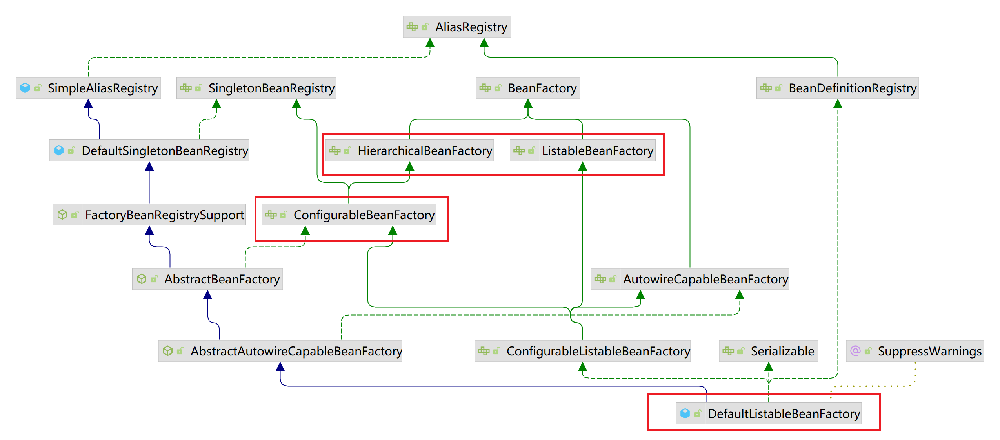

# Spring-IOC 流程图

Spring-IOC bean 的创建大致执行流程如下：


上图可以拆分为3个板块：

1. Spring 是什么；
2. Spring IOC简介以；
3. Spring bean 的创建；

## Spring 是什么

Spring 是一款开源的轻量级的开发框架。该框架的核心是 IOC (控制反转) 和 AOP (切面)。

## IOC

IOC (控制反转)：即研发不用关心对象或者组件的创建，销毁时机。将这些全部交由 Spring IOC 容器管理。IOC 理论实现了对象/组件之间的解耦，降低了代码的
维护成本，只使用简单的依赖注入即可完成对象/组件的创建，不用再关心对象/组件 之间的依赖关系，生命周期，只需要专注业务开发。

## AOP

在后续的章节中在详细叙述

## bean 对象的创建 (读取文件配置)

先看下以 XML 文件配置 bean 属性， Spirng 是如何创建对象的，销毁流程后续再讲。

1. 在文件中自定义 bean 信息；
2. 加载文件并解析：BeanDefinitionReader；
3. 创建 beanDefinition 对象；
4. BeanFactoryPostProcessor 处理器：更改 bean 属性：比如 singleton 改为 prototype
5. 实例化 bean 对象：给对象分配内存空间；
6. 填充 bean 属性；
7. 设置 Aware 属性：获取 Spring 的一些属性
8. BeanPostProcessor 处理器 前置方法：设置 bean 属性；
9. 执行 bean 的初始化方法；
10. BeanPostProcessor 处理器 后置方法：设置 bean 属性

注意：7,9 步骤需要具体方法看是否实现了 BeanPostProcessor 接口；

# BeanFactoryPostProcessor 测试

实现该接口的方法会在 bean 实例化之前执行。即在 IOC 容器实例化任何 bean 之前, 允许 BeanFactoryPostProcessor 读取配置元数据。比如修改 singleton
属性为 prototype。并且可以同时配置多个 BeanFactoryPostProcessor, 并通过设置 order 来控制各个 BeanFactoryPostProcessor 执行次序。

创建 bean 类：

```java
public class MyJavaBeanFactoryPostProcessorDto implements InitializingBean {
    /**
     * 姓名
     */
    private String name;

    /**
     * 备注
     */
    private String remark;

    public MyJavaBeanFactoryPostProcessorDto() {
    }

    public MyJavaBeanFactoryPostProcessorDto(String name, String remark) {
        this.name = name;
        this.remark = remark;
    }

    public String getName() {
        return name;
    }

    public void setName(String name) {
        this.name = name;
    }

    public String getRemark() {
        return remark;
    }

    public void setRemark(String remark) {
        this.remark = remark;
    }

    /**
     * bean 类的初始化方法
     */
    public void MyJavaBeanFactoryPostProcessorDtoMethod (){
        System.out.println("MyJavaBeanFactoryPostProcessorDto.MyJavaBeanFactoryPostProcessorDtoMethod 执行指定的初始化方法");
    }

    @Override
    public void afterPropertiesSet() throws Exception {
        System.out.println("MyJavaBeanFactoryPostProcessorDto 初始化后执行");
    }
}
```

实现 BeanFactoryPostProcessor 接口：

```java
public class MyBeanFactoryPostProcessor implements BeanFactoryPostProcessor {

    @Override
    public void postProcessBeanFactory(ConfigurableListableBeanFactory beanFactory) throws BeansException {
        System.out.println("MyBeanFactoryPostProcessor.postProcessBeanFactory 调用 MyBeanFactoryPostProcessor 的 postProcessBeanFactory ");
        BeanDefinition bd = beanFactory.getBeanDefinition("myJavaBeanFactoryPostProcessorDto");
        System.out.println("MyBeanFactoryPostProcessor.postProcessBeanFactory 属性值==========" + bd.getPropertyValues());
    }
}
```

定义 bean 属性：

```xml
<?xml version="1.0" encoding="UTF-8"?>
<beans xmlns="http://www.springframework.org/schema/beans"
       xmlns:xsi="http://www.w3.org/2001/XMLSchema-instance"
       xsi:schemaLocation="http://www.springframework.org/schema/beans https://www.springframework.org/schema/beans/spring-beans-3.0.xsd">
        <!--测试 BeanFactoryPostProcessor-->
    	<bean id="myJavaBeanFactoryPostProcessorDto" class="com.azh.springpostprocessor.dto.MyJavaBeanFactoryPostProcessorDto" init-method="MyJavaBeanFactoryPostProcessorDtoMethod">
    		<property name="name" value="测试 BeanFactoryPostProcessor"/>
    		<property name="remark" value="备注信息：运行BeanFactoryPostProcessor"/>
    	</bean>
    	<bean id="myBeanFactoryPostProcessor" class="com.azh.springpostprocessor.service.MyBeanFactoryPostProcessor"/>
</beans>

```

创建测试类：

```java
public class SpringBeanFactoryPostProcessorTest {

    public static void main(String[] args) {
        ApplicationContext context = new ClassPathXmlApplicationContext("classpath:spring-config.xml");
        MyJavaBeanFactoryPostProcessorDto myJavaBeanFactoryPostProcessorDto = (MyJavaBeanFactoryPostProcessorDto) context.getBean("myJavaBeanFactoryPostProcessorDto");
        System.out.println("==================输出结果========================");
        System.out.println("SpringBeanFactoryPostProcessorTest.main 名称" + myJavaBeanFactoryPostProcessorDto.getName());
        System.out.println("SpringBeanFactoryPostProcessorTest.main 备注" + myJavaBeanFactoryPostProcessorDto.getRemark());
    }
}
```

执行程序输出结果为: 

```text
MyBeanFactoryPostProcessor.postProcessBeanFactory 调用 MyBeanFactoryPostProcessor 的 postProcessBeanFactory 
MyBeanFactoryPostProcessor.postProcessBeanFactory 属性值==========PropertyValues: length=2; bean property 'name'; bean property 'remark'
MyJavaBeanFactoryPostProcessorDto 初始化后执行
MyJavaBeanFactoryPostProcessorDto.MyJavaBeanFactoryPostProcessorDtoMethod 执行指定的初始化方法
```
# BeanPostProcessor 测试

BeanPostProcessor 有两个方法：

1. postProcessBeforeInitialization() 在初始化方法之前执行；
2. postProcessAfterInitialization() 在初始化方法之后执行；

源码中对该类的描述是：允许自定义修改新的 bean 实例对象；另一方面也说明了该类的使拥范围，需要在 bean 被实例化之后使用。

1,2 中描述的初始化方法是指在定义 bean 的时候，通过 init-method 设置的方法。

创建 bean 类：

```java
public class MyJavaBeanPostProcessorDto {
    /**
     * 姓名
     */
    private String name;

    /**
     * 备注
     */
    private String remark;

    public MyJavaBeanPostProcessorDto() {
    }

    public MyJavaBeanPostProcessorDto(String name, String remark) {
        this.name = name;
        this.remark = remark;
    }

    public String getName() {
        return name;
    }

    public void setName(String name) {
        this.name = name;
    }

    public String getRemark() {
        return remark;
    }

    public void setRemark(String remark) {
        this.remark = remark;
    }

    /**
     * bean 类的初始化方法
     */
    public void MyJavaBeanPostProcessorDtoMethod (){
        System.out.println("2.MyJavaBeanPostProcessorDto.MyJavaBeanPostProcessorDtoMethod 执行指定的初始化方法");
    }
}
```

创建服务类：

```java
public class MyBeanPostProcessor implements BeanPostProcessor {

    @Override
    public Object postProcessBeforeInitialization(Object bean, String beanName) throws BeansException {
        if(bean instanceof  MyJavaBeanPostProcessorDto) {
            System.out.println("1.MyBeanPostProcessor.postProcessBeforeInitialization 初始化前 myJavaBeanPostProcessorDto 的值：" + JSON.toJSONString(bean));
        }
        return bean;
    }

    @Override
    public Object postProcessAfterInitialization(Object bean, String beanName) throws BeansException {
        if (bean instanceof MyJavaBeanPostProcessorDto) {
            System.out.println("3.MyBeanPostProcessor.postProcessBeforeInitialization 初始化后 myJavaBeanPostProcessorDto 的值：" + JSON.toJSONString(bean));
        }
        return bean;
    }
}
```

定义 bean 属性：

```xml
<?xml version="1.0" encoding="UTF-8"?>
<beans xmlns="http://www.springframework.org/schema/beans"
	   xmlns:xsi="http://www.w3.org/2001/XMLSchema-instance"
	   xsi:schemaLocation="http://www.springframework.org/schema/beans https://www.springframework.org/schema/beans/spring-beans-3.0.xsd">
    <!--测试 BeanPostProcessor-->
    <bean id="myJavaBeanPostProcessorDto" class="com.azh.springpostprocessor.dto.MyJavaBeanPostProcessorDto" init-method="MyJavaBeanPostProcessorDtoMethod">
        <property name="name" value="测试 BeanPostProcessor"/>
        <property name="remark" value="备注信息：运行 BeanPostProcessor"/>
    </bean>
    <bean id="myBeanPostProcessor" class="com.azh.springpostprocessor.service.MyBeanPostProcessor"/>
	
</beans>
```

创建测试类

```java
public class SpringBeanPostProcessorTest {

    public static void main(String[] args) {
        ApplicationContext context = new ClassPathXmlApplicationContext("classpath:spring-config.xml");
        context.getBean("myBeanPostProcessor");
    }
}
```

输出结果：

```text
1.MyBeanPostProcessor.postProcessBeforeInitialization 初始化前 myJavaBeanPostProcessorDto 的值：{"name":"测试 BeanPostProcessor","remark":"备注信息：运行 BeanPostProcessor"}
2.MyJavaBeanPostProcessorDto.MyJavaBeanPostProcessorDtoMethod 执行指定的初始化方法
3.MyBeanPostProcessor.postProcessBeforeInitialization 初始化后 myJavaBeanPostProcessorDto 的值：{"name":"测试 BeanPostProcessor","remark":"备注信息：运行 BeanPostProcessor"}```
```

根据输出结果：按照我们预想的输出顺序执行了。

# Aware 接口的作用

bean 通过实现 Aware 的相关接口可以获取到 IOC 容器其他属性。

# BeanFactory 和 FactoryBean

BeanFactory 接口创建对象是由 Spring IOC 创建管理的，需要遵循 Spring 的 bean 的生命周期；

FactoryBean 不需要经过 Spring bean 的创建流程，通过 getObject() 这个方法创建对象；它是 Spring Bean 对象的扩展，通过它可以实现我们自己定义的 bean
对象；

## FactoryBean 获取对象

创建对象类：

```java
public class FactoryBeanDto {
	private String desc;
	private String remark;

	public FactoryBeanDto() {
	}

	public FactoryBeanDto(String desc, String remark) {
		this.desc = desc;
		this.remark = remark;
	}

	public String getDesc() {
		return desc;
	}

	public void setDesc(String desc) {
		this.desc = desc;
	}

	public String getRemark() {
		return remark;
	}

	public void setRemark(String remark) {
		this.remark = remark;
	}
}

public class SpringFactoryBeanDto implements FactoryBean<FactoryBeanDto> {
    @Override
    public FactoryBeanDto getObject() throws Exception {
        return new FactoryBeanDto();
    }

    @Override
    public Class<?> getObjectType() {
        return null;
    }
}
```
创建测试类：

```java
public class SpringFactoryBeanTest {
	public static void main(String[] args) {
		ApplicationContext context = new ClassPathXmlApplicationContext("classpath:spring-config.xml");
		Object factoryBeanDto = context.getBean("springFactoryBeanDto");
		if (factoryBeanDto instanceof  FactoryBeanDto){
			System.out.println("使用 beanFactory 创建对象");
		}
	}
}
```

输出结果:

```text
使用 beanFactory 创建对象
```
证明获取到的对象是 FactoryBeanDto。

# 验证 Spring bean 的创建流程

对于 Spring 来说在创建 BeanFactory 工厂之前还做了一些前置的工作。下面通过测试用例来 Debug 一下。

首先创建用于测试的 demo：

创建 bean 类 (接口类)：
```java
public interface UserService {
	String getName(String firstName, String lastName);
}

public class BaseInfoDto {
   private int code;

   private String desc;

   private String remark;

   public BaseInfoDto() {
   }

   public int getCode() {
      return code;
   }

   public void setCode(int code) {
      this.code = code;
   }

   public String getDesc() {
      return desc;
   }

   public void setDesc(String desc) {
      this.desc = desc;
   }

   public String getRemark() {
      return remark;
   }

   public void setRemark(String remark) {
      this.remark = remark;
   }
}

public class UserInfoDto extends BaseInfoDto implements BeanFactoryPostProcessor, BeanPostProcessor {

   private String userRemark;

   private String userDesc;

   public UserInfoDto() {
   }

   public String getUserRemark() {
      return userRemark;
   }

   public void setUserRemark(String userRemark) {
      this.userRemark = userRemark;
   }

   public String getUserDesc() {
      return userDesc;
   }

   public void setUserDesc(String userDesc) {
      this.userDesc = userDesc;
   }

   @Override
   public void postProcessBeanFactory(ConfigurableListableBeanFactory beanFactory) throws BeansException {
      System.out.println("UserInfoDto.postProcessBeanFactory start execute");
   }
}
```
创建实现类
```java
public class UserServiceImpl implements UserService {
	@Override
	public String getName(String firstName, String lastName) {
		return String.format("I am %s %s", firstName, lastName);
	}
}
```

定义 bean 信息：

```xml
<?xml version="1.0" encoding="UTF-8"?>
<beans xmlns="http://www.springframework.org/schema/beans"
       xmlns:xsi="http://www.w3.org/2001/XMLSchema-instance"
       xsi:schemaLocation="http://www.springframework.org/schema/beans https://www.springframework.org/schema/beans/spring-beans-3.0.xsd">
   <!--测试解析 XML 文件获取 bean-->
   <bean id="userService" class="com.azh.springxmlparsebean.service.impl.UserServiceImpl"></bean>
   <bean id="userInfoDto" class="com.azh.springxmlparsebean.dto.UserInfoDto">
      <property name="userRemark" value="我是 userInfoDto 的 userRemark"/>
      <property name="userDesc" value="我是 userInfoDto 的 userDesc"/>
      <property name="remark" value="我是 userInfoDto 的 remark"/>
   </bean>
</beans>

```
创建运行类:
```java
public class SpringXmlParseApplication {
	public static void main(String[] args) {
		ApplicationContext context = new ClassPathXmlApplicationContext("classpath:spring-config.xml");
		UserService service = (UserService) context.getBean("userService");

		System.out.println(service.getName("An", "ZH"));
	}
}
```

由于整个调用链路是很长的，所以下面 Debug 的时候就只介绍一些比较重要的点来说下，不会按照执行顺序将每个调用函数列出来。

## 创建 BeanFactory 工厂

程序启动需要准备 Spring 的运行环境，解析定义的 XML 路径，setConfigLocations(configLocations) 就干了这个事儿。

bean 整个的创建流程入口在 refresh():

在准备工作之后执行obtainFreshBeanFactory()方法：创建 beanFactory 工厂；这个方法主的核心是内容是：销毁容器中的 bean，关闭所有工厂；接着再创建
新的 beanFactory 工厂，并设置工厂属性，并将定义好的 bean 信息加载到工厂中。创建工厂之后，需要对工厂的一些属性进行初始化，prepareBeanFactory(beanFactory)
这个方法就干了这件事。具体设置了那些属性，就不详细看了。下面是执行完上述过程后 beanFactory 的信息：

填充属性前：
```json
{
	"accessControlContext": {},
	"allowBeanDefinitionOverriding": true,
	"allowEagerClassLoading": true,
	"autowireCandidateResolver": {},
	"beanDefinitionCount": 1,
	"beanDefinitionNames": ["userService"],
	"beanNamesIterator": ["userService"],
	"beanPostProcessorCount": 0,
	"beanPostProcessors": [],
	"cacheBeanMetadata": true,
	"configurationFrozen": false,
	"customEditors": {},
	"propertyEditorRegistrars": [],
	"registeredScopeNames": [],
	"serializationId": "org.springframework.context.support.ClassPathXmlApplicationContext@215be6bb",
	"singletonCount": 0,
	"singletonMutex": {},
	"singletonNames": [],
	"typeConverter": {}
}
```

填充后:
```json
{
   "accessControlContext": {},
   "allowBeanDefinitionOverriding": true,
   "allowEagerClassLoading": true,
   "autowireCandidateResolver": {},
   "beanDefinitionCount": 1,
   "beanDefinitionNames": ["userService"],
   "beanExpressionResolver": {},
   "beanNamesIterator": ["userService", "environment", "systemProperties", "systemEnvironment"],
   "beanPostProcessorCount": 2,
   "beanPostProcessors": [{}, {}],
   "cacheBeanMetadata": true,
   "configurationFrozen": false,
   "customEditors": {},
   "propertyEditorRegistrars": [{}],
   "registeredScopeNames": [],
   "serializationId": "org.springframework.context.support.ClassPathXmlApplicationContext@215be6bb",
   "singletonCount": 3,
   "singletonMutex": {
   },
   "singletonNames": ["environment", "systemProperties", "systemEnvironment"],
   "typeConverter": {}
}
```
很明显的对比。(填充后我删除了 singletonMutex 的内容，太多了)

了解下 DefaultListableBeanFactory 类图：


其中标红的几个类注意下，在源码中出现的频率比较高。暂且搁置一下：ToDo，具体后面了解下。

## BeanFactoryPostProcessor->bean 增强处理器

接着开始加载增强处理器 BeanFactoryPostProcessor, 并执行 BeanFactoryPostProcessor;
postProcessBeanFactory(beanFactory), invokeBeanFactoryPostProcessors(beanFactory);

在源码中添加打印信息：在执行完：invokeBeanFactoryPostProcessors(beanFactory) 确实打印了：

```text
UserInfoDto.postProcessBeanFactory start execute
```
接着开始注册 BeanPostProcessor。添加打印信息，看是否将 UserInfoDto 这个 Bean 注入。

在 beanFactory 的 JSON 串中  "beanPostProcessors" 数组中包含了 UserInfoDto 的信息

```json
{
   "beanPostProcessors": [{}, {}, {
      "code": 0,
      "remark": "我是 userInfoDto 的 remark",
      "userDesc": "我是 userInfoDto 的 userDesc",
      "userRemark": "我是 userInfoDto 的 userRemark"
   }, {}]
}
```

其余的方法不用太过关心，直接到实例化方法的入口：finishBeanFactoryInitialization(beanFactory);

## bean 实例化

之前在图中提到过，Spring 中 bean 的实例化采用的是反射的机制。来 Debug 验证下：

在 finishBeanFactoryInitialization 中还有很多前置工作，下面是我认为比较重要的方法：

1. beanFactory.addEmbeddedValueResolver(strVal -> getEnvironment().resolvePlaceholders(strVal)); 内置解析类：解析给定文本的占位符；
2. String[] weaverAwareNames = beanFactory.getBeanNamesForType(LoadTimeWeaverAware.class, false, false); : 是否有代码织入，aop；

其余代码可以忽略，然后找到 beanFactory.preInstantiateSingletons(); 这段代码，根据函数名称可以知道 bean 函数的创建逻辑在这段代码中。
同样只谈下自己认为比较重要的逻辑：

1. RootBeanDefinition bd = getMergedLocalBeanDefinition(beanName); 将 Spring bean 工厂中的子类 bean 属性合并到 RootBeanDefinition；
2. isFactoryBean(beanName) 判断 bean 是否实现了 FactoryBean 接口, 实现了则会最终通过代理执行 getObject() 方法获取 bean 对象; 后续详细介绍这个代理；

下面以 bean 没有实现 FactoryBean 接口为列：

preInstantiateSingletons 最终会调用 getBean(beanName) 方法, 这个方法比较简单，转手就调用了 doGetBean() 方法。在该方法中要了解的逻辑如下:

1. Object sharedInstance = getSingleton(beanName); 从一级缓存中获取 bean 实例；获取到之后经过一系列逻辑处理正常后返回；

以没有为列继续 Debug

1. isPrototypeCurrentlyInCreation(beanName) 该方法判断是 bean 是否有循环依赖，有的话抛出异常；

接着找到 lambda 表达式中调用的 createBean(beanName, mbd, args) 方法执行 bean 对象的创建逻辑。在该方法中：

1. Object bean = resolveBeforeInstantiation(beanName, mbdToUse); 其次让实现 BeanPostProcessor 的 bean 对象返回一个代理类，而不是目标类；有则返回 bean 对象

以没有实现 BeanPostProcessor 为列，最终 createBean 会执行方法：Object beanInstance = doCreateBean(beanName, mbdToUse, args); 实现 bean 的实例化逻辑；

进入方法中找到：instanceWrapper = createBeanInstance(beanName, mbd, args); doCreateBean(beanName, mbdToUse, args) 调用 
createBeanInstance(beanName, mbd, args) 该方法完成 bean 的实例化逻辑；

在 createBeanInstance(beanName, mbd, args) 方法中， 找到 return instantiateBean(beanName, mbd); 这个方法，在这方法中完成了 bean 创建。进入该方法找到 beanInstance = getInstantiationStrategy().instantiate(mbd, beanName, this);
getInstantiationStrategy().instantiate(mbd, beanName, this) 该方法完成了 bean 对象的创建。

1. constructorToUse = (Constructor<?>) bd.resolvedConstructorOrFactoryMethod; 获取 bean 的构造方法

接着找到 BeanUtils.instantiateClass(constructorToUse); 在这个方法中最终完成了 bean 对象的实例化。

进入 BeanUtils.instantiateClass(constructorToUse) 方法，最终执行了 return ctor.newInstance(argsWithDefaultValues); 方法。
至此完成了 bean 对象的 实例化。

对象实例化之后还需要填充属性。接着往下看。

## 填充属性

继 Object beanInstance = doCreateBean(beanName, mbdToUse, args) 创建实例方法之后，继续向下 Debug，主要了解这这段逻辑：
解决循环依赖:

1. boolean earlySingletonExposure = (mbd.isSingleton() && this.allowCircularReferences && isSingletonCurrentlyInCreation(beanName)); 判断是否有循环依赖；
2. addSingletonFactory(beanName, () -> getEarlyBeanReference(beanName, mbd, bean)); 将 bean 对象放入 三级缓存中；

这块儿逻辑后续详解。

找到该方法：populateBean(beanName, mbd, instanceWrapper); 填充 bean 属性；
方法;

接着执行exposedObject = initializeBean(beanName, exposedObject, mbd); 方法; 该方法完成了初始化给定的 bean 实例，应用工厂回调 
BeanPostProcessor:before 以及 init 方法和 BeanPostProcessor:after  处理器。

1. invokeAwareMethods(beanName, bean); // Aware 属性填充
2. wrappedBean = applyBeanPostProcessorsBeforeInitialization(wrappedBean, beanName); // 前置方法执行
3. wrappedBean = applyBeanPostProcessorsAfterInitialization(wrappedBean, beanName);  // 后置方法执行

至此一个完整的对象创建完成。

# Spring 细节

上面 Debug 代码验证了 Bean 的创建流程是否如我们所画的 Bean 的创建流程图。这次详细的看下其中的代码，了解 Spring IOC 的工作细节。

```java
public class SpringXmlParseApplication {
    public static void main(String[] args) {
        ApplicationContext context = new ClassPathXmlApplicationContext("classpath:spring-config.xml");
        // ....代码省略
    }
}
```

进入 new ClassPathXmlApplicationContext("classpath:spring-config.xml"); 的构造方法

```java
public class ClassPathXmlApplicationContext extends AbstractXmlApplicationContext {
    public ClassPathXmlApplicationContext(
            String[] configLocations, boolean refresh, @Nullable ApplicationContext parent)
            throws BeansException {
        // 调用父类构造方法，进行相关对象的创建等操作；
        super(parent);
        // 1.设置配置文件路径，并准备 Spring 的运行环境：customizePropertySources
        setConfigLocations(configLocations);
        if (refresh) {
            // 刷新环境，创建 bean
            refresh();
        }
    }
}
```
## supper(parent)
super(parent) 调用了很多父类的方法 最终调用了父类 AbstractApplicationContext 方法

```java
public abstract class AbstractApplicationContext extends DefaultResourceLoader implements ConfigurableApplicationContext {
    /** Unique id for this context, if any. 
     * 创建应用的唯一 id
     * */
    private String id = ObjectUtils.identityToString(this);

    /** Environment used by this context.
     *  应用环境
     * */
    @Nullable
    private ConfigurableEnvironment environment;

    /** BeanFactoryPostProcessors to apply on refresh.
     *  处理器
     * */
    private final List<BeanFactoryPostProcessor> beanFactoryPostProcessors = new ArrayList<>();

    /** System time in milliseconds when this context started. 
     *  Spring 启动时间
     * */
    private long startupDate;

    /** Synchronization monitor for the "refresh" and "destroy".
     *  刷新和销毁的同步监视器
     * */
    private final Object startupShutdownMonitor = new Object();

    /**
     * Create a new AbstractApplicationContext with no parent.
     * 资源管理器类的创建：可以理解为文件解析类
     */
    public AbstractApplicationContext() {
        this.resourcePatternResolver = getResourcePatternResolver();
    }

    // 还有其他的属性就不介绍了
    public AbstractApplicationContext(@Nullable ApplicationContext parent) {
		this();
		setParent(parent);
	}
}
```
进入 getResourcePatternResolver 方法创建了 PathMatchingResourcePatternResolver 类，该类就是一个资源加载器。

看下该类的部分源码:

```java
public class PathMatchingResourcePatternResolver implements ResourcePatternResolver {
    // 创建 ant 方式的路径匹配器
    private PathMatcher pathMatcher = new AntPathMatcher();
}
```
类图如下:


ResourceLoader 接口主要是加载资源的策略接口

## setConfigLocations(configLocations);

主要作用设置配置文件路径；源码如下：
```java
public abstract class AbstractRefreshableConfigApplicationContext extends AbstractRefreshableApplicationContext
        implements BeanNameAware, InitializingBean {
    public void setConfigLocations(@Nullable String... locations) {
        if (locations != null) {
            Assert.noNullElements(locations, "Config locations must not be null");
            this.configLocations = new String[locations.length];
            for (int i = 0; i < locations.length; i++) {
                // 解析文件路径：因为在 Sprng 中会使用占位符灵活的配置加载文件
                this.configLocations[i] = resolvePath(locations[i]).trim();
            }
        } else {
            this.configLocations = null;
        }
    }
}
```
使用 resolvePath.resolveRequiredPlaceholders 解析文件路径

```java
public abstract class AbstractRefreshableConfigApplicationContext extends AbstractRefreshableApplicationContext
        implements BeanNameAware, InitializingBean {
    protected String resolvePath(String path) {
        // getEnvironment() 获取当前运行环境的值，解析配置文件当前路径
        return getEnvironment().resolveRequiredPlaceholders(path);
    }
}
```

为什么调用 getEnvironment() 获取当前运行环境变量？

这是因为在这之前还没有读取过 Spring 中任何配置文件的属性值，需要通过这个方法来获取并加载额外的属性。代码如下:

```java
public abstract class AbstractApplicationContext extends DefaultResourceLoader
        implements ConfigurableApplicationContext {
    @Override
    public ConfigurableEnvironment getEnvironment() {
        // 刚开始 环境便令为 null
        if (this.environment == null) {
            // 创建环境变量
            this.environment = createEnvironment();
        }
        return this.environment;
    }

    protected ConfigurableEnvironment createEnvironment() {
        // 创建一个 StandardEnvironment 类
        return new StandardEnvironment();
    }
}
```

创建运行环境中 new 了一个 StandardEnvironment 对象， 该类继承了 AbstractEnvironment 类，创建子类之前先要创建父类，父类初始化一下默认值：

```java
public abstract class AbstractEnvironment implements ConfigurableEnvironment {
    public static final String IGNORE_GETENV_PROPERTY_NAME = "spring.getenv.ignore";

    public static final String ACTIVE_PROFILES_PROPERTY_NAME = "spring.profiles.active";

    public static final String DEFAULT_PROFILES_PROPERTY_NAME = "spring.profiles.default";

    protected static final String RESERVED_DEFAULT_PROFILE_NAME = "default";
}
```
在 AbstractEnvironment 的构造方法中执行了 **customizePropertySources** 方法; 在子类中重写了该方法：
```java
public class StandardEnvironment extends AbstractEnvironment {
    /** System environment property source name: {@value}. */
    public static final String SYSTEM_ENVIRONMENT_PROPERTY_SOURCE_NAME = "systemEnvironment";

    /** JVM system properties property source name: {@value}. */
    public static final String SYSTEM_PROPERTIES_PROPERTY_SOURCE_NAME = "systemProperties";
    
    @Override
    protected void customizePropertySources(MutablePropertySources propertySources) {
        // 除了系统属性，将自定义的属性值添加，比如上面的两个属性 (JVM级别的系统)
        propertySources.addLast(
                new PropertiesPropertySource(SYSTEM_PROPERTIES_PROPERTY_SOURCE_NAME, getSystemProperties()));
        // 除了环境变量，将自定义的环境变量添加 (系统级别)
        propertySources.addLast(
                new SystemEnvironmentPropertySource(SYSTEM_ENVIRONMENT_PROPERTY_SOURCE_NAME, getSystemEnvironment()));
    }
}
```
来看下获取 JVM、System 后的值：省略了很多东西，太多了

```json
[{
  "name": "systemProperties",
  "propertyNames": ["gopherProxySet", "awt.toolkit", "socksProxyHost", "http.proxyHost", "java.specification.version", "sun.cpu.isalist", "sun.jnu.encoding", "java.class.path", "https.proxyPort", "java.vm.vendor", "sun.arch.data.model", "user.variant", "java.vendor.url", "user.timezone", "os.name", "java.vm.specification.version", "user.country", "sun.java.launcher", "sun.boot.library.path", "sun.java.command", "http.nonProxyHosts", "jdk.debug", "sun.cpu.endian", "user.home", "user.language", "java.specification.vendor", "java.version.date", "java.home", "file.separator", "https.proxyHost", "java.vm.compressedOopsMode", "line.separator", "java.specification.name", "java.vm.specification.vendor", "java.awt.graphicsenv", "user.script", "sun.management.compiler", "ftp.nonProxyHosts", "java.runtime.version", "user.name", "path.separator", "os.version", "java.runtime.name", "file.encoding", "java.vm.name", "java.vendor.version", "java.vendor.url.bug", "java.io.tmpdir", "java.version", "user.dir", "os.arch", "socksProxyPort", "java.vm.specification.name", "java.awt.printerjob", "sun.os.patch.level", "java.library.path", "java.vendor", "java.vm.info", "java.vm.version", "sun.io.unicode.encoding", "java.class.version", "socksNonProxyHosts", "http.proxyPort"],
  "source": {
    "gopherProxySet": "false",
    "awt.toolkit": "sun.lwawt.macosx.LWCToolkit"
  }
}, {
  "name": "systemEnvironment",
  "propertyNames": ["PATH", "JAVA_8_HOME", "DEFAULT_USER", "GATEWAY_VM_OPTIONS", "MVN_HOME", "JAVA_11_HOME", "RIDER_VM_OPTIONS", "LOGNAME", "INFOPATH", "JAVA_MAIN_CLASS_797", "SHELL", "APPCODE_VM_OPTIONS", "PAGER", "HOMEBREW_BOTTLE_DOMAIN", "HOMEBREW_CELLAR", "OLDPWD", "ZSH", "P9K_SSH", "TMPDIR", "DATASPELL_VM_OPTIONS", "XPC_FLAGS", "__CF_USER_TEXT_ENCODING", "LESS", "LC_CTYPE", "DATAGRIP_VM_OPTIONS", "MANPATH", "PYCHARM_VM_OPTIONS", "WEBSTORM_VM_OPTIONS", "JAVA_HOME", "CLION_VM_OPTIONS", "JETBRAINSCLIENT_VM_OPTIONS", "HOMEBREW_PREFIX", "GRADLE_HOME", "COMMAND_MODE", "GOLAND_VM_OPTIONS", "GRADLE_USER_HOME", "IDEA_VM_OPTIONS", "RUBYMINE_VM_OPTIONS", "JETBRAINS_CLIENT_VM_OPTIONS", "HOMEBREW_REPOSITORY", "XPC_SERVICE_NAME", "__CFBundleIdentifier", "LSCOLORS", "CLICOLOR", "USER", "CLASSPATH", "SSH_AUTH_SOCK", "WEBIDE_VM_OPTIONS", "PHPSTORM_VM_OPTIONS", "HOME"],
  "source": {
    "PATH": "/xxxx/xxx/xxx:/xxx/xxx:/xxx:/xx/xxxx:/xxxx:/xxx/xxx/xxx/xxx/xxx/xxxxx/Contents/Home/bin:/Users/anzhihong/Dev_AZH/Java_Env/maven_env/apache-maven-3.6.1/bin:/Users/anzhihong/Dev_AZH/Java_Env/gradle_env/gradle-5.6.3-bin/bin:/usr/local/sbin",
    "JAVA_8_HOME": "/Users/xxxxx/xxxxxx/xxxxxxx/xxxxxxx/xxxxx/Contents/Home"

  }
}]
```

可以看到从 JVM 系统级别和 System 获取了属性配置信息。接着就是执行 resolveRequiredPlaceholders(path) 方法解析配置文件名称解析。该方法最终调用了

org.springframework.util.PropertyPlaceholderHelper.parseStringValue() 方法完成配置文件名称的解析；像在 Spring Boot 中多环境配置文件的加载
应该就是在这里完成的了。(看 Spring Boot 的时候看下)

## AbstractApplicationContext.initPropertySources 讲解

这个类在父类中并没有实现，是留给子类做扩展使用。可以通过继承 AbstractApplicationContext 类重写 initPropertySources 来初始化环境的配置属性。
创建 demo 验证一下:

```java
public class SpringInitPropertySourcesApplicationContext extends ClassPathXmlApplicationContext {

	public SpringInitPropertySourcesApplicationContext(String ...config){
		super(config);
	}

    @Override
    protected void initPropertySources() {
        System.out.println("子类扩展 initPropertySources");
        // 设置 username 属性是必须的
        getEnvironment().setRequiredProperties("username");
    }
}

public class SpringApplication {
    public static void main(String[] args) {
        SpringInitPropertySourcesApplicationContext context = new SpringInitPropertySourcesApplicationContext("spring-config.xml");
    }
}
```
运行代码，看是否打印了我们添加的输出信息:
```text
子类扩展 initPropertySources
```
可以看到执行了子类的重写方法。在 Spring MVC 中就利用了这个扩展函数。然后函数 getEnvironment().validateRequiredProperties(); 会校验这个 username 属性，
如果没有，添加将缺少的 key(属性) 放入 missingRequiredProperties 集合中。

```java
public abstract class AbstractPropertyResolver implements ConfigurablePropertyResolver {
    @Override
    public void validateRequiredProperties() {
        MissingRequiredPropertiesException ex = new MissingRequiredPropertiesException();
        for (String key : this.requiredProperties) {
            if (this.getProperty(key) == null) {
                ex.addMissingRequiredProperty(key);
            }
        }
        if (!ex.getMissingRequiredProperties().isEmpty()) {
            throw ex;
        }
    }
}
```

## AbstractApplicationContext.prepareRefresh 的扩展点

部分源码如下:

```java
public abstract class AbstractApplicationContext extends DefaultResourceLoader
        implements ConfigurableApplicationContext {

    /** Local listeners registered before refresh. */
    @Nullable
    private Set<ApplicationListener<?>> earlyApplicationListeners;
    
    protected void prepareRefresh() {
        // Store pre-refresh ApplicationListeners...
        // 判断刷新前的应用程序监听器集合是否为 null：如果为 null，将集合添加到 earlyApplicationListeners 中，也是个扩展点 (在 Spring Boot 中有监听器)
        if (this.earlyApplicationListeners == null) {
            this.earlyApplicationListeners = new LinkedHashSet<>(this.applicationListeners);
        }
        else {
            // Reset local application listeners to pre-refresh state.
            // 如果不等于 null， 则清空集合， 将现有数据放入 applicationListeners
            this.applicationListeners.clear();
            this.applicationListeners.addAll(this.earlyApplicationListeners);
        }

        // Allow for the collection of early ApplicationEvents,
        // to be published once the multicaster is available...
        this.earlyApplicationEvents = new LinkedHashSet<>();
    }
}
```
如果需要使用监听器，则提前将监听器放入 earlyApplicationListeners 集合中, 在用到的时候直接使用

## bean 工厂讲解

在 refresh() 方法中实现 bean 工厂创建是调用了 obtainFreshBeanFactory() 这个方法，源码如下:

```java
public abstract class AbstractApplicationContext extends DefaultResourceLoader
        implements ConfigurableApplicationContext {
    protected ConfigurableListableBeanFactory obtainFreshBeanFactory() {
        // 初始化 BeanFactory, 并进行 XML 读取, 并将得到的 BeanFactory 记录到当前实体的属性当中
        refreshBeanFactory();
        // 返回当前 BeanFactory 属性
        return getBeanFactory();
    }
}
```
在创建工厂之前，首先是刷行工厂，源码如下:

```java
public abstract class AbstractRefreshableApplicationContext extends AbstractApplicationContext {
    @Override
    protected final void refreshBeanFactory() throws BeansException {
        // 如果存在 beanFactory，则销毁 BeanFactory
        if (hasBeanFactory()) {
            destroyBeans();
            closeBeanFactory();
        }
        try {
            // 创建 BeanFactory 工厂
            DefaultListableBeanFactory beanFactory = createBeanFactory();
            // 为了序列化指定 id， 可以从 id 反序列化到 beanFactory 对象
            beanFactory.setSerializationId(getId());
            // 定制 beanFactory 设置相关属性，包括是否允许覆盖同名文件的不同定义对象以及循环依赖
            customizeBeanFactory(beanFactory);
            // 初始化配置定义的 bean 信息，并读取解析
            loadBeanDefinitions(beanFactory);
            this.beanFactory = beanFactory;
        } catch (IOException ex) {
            throw new ApplicationContextException("I/O error parsing bean definition source for " + getDisplayName(), ex);
        }
    }
}
```
createBeanFactory() 是一大堆的父类方法的调用，最终执行到 AbstractRefreshableApplicationContext 的 AbstractAutowireCapableBeanFactory 构造方法：
```java
public class DefaultListableBeanFactory extends AbstractAutowireCapableBeanFactory
        implements ConfigurableListableBeanFactory, BeanDefinitionRegistry, Serializable {
    
    /** Whether to automatically try to resolve circular references between beans.
     *
     * 是否尝试自动解决循环依赖
     * */
    private boolean allowCircularReferences = true;

    /**
     * Whether to resort to injecting a raw bean instance in case of circular reference,
     * even if the injected bean eventually got wrapped.
     * 
     * 是否在循环引用的情况下注入原始的 bean
     */
    private boolean allowRawInjectionDespiteWrapping = false;
    
    /**
     * Create a new AbstractAutowireCapableBeanFactory.
     */
    public AbstractAutowireCapableBeanFactory() {
        super();
        // 忽略依赖接口
        ignoreDependencyInterface(BeanNameAware.class);
        ignoreDependencyInterface(BeanFactoryAware.class);
        ignoreDependencyInterface(BeanClassLoaderAware.class);
    }

    /**
     * Create a new AbstractAutowireCapableBeanFactory with the given parent.
     * @param parentBeanFactory parent bean factory, or {@code null} if none
     */
    public AbstractAutowireCapableBeanFactory(@Nullable BeanFactory parentBeanFactory) {
        // 执行构造函数
        this();
        // 设置父工厂
        setParentBeanFactory(parentBeanFactory);
    }
}
```

需要注意 allowCircularReferences 这个变量，默认赋值为 true。后续解决循环依赖的时候会用到。

继而执行 customizeBeanFactory(beanFactory); 定制 beanFactory 属性，在这个方法中有这样的判断：扩展点:

```java
public abstract class AbstractRefreshableApplicationContext extends AbstractApplicationContext {


    @Nullable
    private Boolean allowBeanDefinitionOverriding;

    @Nullable
    private Boolean allowCircularReferences;
    
    protected void customizeBeanFactory(DefaultListableBeanFactory beanFactory) {
        // 如果 allowBeanDefinitionOverriding 属性不为空，设置 beanFactory 对象相应的属性，是否允许覆盖同名称的不同定义对象
        if (this.allowBeanDefinitionOverriding != null) {
            beanFactory.setAllowBeanDefinitionOverriding(this.allowBeanDefinitionOverriding);
        }
        // 如果 allowCircularReferences 不为空，设置 beanFactory 对象相应属性，是否允许 bean 之间存在循环依赖
        if (this.allowCircularReferences != null) {
            beanFactory.setAllowCircularReferences(this.allowCircularReferences);
        }
    }
}
```

我们可以通过重写这个方法实现对 allowBeanDefinitionOverriding、allowCircularReferences 这两个布尔变量赋值。实现如下:
```java

public class SpringInitPropertySourcesApplicationContext extends ClassPathXmlApplicationContext {

    public SpringInitPropertySourcesApplicationContext(String ...config){
        super(config);
    }
    
    @Override
    protected void customizeBeanFactory(DefaultListableBeanFactory beanFactory) {
        super.setAllowBeanDefinitionOverriding(true);
        super.setAllowCircularReferences(false);
        super.customizeBeanFactory(beanFactory);
    }
}
```
## loadBeanDefinitions 细节

bean 的定义信息是存储到配置文件中的，所以我们需要将 bean 的定义信息解析出来，那么解析得到后的信息又存放到哪里呢？ 答案是 beanFactory Spring 
的 bean 工厂。所以这个接口将 beanFactory 当做参数传入。这个接口经过了一系列重载，比较多。不慌，慢慢看。
```java
public abstract class AbstractXmlApplicationContext extends AbstractRefreshableConfigApplicationContext {
    @Override
    protected void loadBeanDefinitions(DefaultListableBeanFactory beanFactory) throws BeansException, IOException {
        // Create a new XmlBeanDefinitionReader for the given BeanFactory.
        // 设计模式：适配器模式-》将 beanFactory 对象转换为 XmlBeanDefinitionReader 进行处理
        XmlBeanDefinitionReader beanDefinitionReader = new XmlBeanDefinitionReader(beanFactory);

        // Configure the bean definition reader with this context's
        // resource loading environment.
        beanDefinitionReader.setEnvironment(this.getEnvironment());
        beanDefinitionReader.setResourceLoader(this);
        // ResourceEntityResolver 对应 XML 的标签，可以将其理解架构配置文件(资源库)的标签类
        // 允许使用标准 XML 实体将 XML 片段包含到应用程序上下文定义中，例如将大型 XML 文件拆分为各种模块
        beanDefinitionReader.setEntityResolver(new ResourceEntityResolver(this));

        // Allow a subclass to provide custom initialization of the reader,
        // then proceed with actually loading the bean definitions.
        // 初始化 bean 的阅读器
        initBeanDefinitionReader(beanDefinitionReader);
        // 重载 loadBeanDefinitions 方法
        loadBeanDefinitions(beanDefinitionReader);
    }
}
```

这里有关设计模式的点就是 "适配器" 了。其次是 Spring 资源库文件的解析。文档的配置是有规则的，都要遵循统一的标准。ResourceEntityResolver 类就是
为这套准则定义的。看下它的构造函数:
```java
public class ResourceEntityResolver extends DelegatingEntityResolver {
    /**
     * Create a ResourceEntityResolver for the specified ResourceLoader
     * (usually, an ApplicationContext).
     * @param resourceLoader the ResourceLoader (or ApplicationContext)
     * to load XML entity includes with
     */
    public ResourceEntityResolver(ResourceLoader resourceLoader) {
        super(resourceLoader.getClassLoader());
        this.resourceLoader = resourceLoader;
    }
}
```
父类 DelegatingEntityResolver 构造函数为构建了 DTD(文档类型定义) 解析器，schema 解析器，在META-INF/spring.schemas查找文件
```java
public class DelegatingEntityResolver implements EntityResolver {
	/**
	 * Create a new DelegatingEntityResolver that delegates to
	 * a default {@link BeansDtdResolver} and a default {@link PluggableSchemaResolver}.
	 * <p>Configures the {@link PluggableSchemaResolver} with the supplied
	 * {@link ClassLoader}.
	 * @param classLoader the ClassLoader to use for loading
	 * (can be {@code null}) to use the default ClassLoader)
	 */
    public DelegatingEntityResolver(@Nullable ClassLoader classLoader) {
        // DTD 文档类型定义
        this.dtdResolver = new BeansDtdResolver();
        // 架构文件映射文件查找
        this.schemaResolver = new PluggableSchemaResolver(classLoader);
    }
}
```
BeansDtdResolver 类定义:
```java
public class BeansDtdResolver implements EntityResolver {
    private static final String DTD_EXTENSION = ".dtd";

    private static final String DTD_NAME = "spring-beans";
}
```

PluggableSchemaResolver 类定义：
```java
public class PluggableSchemaResolver implements EntityResolver {
    
    /**
     * The location of the file that defines schema mappings.
     * Can be present in multiple JAR files.
     */
    public static final String DEFAULT_SCHEMA_MAPPINGS_LOCATION = "META-INF/spring.schemas";
    /** Stores the mapping of schema URL -> local schema path.
     *
     * 资源路径映射
     * */
    @Nullable
    private volatile Map<String, String> schemaMappings;
   
    /**
     * Loads the schema URL -> schema file location mappings using the default
     * mapping file pattern "META-INF/pring.schemas".
     * @param classLoader the ClassLoader to use for loading
     * (can be {@code null}) to use the default ClassLoader)
     * @see PropertiesLoaderUtils#loadAllProperties(String, ClassLoader)
     */
    public PluggableSchemaResolver(@Nullable ClassLoader classLoader) {
        this.classLoader = classLoader;
        // 定义的架构文件的位置
        this.schemaMappingsLocation = DEFAULT_SCHEMA_MAPPINGS_LOCATION;
    }

    @Override
    public String toString() {
        return "EntityResolver using schema mappings " + getSchemaMappings();
    }

}
```

这里需要注意：在 Debug 的时候 schemaMappings 是有值的 这因为 toString() 的时候调用了 getSchemaMappings() 方法，尽管他是懒加载的方法。这是
idea 的机制。与代码无关。可以看下这个 Map 的值：


接着就是 loadBeanDefinitions 一系列的重载执行：
最终由 XmlBeanDefinitionReader.doLoadBeanDefinitions 方法完成 BeanDefinition加载


捡几个说说：
org.springframework.context.support.AbstractXmlApplicationContext.loadBeanDefinitions(org.springframework.beans.factory.xml.XmlBeanDefinitionReader)
解析文件资源的两种方式: getConfigResources()、 getConfigLocations()
```java
public abstract class AbstractXmlApplicationContext extends AbstractRefreshableConfigApplicationContext {
	/**
	 * Load the bean definitions with the given XmlBeanDefinitionReader.
	 * <p>The lifecycle of the bean factory is handled by the {@link #refreshBeanFactory}
	 * method; hence this method is just supposed to load and/or register bean definitions.
	 * @param reader the XmlBeanDefinitionReader to use
	 * @throws BeansException in case of bean registration errors
	 * @throws IOException if the required XML document isn't found
	 * @see #refreshBeanFactory
	 * @see #getConfigLocations
	 * @see #getResources
	 * @see #getResourcePatternResolver
	 */
	protected void loadBeanDefinitions(XmlBeanDefinitionReader reader) throws BeansException, IOException {
        // 以 Resource 的方式获取文件资源路径(用的较少)
        Resource[] configResources = getConfigResources();
        if (configResources != null) {
            reader.loadBeanDefinitions(configResources);
        }
        // 以 String 的形式获取配置文件资源路径
        String[] configLocations = getConfigLocations();
        if (configLocations != null) {
            reader.loadBeanDefinitions(configLocations);
        }
    }
}
```
纵观整个 loadBeanDefinitions 重载链路，从参数方面了解它的链路：

String[] -》String -》Resource[] -》Resource -》Document -》BeamDefinition

最终在 org.springframework.beans.factory.xml.XmlBeanDefinitionReader.doLoadBeanDefinitions 完成对 BeanDefinition 的封装。

### doLoadDocument(inputSource, resource) 方法
这个方法完成了对配置文档的识别：验证 XML 是 XSD 模式还是 DTD 模式。就是资源验证。
DTD(Document Type Definition)，即文档类型定义，为 XML 文件的验证机制，属于 XML 文件中组成的一部分。DTD 是一种保证 XML 文档格式正确的有
效验证方式，它定义了相关 XML 文档的元素、属性、排列方式、元素的内容类型以及元素的层次结构。其实 DTD 就相当于 XML 中的 “词汇”和“语法”，我们可以
通过比较 XML 文件和 DTD 文件 来看文档是否符合规范，元素和标签使用是否正确。

举个例子DTD：
```xml
<?xml version="1.0" encoding="UTF-8"?>
<!DOCTYPE beans PUBLIC  "-//SPRING//DTD BEAN//EN"  "http://www.springframework.org/dtd/spring-beans.dtd">
```

XSD:
针对 DTD 的缺陷，W3C 在 2001 年推出 XSD。XSD（XML Schemas Definition）即 XML Schema 语言。XML Schema 本身就是一个 XML文档，使用的
是 XML 语法，因此可以很方便的解析 XSD 文档。
```xml
<beans xmlns="http://www.springframework.org/schema/beans"
       xmlns:xsi="http://www.w3.org/2001/XMLSchema-instance"
       xmlns:context="http://www.springframework.org/schema/context"
       xmlns:mvc="http://www.springframework.org/schema/mvc"
       xsi:schemaLocation="http://www.springframework.org/schema/beans http://www.springframework.org/schema/beans/spring-beans-4.3.xsd
        http://www.springframework.org/schema/context http://www.springframework.org/schema/context/spring-context-4.3.xsd
        http://www.springframework.org/schema/mvc http://www.springframework.org/schema/mvc/spring-mvc-4.3.xsd">

</beans>
```
进一步分析下这个方法：

```java
public class XmlBeanDefinitionReader extends AbstractBeanDefinitionReader {
    /**
     * Actually load the specified document using the configured DocumentLoader.
     * @param inputSource the SAX InputSource to read from
     * @param resource the resource descriptor for the XML file
     * @return the DOM Document
     * @throws Exception when thrown from the DocumentLoader
     * @see #setDocumentLoader
     * @see DocumentLoader#loadDocument
     */
    protected Document doLoadDocument(InputSource inputSource, Resource resource) throws Exception {
        return this.documentLoader.loadDocument(inputSource, getEntityResolver(), this.errorHandler,
                getValidationModeForResource(resource), isNamespaceAware());
    }
}
```
1. getEntityResolver() 获取实体资源加载器;
2. getValidationModeForResource(resource) 获取验证模式;
   1. 包含的几种验证模式:
      1. public static final int VALIDATION_NONE = 0; 禁用验证
      2. public static final int VALIDATION_AUTO = 1; 自动检测验证模式
      3. public static final int VALIDATION_DTD = 2; DTD 模式
      4. public static final int VALIDATION_XSD = 3; XSD 模式
3. isNamespaceAware() 是否支持 XML 解析器是否应该支持 XML 命名空间

在获取验证模式中用到了设计模式中的委派模式: 由org.springframework.beans.factory.xml.XmlBeanDefinitionReader.detectValidationMode 调用了
org.springframework.util.xml.XmlValidationModeDetector.detectValidationMode 方法。方法源码细节就不展示了。可以自行Debug 查看。

接着再来看下
```java
public class DefaultDocumentLoader implements DocumentLoader {
   @Override
   public Document loadDocument(InputSource inputSource, EntityResolver entityResolver,
                                ErrorHandler errorHandler, int validationMode, boolean namespaceAware) throws Exception {
      // 创建 DOM 工厂
      DocumentBuilderFactory factory = createDocumentBuilderFactory(validationMode, namespaceAware);
      if (logger.isTraceEnabled()) {
         logger.trace("Using JAXP provider [" + factory.getClass().getName() + "]");
      }
      // 创建 reader 解析 XML
      DocumentBuilder builder = createDocumentBuilder(factory, entityResolver, errorHandler);
      // 具体解析返回 Document 对象
      return builder.parse(inputSource);
   }
}
```

## BeanDefinitions 对象封装
BeanDefinitions 对象封装是通过这个方法进行解析(即对 XML 节点进行解析)-》org.springframework.beans.factory.xml.XmlBeanDefinitionReader.registerBeanDefinitions
来具体分析一下这方法:
```java
public class XmlBeanDefinitionReader extends AbstractBeanDefinitionReader {
   public int registerBeanDefinitions(Document doc, Resource resource) throws BeanDefinitionStoreException {
       // 创建解析器
      BeanDefinitionDocumentReader documentReader = createBeanDefinitionDocumentReader();
      int countBefore = getRegistry().getBeanDefinitionCount();
      // 生成 BeanDefinition (委派模式)
      documentReader.registerBeanDefinitions(doc, createReaderContext(resource));
      return getRegistry().getBeanDefinitionCount() - countBefore;
   }
}
```
通过委派调用 doRegisterBeanDefinitions(doc.getDocumentElement()); 完成 BeanDefinition 创建; 这个方法中模拟了堆委托：
```java
public class DefaultBeanDefinitionDocumentReader implements BeanDefinitionDocumentReader {
   /**
    * Register each bean definition within the given root {@code <beans/>} element.
    */
   @SuppressWarnings("deprecation")  // for Environment.acceptsProfiles(String...)
   protected void doRegisterBeanDefinitions(Element root) {
      // ...此处省略代码
      // XML 扩展点: 子类可以重写该方法实现 XML 元素扩展
      preProcessXml(root);
      // 解析文档中根级别的元素：“import”、“alias”、“bean”。 @param root 文档的 DOM 根元素
      parseBeanDefinitions(root, this.delegate);
      postProcessXml(root);

      this.delegate = parent;
   }
}
```
preProcessXml(root)、postProcessXml(root); 是两个扩展方法, 留给子类扩展。

在 parseBeanDefinitions(root, this.delegate); 中有三个核心方法:
1. org.springframework.beans.factory.xml.DefaultBeanDefinitionDocumentReader.parseDefaultElement 解析默认的 bean 标签
2. org.springframework.beans.factory.xml.BeanDefinitionParserDelegate.parseCustomElement(org.w3c.dom.Element) 解析自定义标签
3. org.springframework.beans.factory.xml.DefaultBeanDefinitionDocumentReader.parseBeanDefinitions 解析 Document 中的根元素。 部分源码如下：
```java
public class DefaultBeanDefinitionDocumentReader implements BeanDefinitionDocumentReader {
   /**
    * Parse the elements at the root level in the document:
    * "import", "alias", "bean".
    * @param root the DOM root element of the document
    */
   protected void parseBeanDefinitions(Element root, BeanDefinitionParserDelegate delegate) {
      // 此处省略代码
      if (delegate.isDefaultNamespace(ele)) {
         // 解析标准定义的标签
         parseDefaultElement(ele, delegate);
      } else {
         // 解析自定义的标签
         delegate.parseCustomElement(ele);
      }
      // 此处省略代码
   }

   private void parseDefaultElement(Element ele, BeanDefinitionParserDelegate delegate) {
      if (delegate.nodeNameEquals(ele, IMPORT_ELEMENT)) {
         importBeanDefinitionResource(ele);
      }
      else if (delegate.nodeNameEquals(ele, ALIAS_ELEMENT)) {
         processAliasRegistration(ele);
      }
      else if (delegate.nodeNameEquals(ele, BEAN_ELEMENT)) {
         processBeanDefinition(ele, delegate);
      }
      else if (delegate.nodeNameEquals(ele, NESTED_BEANS_ELEMENT)) {
         // recurse
         doRegisterBeanDefinitions(ele);
      }
   }

   /**
    * Process the given alias element, registering the alias with the registry.
    */
   protected void processAliasRegistration(Element ele) {
      String name = ele.getAttribute(NAME_ATTRIBUTE);
      String alias = ele.getAttribute(ALIAS_ATTRIBUTE);
      boolean valid = true;
      if (!StringUtils.hasText(name)) {
         getReaderContext().error("Name must not be empty", ele);
         valid = false;
      }
      if (!StringUtils.hasText(alias)) {
         getReaderContext().error("Alias must not be empty", ele);
         valid = false;
      }
      if (valid) {
         try {
            getReaderContext().getRegistry().registerAlias(name, alias);
         }
         catch (Exception ex) {
            getReaderContext().error("Failed to register alias '" + alias +
                    "' for bean with name '" + name + "'", ele, ex);
         }
         getReaderContext().fireAliasRegistered(name, alias, extractSource(ele));
      }
   }
}
```
以解析标准定义的标签为例: 直接看 **BEAN_ELEMENT** 判断逻辑的方法, 最终执行核心逻辑的方法为:
org.springframework.beans.factory.xml.BeanDefinitionParserDelegate.parseBeanDefinitionElement(org.w3c.dom.Element, org.springframework.beans.factory.config.BeanDefinition)

该方法完成了 **BeanDefinition** 的**创建**。里面具体的逻辑就不介绍了。有兴趣的可以看看。就是一些属性的解析填充。 

## parseCustomElement 方法解析

上文提到过在 parseBeanDefinitions 中有两种解析 XML 的方式: 标准定义的 XML 标签文档, 自定义的 XML 标签。该方法实现了自定义的 XML 标签解析:
```java
public class BeanDefinitionParserDelegate {
   /**
    * Parse a custom element (outside of the default namespace).
    * @param ele the element to parse
    * @param containingBd the containing bean definition (if any)
    * @return the resulting bean definition
    */
   @Nullable
   public BeanDefinition parseCustomElement(Element ele, @Nullable BeanDefinition containingBd) {
      // 获取命名空的URL
      String namespaceUri = getNamespaceURI(ele);
      if (namespaceUri == null) {
         return null;
      }
      // 用于处理 Spring XML 配置文件中的自定义命名空间的基本接口。
      // 从配置的映射中找到提供的命名空间 URI 的 NamespaceHandler 实现
      NamespaceHandler handler = this.readerContext.getNamespaceHandlerResolver().resolve(namespaceUri);
      if (handler == null) {
         error("Unable to locate Spring NamespaceHandler for XML schema namespace [" + namespaceUri + "]", ele);
         return null;
      }
      // 通过 handle 调用解析方法
      return handler.parse(ele, new ParserContext(this.readerContext, this, containingBd));
   }
}
```

该方法具体还调用很多方法，暂时不深入看了。


### 自定义配置文件标签
上面介绍了解析标准标签的大致流程，接下来看下 Spring 是如何解析非标准的标签。

先定义非标准标签：
```xml
<?xml version="1.0" encoding="UTF-8"?>
<beans xmlns="http://www.springframework.org/schema/beans"
	   xmlns:xsi="http://www.w3.org/2001/XMLSchema-instance"
	   xmlns:context="http://www.springframework.org/schema/context"
	   xsi:schemaLocation="http://www.springframework.org/schema/beans https://www.springframework.org/schema/beans/spring-beans-3.0.xsd http://www.springframework.org/schema/context https://www.springframework.org/schema/context/spring-context.xsd">
	<!--非标准标签解析-->
	<context:property-placeholder location="classpath:db.properties"/>
</beans>
```

自定义标签解析过程:
1. 加载 spring.handlers 的配置文件(需要设置 spring.schemas指定定义的 xsd 文件)
2. 将配置文件内容加载到 map 集合中
3. 根据指定的 key 获取相应的命名空间处理器
4. 调用对应的解析器解析标签属性

定义 handlers 文件，在 resources 目录创建 META-INF 目录
1. 创建 spring.handlers 文件，内容暂时先抄一份 
```text
http\://www.springframework.org/schema/cache=org.springframework.cache.config.CacheNamespaceHandler
```
2. 定义映射文件 spring.schemas
```text
http\://www.springframework.org/schema/context/spring-context-2.5.xsd=org/springframework/context/config/spring-context.xsd
```
3. 创建 xsd 标准定义文件:
```text
<?xml version="1.0" encoding="UTF-8"?>

<xsd:schema xmlns="http://www.springframework.org/schema/context"
		xmlns:xsd="http://www.w3.org/2001/XMLSchema"
		xmlns:beans="http://www.springframework.org/schema/beans"
		xmlns:tool="http://www.springframework.org/schema/tool"
		targetNamespace="http://www.springframework.org/schema/context"
		elementFormDefault="qualified"
		attributeFormDefault="unqualified">
		
</xsd:schema>
```
4. 该有的文件都有了，需要创建对应的解析类：
```java
public class CustomElementAzh {
   private String name;

   private String email;

   private String userPhone;

   public CustomElementAzh() {
   }


   public String getName() {
      return name;
   }

   public void setName(String name) {
      this.name = name;
   }

   public String getEmail() {
      return email;
   }

   public void setEmail(String email) {
      this.email = email;
   }

   public String getUserPhone() {
      return userPhone;
   }

   public void setUserPhone(String userPhone) {
      this.userPhone = userPhone;
   }
}
```

5. 创建 CustomElementAzh 的解析器， 参考 AbstractPropertyLoadingBeanDefinitionParser，继承 AbstractSingleBeanDefinitionParser
```java
public class CustomElementParser extends AbstractSingleBeanDefinitionParser {

   // 获取属性类
   @Override
   protected Class<?> getBeanClass(Element element) {
      return CustomElementParser.class;
   }

   // 获取属性值
   @Override
   protected void doParse(Element element, ParserContext parserContext, BeanDefinitionBuilder builder) {
      String name = element.getAttribute("name");
      if (StringUtils.hasText(name)) {
         builder.addPropertyReference("name", name);
      }

      String email = element.getAttribute("email");
      if (StringUtils.hasText(email)) {
         builder.addPropertyValue("email", email);
      }

      String userPhone = element.getAttribute("userPhone");
      if (StringUtils.hasText(userPhone)) {
         builder.addPropertyValue("userPhone", userPhone);
      }
   }
}
```

6. 创建对应的命名空间处理类，参考 ContextNamespaceHandler
```java
public class CustomElementHandler extends NamespaceHandlerSupport {
	@Override
	public void init() {
		registerBeanDefinitionParser("azh", new CustomElementParser());
	}
}
```
在准备好类之后，此时需要将 1、2、3 步骤中对应的文件路径修改为我们的自己的路径，修改如下:

修改 1 如下:
```text
http\://www.localhost.com/schema/apple=com.azh.customelementparse.namespacehandler.CustomElementHandler

http\://www.springframework.org  这个随便定义； schema/cache cache 需要修改为自己在 CustomElementHandler 中注册的
```
修改 2 如下：
```text
http\://www.localhost.com/schema/customElementAzh.xsd=META-INF/Spring-customElementAzh.xsd

http\://www.springframework.org 这个随便定义； /schema 后面指定文件名称； = 后面跟路径
```

修改 3 如下:
```text
<?xml version="1.0" encoding="UTF-8"?>
<xsd:schema xmlns="http://www.localhost.com/schema/customElementAzh"
			xmlns:xsd="http://www.w3.org/2001/XMLSchema"
			targetNamespace="http://www.localhost.com/schema/customElementAzh"
			elementFormDefault="qualified">
	<xsd:complexType name="customElementAzh">
		<xsd:attribute name="id" type="xsd:string"> <!-- 指定作为顶级元素使用的id-->
			<xsd:annotation>
				<xsd:documentation>
					<![CDATA[ The price for a bean. ]]>
				</xsd:documentation>
			</xsd:annotation>
		</xsd:attribute>
		<xsd:attribute name="user-name" type="xsd:string"> <!--注意这里指定名称并不是我们定义类的属性，而是在 xml 中使用的属性-->
			<xsd:annotation>
				<xsd:documentation>
					<![CDATA[ The price for a bean. ]]>
				</xsd:documentation>
			</xsd:annotation>
		</xsd:attribute>
		<xsd:attribute name="email" type="xsd:string">
			<xsd:annotation>
				<xsd:documentation>
					<![CDATA[ The origin of the bean. ]]>
				</xsd:documentation>
			</xsd:annotation>
		</xsd:attribute>
		<xsd:attribute name="user-phone" type="xsd:string">
			<xsd:annotation>
				<xsd:documentation>
					<![CDATA[ The origin of the bean. ]]>
				</xsd:documentation>
			</xsd:annotation>
		</xsd:attribute>
	</xsd:complexType>

	<xsd:element name="customElementAzh" type="customElementAzh">
		<xsd:annotation>
			<xsd:documentation><![CDATA[ The service config ]]></xsd:documentation>
		</xsd:annotation>
	</xsd:element>

</xsd:schema>
```

xmlns="http://www.localhost.com/schema/customElementAzh" 是 xml 配置文件添加使用的链接，如 修改读取的 xml 文件 
spring-config-dev.xml, 添加声明对象的配置
```xml
<?xml version="1.0" encoding="UTF-8"?>
<beans xmlns="http://www.springframework.org/schema/beans"
	   xmlns:xsi="http://www.w3.org/2001/XMLSchema-instance"
	   xmlns:myCustomElementAzh="http://www.localhost.com/schema/customElementAzh"
	   xsi:schemaLocation="http://www.springframework.org/schema/beans
	   https://www.springframework.org/schema/beans/spring-beans-3.0.xsd
	   http://www.localhost.com/schema/customElementAzh http://www.localhost.com/schema/customElementAzh.xsd">

	<myCustomElementAzh:customElementAzh id="id" user-name="customElementAzh" user-phone="111111111" email="1234@qq.com"/>
</beans>
```

上述四个文件的关联: Spring.handlers 指定了当前命名空间的处理逻辑类，Spring.schemas 则指定了一个 xsd 文件，
该文件(Spring-customElementAzh.xsd)声明了自定义标签的属性，spring-config-dev.xml 在 <beans></beans>中配置 xsd 定义的链接。

创建 **SpringCsutomeElementApplication** 运行测试:
```java
public class SpringCsutomeElementApplication {
	public static void main(String[] args) {
		ApplicationContext applicationContext = new ClassPathXmlApplicationContext("classpath:spring-customeele-dev.xml");
		CustomElementAzh bean = (CustomElementAzh) applicationContext.getBean("myCustomElementAzh");
		System.out.println("custom-------------getName() = " + bean.toString());
	}
}
```

运行结果
```text
custom-------------getName() = CustomElementAzh{userName='customElementAzh', email='1234@qq.com', userPhone='111111111'}
```

#### 自定义遇到的问题
1. 在 XSD 指定标签属性的时候需要注意：如果属性要作为顶级标签使用的时候，需要在 XSD 指定 id 属性。并且在 spring 读取的配置文件 .xml 中给 id 属性
赋值，并且 id 是唯一的，否则报错: **onfiguration problem: Id is required for element 'customElementAzh' when use**;
2. 在创建 Spring.handlers、Spring.schemas 这两个文件的时候要指定文件类型为 properties,否则无法识别，导致无法解析。
## prepareBeanFactory 分析
该方法主要完成了 bean 工厂属性设置的操作。具体实现如下:
```java
public abstract class AbstractApplicationContext extends DefaultResourceLoader
        implements ConfigurableApplicationContext {
   protected void prepareBeanFactory(ConfigurableListableBeanFactory beanFactory) {
      // Tell the internal bean factory to use the context's class loader etc.
      // 设置资源加载器, getClassLoader() 在 super 中完成了赋值
      beanFactory.setBeanClassLoader(getClassLoader());
      // 设置 beanFactory 表达式的语言处理器
      beanFactory.setBeanExpressionResolver(new StandardBeanExpressionResolver(beanFactory.getBeanClassLoader()));
      // 为 beanFactory 增加一个默认的 PropertyEditorRegistrar, 这个主要是针对 bean 属性等设置管理的一个工具类
      // 可以自定义扩展类实现 beanFactory 的解析: 比如解析 地址：xxx_xxx_xx 定义相应的规则实现解析
      // 这个解析方法是 registerCustomEditors, 可以重写实现我自己的解析方法
      // 在 ResourceEditorRegistrar 类中实现了接口类 PropertyEditorRegistrar 的 registerCustomEditors(PropertyEditorRegistry registry) 方法完成
      // bean 的解析
      beanFactory.addPropertyEditorRegistrar(new ResourceEditorRegistrar(this, getEnvironment()));

      // Configure the bean factory with context callbacks.
      // 添加 bean 实例化后的后置处理器
      beanFactory.addBeanPostProcessor(new ApplicationContextAwareProcessor(this));
      // 设置要忽略自动装配的接口，这是因为这些接口的实现是由容器通过 set 方法进行注入的
      // 所以需要在自动注入的时候进行忽略
      beanFactory.ignoreDependencyInterface(EnvironmentAware.class);
      beanFactory.ignoreDependencyInterface(EmbeddedValueResolverAware.class);
      beanFactory.ignoreDependencyInterface(ResourceLoaderAware.class);
      beanFactory.ignoreDependencyInterface(ApplicationEventPublisherAware.class);
      beanFactory.ignoreDependencyInterface(MessageSourceAware.class);
      beanFactory.ignoreDependencyInterface(ApplicationContextAware.class);

      // BeanFactory interface not registered as resolvable type in a plain factory.
      // MessageSource registered (and found for autowiring) as a bean.
      beanFactory.registerResolvableDependency(BeanFactory.class, beanFactory);
      beanFactory.registerResolvableDependency(ResourceLoader.class, this);
      beanFactory.registerResolvableDependency(ApplicationEventPublisher.class, this);
      beanFactory.registerResolvableDependency(ApplicationContext.class, this);

      // Register early post-processor for detecting inner beans as ApplicationListeners.
      // 添加 bean 实例化后的后置处理器
      beanFactory.addBeanPostProcessor(new ApplicationListenerDetector(this));

      // Detect a LoadTimeWeaver and prepare for weaving, if found.
      if (beanFactory.containsBean(LOAD_TIME_WEAVER_BEAN_NAME)) {
         beanFactory.addBeanPostProcessor(new LoadTimeWeaverAwareProcessor(beanFactory));
         // Set a temporary ClassLoader for type matching.
         beanFactory.setTempClassLoader(new ContextTypeMatchClassLoader(beanFactory.getBeanClassLoader()));
      }

      // Register default environment beans.
      if (!beanFactory.containsLocalBean(ENVIRONMENT_BEAN_NAME)) {
         beanFactory.registerSingleton(ENVIRONMENT_BEAN_NAME, getEnvironment());
      }
      if (!beanFactory.containsLocalBean(SYSTEM_PROPERTIES_BEAN_NAME)) {
         beanFactory.registerSingleton(SYSTEM_PROPERTIES_BEAN_NAME, getEnvironment().getSystemProperties());
      }
      if (!beanFactory.containsLocalBean(SYSTEM_ENVIRONMENT_BEAN_NAME)) {
         beanFactory.registerSingleton(SYSTEM_ENVIRONMENT_BEAN_NAME, getEnvironment().getSystemEnvironment());
      }
   }
}
```


## 扩展 bean 的自定义属性
1. 自定义实现 PropertyEditorRegistrar 接口的编辑器
2. 自定义实现属性编辑器的注册器，实现 PropertyEditorRegistry 接口
3. 注册属性编辑器通过 BeanFactoryPostProcessor

来看下 Spring 中是如和实现的：前面源码中有这样一段代码：`beanFactory.addPropertyEditorRegistrar(new ResourceEditorRegistrar(this, getEnvironment()));`
可以看到在首先创建了一个 ResourceEditorRegistrar 对象，进一步查看该兑现做了那些事情：new ResourceEditorRegistrar(this, getEnvironment()):
```java
public class ResourceEditorRegistrar implements PropertyEditorRegistrar {
   public ResourceEditorRegistrar(ResourceLoader resourceLoader, PropertyResolver propertyResolver) {
      this.resourceLoader = resourceLoader;
      this.propertyResolver = propertyResolver;
   }
   
   // 这里有个比较要中的方法：使用以下资源编辑器填充给定的注册器
   // 在这个方法中完成了各种资源编辑器的注册，那么这个方法是什么时候调用的呢?
   @Override
   public void registerCustomEditors(PropertyEditorRegistry registry) {
      ResourceEditor baseEditor = new ResourceEditor(this.resourceLoader, this.propertyResolver);
      doRegisterEditor(registry, Resource.class, baseEditor);
      doRegisterEditor(registry, ContextResource.class, baseEditor);
      doRegisterEditor(registry, InputStream.class, new InputStreamEditor(baseEditor));
      doRegisterEditor(registry, InputSource.class, new InputSourceEditor(baseEditor));
      doRegisterEditor(registry, File.class, new FileEditor(baseEditor));
      doRegisterEditor(registry, Path.class, new PathEditor(baseEditor));
      doRegisterEditor(registry, Reader.class, new ReaderEditor(baseEditor));
      doRegisterEditor(registry, URL.class, new URLEditor(baseEditor));

      ClassLoader classLoader = this.resourceLoader.getClassLoader();
      doRegisterEditor(registry, URI.class, new URIEditor(classLoader));
      doRegisterEditor(registry, Class.class, new ClassEditor(classLoader));
      doRegisterEditor(registry, Class[].class, new ClassArrayEditor(classLoader));

      if (this.resourceLoader instanceof ResourcePatternResolver) {
         doRegisterEditor(registry, Resource[].class,
                 new ResourceArrayPropertyEditor((ResourcePatternResolver) this.resourceLoader, this.propertyResolver));
      }
   }
   
}
```
可以看到在注册资源编辑器的时候，创建很多 editor 对象，因此大概率我们也需要创建对应的一个 editor 对象，随便进入一个 editor 对象我们看下: 比如
FileEditor 对象:
```java
public class FileEditor extends PropertyEditorSupport {
    //通过解析给定的字符串来设置属性值。如果字符串格式错误或此类属性无法表示为文本
   public void setAsText(String text) throws java.lang.IllegalArgumentException {
      if (value instanceof String) {
         setValue(text);
         return;
      }
      throw new java.lang.IllegalArgumentException(text);
   }
}
```
根据方法的注释可以知道这个方法是属性赋值的方法，可以重写父类 PropertyEditorSupport 这个方法实现自定义属性解析。创建要解析的类:
```java
public class CustomBeanAddress {
	private String province;

	private String city;

	private String town;

	public String getProvince() {
		return province;
	}

	public void setProvince(String province) {
		this.province = province;
	}

	public String getCity() {
		return city;
	}

	public void setCity(String city) {
		this.city = city;
	}

	public String getTown() {
		return town;
	}

	public void setTown(String town) {
		this.town = town;
	}

	@Override
	public String toString() {
		return "CustomBeanAddress{" +
				"province='" + province + '\'' +
				", city='" + city + '\'' +
				", town='" + town + '\'' +
				'}';
	}
}


public class MyCustomBean {
   private String name;

   private CustomBeanAddress customBeanAddress;

   public String getName() {
      return name;
   }

   public void setName(String name) {
      this.name = name;
   }

   public CustomBeanAddress getCustomBeanAddress() {
      return customBeanAddress;
   }

   public void setCustomBeanAddress(CustomBeanAddress customBeanAddress) {
      this.customBeanAddress = customBeanAddress;
   }

   @Override
   public String toString() {
      return "MyCustomBean{" +
              "name='" + name + '\'' +
              ", customBeanAddress=" + customBeanAddress +
              '}';
   }
}
```

定义 editor 编辑器:
```java
public class CustomBeanPropertyEditor extends PropertyEditorSupport {
	@Override
	public void setAsText(String text) throws IllegalArgumentException {
		String[] str = text.split("_");
		CustomBeanAddress customBeanAddress = new CustomBeanAddress();
		customBeanAddress.setProvince(str[0]);
		customBeanAddress.setCity(str[1]);
		customBeanAddress.setTown(str[2]);
		setValue(customBeanAddress);
	}
}
```
完成我们自定义的编辑器后，怎么才能让我们自定义的编辑器被 Spring 识别，那怎么识别的呢，上面最开始的方法 registerCustomEditors；将编辑器注册到 Spring中。
因此我们还需要自定义实现一个编辑器的注册器。同样根据 Spring 的编写方式，我们自定义创建类实现 PropertyEditorRegistrar 接口：
```java
public class CustomBeanPropertyEditorRegistrar implements PropertyEditorRegistrar {
	@Override
	public void registerCustomEditors(PropertyEditorRegistry registry) {
		registry.registerCustomEditor(CustomBeanAddress.class, new CustomBeanPropertyEditor());
	}
}
```
那么如何保证 Spring 可以识别到这个编辑注册器呢? 找到这个类 CustomEditorConfigurer，该类继承了 BeanFactoryProcessor，这个大家应该很熟悉了吧：
可以看到其中一个属性?
```java
public class CustomEditorConfigurer implements BeanFactoryPostProcessor, Ordered {
   @Nullable
   private PropertyEditorRegistrar[] propertyEditorRegistrars; // 这个数组中存放了我们将要注册到 Spring 中的注册编辑器。

   @Override
   public void postProcessBeanFactory(ConfigurableListableBeanFactory beanFactory) throws BeansException {
      if (this.propertyEditorRegistrars != null) {
         for (PropertyEditorRegistrar propertyEditorRegistrar : this.propertyEditorRegistrars) {
            beanFactory.addPropertyEditorRegistrar(propertyEditorRegistrar);
         }
      }
      if (this.customEditors != null) {
         this.customEditors.forEach(beanFactory::registerCustomEditor);
      }
   }
}
```

在 BeanDefinition 创建好后执行 postProcessBeanFactory 将注册编辑注册器添加到 PropertyEditorRegistrar[] 数组中。这样就把整个逻辑理清了。
配置读取文件:
```xml
<?xml version="1.0" encoding="UTF-8"?>
<beans xmlns="http://www.springframework.org/schema/beans"
	   xmlns:xsi="http://www.w3.org/2001/XMLSchema-instance"
	   xmlns:context="http://www.springframework.org/schema/context"
	   xsi:schemaLocation="http://www.springframework.org/schema/beans
	   https://www.springframework.org/schema/beans/spring-beans-3.0.xsd
	   http://www.springframework.org/schema/context
	   https://www.springframework.org/schema/context/spring-context.xsd">

	<!--自定义bean属性-->
	<bean id="myCustomBean" class="com.azh.custombeanproperties.MyCustomBean">
		<property name="name" value="张三"/>
		<property name="customBeanAddress" value="北京_朝阳区_阜通站"/>
	</bean>

	<bean class="org.springframework.beans.factory.config.CustomEditorConfigurer">
		<property name="propertyEditorRegistrars">
			<list>
				<bean class="com.azh.custombeanproperties.CustomBeanPropertyEditorRegistrar"/>
			</list>
		</property>
	</bean>
</beans>
```

输出结果:
```text
out-------MyCustomBean{name='张三', customBeanAddress=CustomBeanAddress{province='北京', city='朝阳区', town='阜通站'}}
```
还有另外一种配置方式: 就是直接指定我们的编辑器:
```xml
 <!--另外一种配置方式-->
 <bean class="org.springframework.beans.factory.config.CustomEditorConfigurer">
     <property name="customEditors">
         <map>
             <entry key="com.azh.custombeanproperties.CustomBeanAddress">
                 <value>com.azh.custombeanproperties.CustomBeanPropertyEditor</value>
             </entry>
         </map>
     </property>
 </bean>
```
那么 Spring 怎么知道要执行 CustomEditorConfigurer 类中的 postProcessBeanFactory 方法呢？下面会了解，现在回到我们最初的节点：prepareBeanFactory 分析
代码分析中：
`````java
public abstract class AbstractApplicationContext extends DefaultResourceLoader
        implements ConfigurableApplicationContext {
   protected void prepareBeanFactory(ConfigurableListableBeanFactory beanFactory) {
      // Register early post-processor for detecting inner beans as ApplicationListeners.
      // 可以自定义扩展类实现 beanFactory 的解析: 比如解析 地址：xxx_xxx_xx 定义相应的规则实现解析
      // 这个解析方法是 registerCustomEditors, 可以重写实现我自己的解析方法(实际扩展这个很少)
      // new ApplicationListenerDetector(this) 完成某些 Aware 的注入
      beanFactory.addBeanPostProcessor(new ApplicationListenerDetector(this));
      // 设置要忽略自动装配的接口，这是因为这些接口在 new ApplicationListenerDetector(this) 的 postProcessBeforeInitialization 完成了注入
      // 因此不需要重复进行注入
      // 所以需要在自动注入的时候进行忽略
      beanFactory.ignoreDependencyInterface(EnvironmentAware.class);
      beanFactory.ignoreDependencyInterface(EmbeddedValueResolverAware.class);
      beanFactory.ignoreDependencyInterface(ResourceLoaderAware.class);
      beanFactory.ignoreDependencyInterface(ApplicationEventPublisherAware.class);
      beanFactory.ignoreDependencyInterface(MessageSourceAware.class);
      beanFactory.ignoreDependencyInterface(ApplicationContextAware.class);
      // Detect a LoadTimeWeaver and pre pare for weaving, if found.
      // 增加对 AspectJ 的支持，在Java 中织入分为三种：分为编译器织入、类加载器织入，运行器织入。
      // 编译器织入是指在 Java 编译器，采用特殊的编译器，将切面织入到 java 类中
      // 而类加载器织入则通过特殊的类加载器，在类字节码加载到 JVM 时，织入切面
      // 运行期织入则是采用 cglib 和 jdk 进行切面的织入
      // aspectJ 提供了两种织入方式，第一种是通过特殊编译器，将 aspectJ 语言编写的切面类织入到 Java 中，第二种就是类加载器织入，就是下面这段代码
      // loadTimeWeaver
      if (beanFactory.containsBean(LOAD_TIME_WEAVER_BEAN_NAME)) {
         beanFactory.addBeanPostProcessor(new LoadTimeWeaverAwareProcessor(beanFactory));
         // Set a temporary ClassLoader for type matching.
         beanFactory.setTempClassLoader(new ContextTypeMatchClassLoader(beanFactory.getBeanClassLoader()));
      }

      // 将默认的系统环境添加到一级缓存中
      if (!beanFactory.containsLocalBean(ENVIRONMENT_BEAN_NAME)) {
         beanFactory.registerSingleton(ENVIRONMENT_BEAN_NAME, getEnvironment());
      }
      if (!beanFactory.containsLocalBean(SYSTEM_PROPERTIES_BEAN_NAME)) {
         beanFactory.registerSingleton(SYSTEM_PROPERTIES_BEAN_NAME, getEnvironment().getSystemProperties());
      }
      if (!beanFactory.containsLocalBean(SYSTEM_ENVIRONMENT_BEAN_NAME)) {
         beanFactory.registerSingleton(SYSTEM_ENVIRONMENT_BEAN_NAME, getEnvironment().getSystemEnvironment());
      }
   }
}
`````
beanFactory.addBeanPostProcessor(new ApplicationListenerDetector(this)); 既然是因为 BeanPostProcessor()处理下面忽略的注册，那么我们是不是
可以注释掉忽略接口的代码？记住这个问题。后续解答。

接下来的 beanFactory.containsBean(LOAD_TIME_WEAVER_BEAN_NAME) 代码块儿是对 AOP 的支持，这里暂时只关注 XML 的解析，所以不深入分析。再往下一层
则是将默认的系统环境添加到一级缓存中。

## postProcessBeanFactory(beanFactory)：
子类覆盖方法可以对 beanFactory 做额外的处理，此处一般不做任何扩展工作，在 Spring MVC 以及 Spring Boot 中有相关的操作。

## invokeBeanFactoryPostProcessors(beanFactory)
调用各种 beanFactory 处理器。
```java
public abstract class AbstractApplicationContext extends DefaultResourceLoader
        implements ConfigurableApplicationContext {
   protected void invokeBeanFactoryPostProcessors(ConfigurableListableBeanFactory beanFactory) {
      // 获取到当前应用程序上下文的 beanFactoryPostProcessor 变量的值，并且实例化调用执行所有已经注册的 beanFactoryPostProcessor
      // 默认情况下，通过 getBeanFactoryPostProcessor() 来获取已经注册的 beanFactoryPostProcessor
      PostProcessorRegistrationDelegate.invokeBeanFactoryPostProcessors(beanFactory, getBeanFactoryPostProcessors());

      // Detect a LoadTimeWeaver and prepare for weaving, if found in the meantime
      // (e.g. through an @Bean method registered by ConfigurationClassPostProcessor)
      if (beanFactory.getTempClassLoader() == null && beanFactory.containsBean(LOAD_TIME_WEAVER_BEAN_NAME)) {
         beanFactory.addBeanPostProcessor(new LoadTimeWeaverAwareProcessor(beanFactory));
         beanFactory.setTempClassLoader(new ContextTypeMatchClassLoader(beanFactory.getBeanClassLoader()));
      }
   }
}
```

getBeanFactoryPostProcessors() 获取 beanFactoryPostProcessor。之前讲到过一个可以操作 beanFctory 的方法 customizeBeanFactory，可以
直接调用父类方法将我们实现 BeanFactoryPostProcessor 接口的类添加到 beanFactoryPostProcessors 集合中去。可以不用在 XML 中配置
```java
public class MySpringFactoryBeanContext extends ClassPathXmlApplicationContext {
	public MySpringFactoryBeanContext(String ...val) {
		super(val);
	}

	@Override
	protected void customizeBeanFactory(DefaultListableBeanFactory beanFactory) {
		// 可以不同过配置 XML 的方式实现添加实现 BeanFactoryPostProcessor 的接口
		super.addBeanFactoryPostProcessor(new MyBeanFactoryPostProcessor());
		super.setAllowBeanDefinitionOverriding(false);
		super.setAllowCircularReferences(true);
		super.customizeBeanFactory(beanFactory);
	}
}
```
接着进入 `PostProcessorRegistrationDelegate.invokeBeanFactoryPostProcessors(beanFactory, getBeanFactoryPostProcessors());`
在梳理 invokeBeanFactoryPostProcessors 方法源码之前先了解一下 BeanFactoryPostProcessor 接口与 BeanDefinitionRegistryPostProcessor 接口的关系
```java
public interface BeanDefinitionRegistryPostProcessor extends BeanFactoryPostProcessor {
    // 入参对象为 BeanDefinitionRegistry，提供了对 BeanDefinition 的操作
	void postProcessBeanDefinitionRegistry(BeanDefinitionRegistry registry) throws BeansException;

}
```
可以看到 BeanDefinitionRegistryPostProcessor 继承了 BeanFactoryPostProcessor；所以在处理 BeanFactoryPostProcessor 的接口之前首先得先处理
实现子类接口 BeanDefinitionRegistryPostProcessor 接口的类。在处理完基本的处理器接口后，针对 BeanDefinitionRegistryPostProcessor 接口还有 PriorityOrdered
与 Ordered 的接口，而这两个接口也属于继承关系：
```java
public interface PriorityOrdered extends Ordered {
}
```
这两个接口的主要作用就是决定 Spring 加载组件的顺序，在有的处理器的接口实现类中不止实现了 BeanFactoryPostProcessor/BeanDefinitionRegistryPostProcessor 
这两个接口，还实现了 PriorityOrdered/Ordered 接口，因此在处理排序的时候也需要分开处理。

接下来我们再来分析这个方法。 方法源码如下：
```java
final class PostProcessorRegistrationDelegate {
   public static void invokeBeanFactoryPostProcessors(
           ConfigurableListableBeanFactory beanFactory, List<BeanFactoryPostProcessor> beanFactoryPostProcessors) {

      // Invoke BeanDefinitionRegistryPostProcessors first, if any.
      // 无论什么情况，优先执行 BeanDefinitionRegistryPostProcessors，将已经执行过的 BeanFactoryPostProcessor
      // 存储在 processedBeans 中，防止重复执行,hashSet 去重
      Set<String> processedBeans = new HashSet<>();

      // 判断 beanFactory 是否是 BeanDefinitionRegistry 类型，此处的 beanFactory 是 DefaultListableBeanFactory, 实现了 BeanDefinitionRegistry
      // 接口，为 true
      if (beanFactory instanceof BeanDefinitionRegistry) {
         // 将 beanFactory 转换为 BeanDefinitionRegistry
         BeanDefinitionRegistry registry = (BeanDefinitionRegistry) beanFactory;
         // BeanFactoryPostProcessor 集合 regularPostProcessors
         List<BeanFactoryPostProcessor> regularPostProcessors = new ArrayList<>();
         // BeanDefinitionRegistryPostProcessor 集合 registryProcessors
         List<BeanDefinitionRegistryPostProcessor> registryProcessors = new ArrayList<>();
         // 此处需要做一个区分：两个接口是不同的：需要区分 BeanDefinitionRegistryPostProcessor 操作 beandefinition
         // 和 BeanFactoryPostProcessor 操作 beanFactory，前者是后者的子集
         // 遍历 beanFactoryPostProcessors 集合
         for (BeanFactoryPostProcessor postProcessor : beanFactoryPostProcessors) {
            // 对 BeanFactoryPostProcessor 和 BeanDefinitionRegistryPostProcessor 接口进行区分，分别放入不同的集合
            // 如果处理器属于 BeanDefinitionRegistryPostProcessor 获取手动添加的处理器
            if (postProcessor instanceof BeanDefinitionRegistryPostProcessor) {
               BeanDefinitionRegistryPostProcessor registryProcessor =
                       (BeanDefinitionRegistryPostProcessor) postProcessor;
               // 先执行子类的  postProcessBeanDefinitionRegistry 方法
               registryProcessor.postProcessBeanDefinitionRegistry(registry);
               // 将 registryProcessor 添加到 BeanDefinitionRegistryPostProcessor 的集合中用于后续执行
               // postBeanFactoryProcess 方法
               registryProcessors.add(registryProcessor);
            } else { // 否则添加 BeanFactoryPostProcessor 的集合中，用于后续执行 postBeanFactoryProcess 方法
               regularPostProcessors.add(postProcessor);
            }
         }

         // Do not initialize FactoryBeans here: We need to leave all regular beans
         // uninitialized to let the bean factory post-processors apply to them!
         // Separate between BeanDefinitionRegistryPostProcessors that implement
         // PriorityOrdered, Ordered, and the rest.
         // 用于保存当前 BeanDefinitionRegistryPostProcessor 集合，即子类的集合处理完成
         List<BeanDefinitionRegistryPostProcessor> currentRegistryProcessors = new ArrayList<>();

         // First, invoke the BeanDefinitionRegistryPostProcessors that implement PriorityOrdered.
         // 根据类型 BeanDefinitionRegistryPostProcessor 获取 bean 的名称
         // registryProcessor.postProcessBeanDefinitionRegistry(registry); 中注册了新的 BeanDefinitionRegistryPostProcessor 处理器
         // 通过 beanFactory.getBeanNamesForType 根据类型获取实现 BDPP 的处理器，以及在 XML 中配置指定的处理器
         String[] postProcessorNames =
                 beanFactory.getBeanNamesForType(BeanDefinitionRegistryPostProcessor.class, true, false);
         // 将 BeanDefinitionRegistryPostProcessor 放入当前的执行集合
         for (String ppName : postProcessorNames) {
            // 判断接口类型是否符合PriorityOrdered类
            if (beanFactory.isTypeMatch(ppName, PriorityOrdered.class)) {
               // 获取名称对应的 bean 实例，添加到 currentRegistryProcessors 中
               currentRegistryProcessors.add(beanFactory.getBean(ppName, BeanDefinitionRegistryPostProcessor.class));
               // 将已经执行的 beanFactoryProcess 添加到已经执行的集合中
               processedBeans.add(ppName);
            }
         }
         // 按照优先级顺序操作
         sortPostProcessors(currentRegistryProcessors, beanFactory);
         // 将当前执行的集合放入 BeanDefinitionRegistryPosProcess 集合中
         registryProcessors.addAll(currentRegistryProcessors);
         // 遍历 currentRegistryProcessors 集合执行 postProcessBeanDefinitionRegistry
         invokeBeanDefinitionRegistryPostProcessors(currentRegistryProcessors, registry);
         // 执行完成后，清空当前集合
         currentRegistryProcessors.clear();

         // Next, invoke the BeanDefinitionRegistryPostProcessors that implement Ordered.
         // 再次获取值的原因：在 invokeBeanDefinitionRegistryPostProcessors 执行 postProcessBeanDefinitionRegistry 的时候存在添加
         // 其他实现 BeanDefinitionRegistryPostProcessor 的接口，因此需要重新获取
         postProcessorNames = beanFactory.getBeanNamesForType(BeanDefinitionRegistryPostProcessor.class, true, false);
         // 将 BeanDefinitionRegistryPostProcessor 放入当前的执行集合
         for (String ppName : postProcessorNames) {
            // 判断接口类型是否符合 Ordered 类
            if (!processedBeans.contains(ppName) && beanFactory.isTypeMatch(ppName, Ordered.class)) {
               // 获取名称对应的 bean 实例，添加到 currentRegistryProcessors 中
               currentRegistryProcessors.add(beanFactory.getBean(ppName, BeanDefinitionRegistryPostProcessor.class));
               // 将已经执行的 beanFactoryProcess 添加到已经执行的集合中
               processedBeans.add(ppName);
            }
         }
         // 按照优先级顺序操作
         sortPostProcessors(currentRegistryProcessors, beanFactory);
         // 将当前执行的集合放入 BeanDefinitionRegistryPosProcess 集合中
         registryProcessors.addAll(currentRegistryProcessors);
         // 遍历 currentRegistryProcessors 集合执行 postProcessBeanDefinitionRegistry
         invokeBeanDefinitionRegistryPostProcessors(currentRegistryProcessors, registry);
         // 执行完成后，清空当前集合
         currentRegistryProcessors.clear();

         // Finally, invoke all other BeanDefinitionRegistryPostProcessors until no further ones appear.
         // 循环处理实现 BeanDefinitionRegistryPostProcessor 接口的类，防止前面有遗漏的处理器没有执行，有遗漏的原因是因为实现处理器
         // 的接口类没有按照 PriorityOrdered -》 Ordered 的顺序注入，比如在实现 Ordered 的接口类中注册实现 PriorityOrdered 的接口类
         boolean reiterate = true;
         while (reiterate) {
            // 循环标志位
            reiterate = false;
            // 再次根据类型 BeanDefinitionRegistryPostProcessor 获取 bean 的名称，这里只要实现了 BeanDefinitionRegistryPostProcessor
            // 接口就可以将遗漏的获取到执行
            postProcessorNames = beanFactory.getBeanNamesForType(BeanDefinitionRegistryPostProcessor.class, true, false);
            for (String ppName : postProcessorNames) {
               // 如果集合不包含 bean 的名称将这个 bean放入 currentRegistryProcessors 集合中
               if (!processedBeans.contains(ppName)) {
                  // 获取名称对应的 bean 实例，添加到 currentRegistryProcessors 中
                  currentRegistryProcessors.add(beanFactory.getBean(ppName, BeanDefinitionRegistryPostProcessor.class));
                  // 将已经执行的 beanFactoryProcess 添加到已经执行的集合中
                  processedBeans.add(ppName);
                  reiterate = true;
               }
            }
            // 按照优先级顺序操作
            sortPostProcessors(currentRegistryProcessors, beanFactory);
            // 将当前执行的集合放入 BeanDefinitionRegistryPosProcess 集合中
            registryProcessors.addAll(currentRegistryProcessors);
            // 遍历 currentRegistryProcessors 集合执行 postProcessBeanDefinitionRegistry
            invokeBeanDefinitionRegistryPostProcessors(currentRegistryProcessors, registry);
            // 清空 currentRegistryProcessors 集合
            currentRegistryProcessors.clear();
         }

         // Now, invoke the postProcessBeanFactory callback of all processors handled so far.
         // 分别处理两个集合中 BeanFactoryPostProcessor 集合 regularPostProcessors 和 BeanDefinitionRegistryPostProcessor 集合 registryProcessors
         // 的回调
         // 执行子接口 BeanDefinitionRegistryPostProcessor 的 postProcessBeanFactory 方法
         invokeBeanFactoryPostProcessors(registryProcessors, beanFactory);
         // 执行 BeanFactoryPostProcessor 的 postProcessBeanFactory 方法
         invokeBeanFactoryPostProcessors(regularPostProcessors, beanFactory);
      } else {
         // Invoke factory processors registered with the context instance.
         // 否则处理 BeanFactory 的类
         invokeBeanFactoryPostProcessors(beanFactoryPostProcessors, beanFactory);
      }

      // 到目目前为止，上述一整段代码都是处理实现了 beanFactoryPostProcessors 接口和容器中所有实现了 BeanDefinitionRegistorypostProcessor 接口的类，
      // 以及 用户添加的实现 BeanFactoryPostprocessor 接口类，
      // 接着开始处理容器中由 Spring 根据类型获取所有实现 BeanFactoryPostProcessor 的接口类。这些类包含了只实现了 BeanFactoryPostProcessor 接口，
      // 没有实现 BeanDefinitionRegistryPostProcessor 接口；

      // Do not initialize FactoryBeans here: We need to leave all regular beans
      // uninitialized to let the bean factory post-processors apply to them!
      // 找到所有实现 BeanFactoryPostProcessor 的接口类，通过类型获取，以配置文件 XML 为例，获取的类型就是在 XML 配置的
      // 接口类，前面执行的代码没有处理通过类型获取的接口类
      String[] postProcessorNames =
              beanFactory.getBeanNamesForType(BeanFactoryPostProcessor.class, true, false);

      // Separate between BeanFactoryPostProcessors that implement PriorityOrdered,
      // Ordered, and the rest.
      // 用于存放实现 PriorityOrdered 接口的 BeanFactoryPostProcessor
      List<BeanFactoryPostProcessor> priorityOrderedPostProcessors = new ArrayList<>();
      // 用于存放实现 Ordered 接口的 BeanFactoryPostProcessor 接口
      List<String> orderedPostProcessorNames = new ArrayList<>();
      // 用于存放没有实现 PriorityOrdered、Ordered 接口的 BeanFactoryPostProcessor 接口
      List<String> nonOrderedPostProcessorNames = new ArrayList<>();
      for (String ppName : postProcessorNames) {
         if (processedBeans.contains(ppName)) {
            // skip - already processed in first phase above
         } else if (beanFactory.isTypeMatch(ppName, PriorityOrdered.class)) {
            // 向 priorityOrderedPostProcessors 集合中添加接口
            priorityOrderedPostProcessors.add(beanFactory.getBean(ppName, BeanFactoryPostProcessor.class));
         } else if (beanFactory.isTypeMatch(ppName, Ordered.class)) {
            // 向 orderedPostProcessorNames 集合中添加接口
            orderedPostProcessorNames.add(ppName);
         } else {
            // 向 nonOrderedPostProcessorNames 集合中添加接口
            nonOrderedPostProcessorNames.add(ppName);
         }
      }

      // First, invoke the BeanFactoryPostProcessors that implement PriorityOrdered.
      // 对实现 PriorityOrdered 接口排序
      sortPostProcessors(priorityOrderedPostProcessors, beanFactory);
      // 执行 postProcessBeanFactory
      invokeBeanFactoryPostProcessors(priorityOrderedPostProcessors, beanFactory);

      // Next, invoke the BeanFactoryPostProcessors that implement Ordered.
      List<BeanFactoryPostProcessor> orderedPostProcessors = new ArrayList<>(orderedPostProcessorNames.size());
      for (String postProcessorName : orderedPostProcessorNames) {
         // 添加实现了 Ordered 接口的类
         orderedPostProcessors.add(beanFactory.getBean(postProcessorName, BeanFactoryPostProcessor.class));
      }
      // 对集合排序
      sortPostProcessors(orderedPostProcessors, beanFactory);
      // 执行 postProcessBeanFactory
      invokeBeanFactoryPostProcessors(orderedPostProcessors, beanFactory);

      // Finally, invoke all other BeanFactoryPostProcessors.
      List<BeanFactoryPostProcessor> nonOrderedPostProcessors = new ArrayList<>(nonOrderedPostProcessorNames.size());
      for (String postProcessorName : nonOrderedPostProcessorNames) {
         // 添加实现了普通的 BeanFactoryPostProcessor 接口类
         nonOrderedPostProcessors.add(beanFactory.getBean(postProcessorName, BeanFactoryPostProcessor.class));
      }
      // 执行 postProcessBeanFactory
      invokeBeanFactoryPostProcessors(nonOrderedPostProcessors, beanFactory);

      // Clear cached merged bean definitions since the post-processors might have
      // modified the original metadata, e.g. replacing placeholders in values...
      // 清除元数据缓存(mergerBeanDefinitions、aliBeannameType\singletonBeanNameType)
      beanFactory.clearMetadataCache();
   }
}
```
根据对上述源码的流程分析，总结如下：
1. 将入参 beanFactoryPostProcessors 集合分类处理：这是因为 BeanDefinitionRegistryPostProcess 继承了 BeanFactoryPostProcessor 接口，因此
需要将 beanFactoryPostProcessors 集合分成两大类：实现 BeanDefinitionRegistryPostProcess 接口类的集合：registryProcessors；实现 beanFactoryPostProcess
的集合：regularPostProcessors；注意这里获取的处理器是通过子类继承 ClassPathXmlApplicationContext 重写 customizeBeanFactory 方法手动添加进去的处理器； 如果是
实现了 BeanDefinitionRegistryPostProcess 接口，会执行对应处理器的方法：postProcessBeanDefinitionRegistry，并将这个类放入 registryProcessors集合中；对于实现 BeanFactoryPostprocess
则是直接放入 regularPostProcessors 集合中；
2. 接着 Spring 根据类型获取实现 BeanDefinitionRegistryPostProcess 接口类，这里需要注意的是这个接口类也可能实现了 PriorityOrdered 或者 Ordered 接口，
在依据类型获取到实现接口类后，还要判断是否实现了 PriorityOrdered.class 接口；这里获取的是通过 Spring 配置或者通过步骤 1 中postProcessBeanDefinitionRegistry
再次注册了其他实现 BeanDefinitionRegistryPostProcess 接口的类；然后排序，将类放入 registryProcessors 集合中，以及执行过的集合 processedBeans 执行 invokeBeanDefinitionRegistryPostProcessors
方法，完成 postProcessBeanDefinitionRegistry 的调用；
3. 接着再次根据类型获取 BeanDefinitionRegistryPostProcess 接口类，这是因为在步骤 2 中的  invokeBeanDefinitionRegistryPostProcessors 方法调用
postProcessBeanDefinitionRegistry 可能存在注册了其他实现 BeanDefinitionRegistryPostProcess 接口的类，需要再次获取，然后判断接口是否实现了 Ordered 接口；如果
实现了则添加到 registryProcessors 集合中，并放入 processedBeans 集合中；执行 invokeBeanDefinitionRegistryPostProcessors 方法，完成 postProcessBeanDefinitionRegistry 的调用；
4. 循环根据类型获取 BeanDefinitionRegistryPostProcess 接口类，这是因为在步骤 2， 3 中存在获取 BeanDefinitionRegistryPostProcess 接口类遗漏的情况；比如在实现
Ordered 的接口中注册了实现 PriorityOrdered 接口，这样就会丢失掉这个处理器；这次的死循环就是再次依据 BeanDefinitionRegistryPostProcess.class 获取类，将其放入 registryProcessors 集合中，同时放入
processedBeans 的集合中；接着执行 执行 invokeBeanDefinitionRegistryPostProcessors 方法，完成 postProcessBeanDefinitionRegistry 的调用；
5. 上述实现 BeanDefinitionRegistryPostProcess 接口类并没有完全执行完成，因为还有 postProcessBeanFactory 方法没有执行，所以最后将两个集合中的处理器类
一起执行 invokeBeanFactoryPostProcessors 完成对 postProcessBeanFactory 调用；
6. 接着还需要处理 Spring 根据类型获取实现 beanFactoryPostProcessor 接口的类，突然根据接口类判断是否实现了 PriorityOrdered 或者 Ordered 接口，或者都没有
实现，分成三个逻辑处理

(需要注意的是 beanFactory.getBean(ppName, BeanFactoryPostProcessor.class) 就已经完成了 bean 的实例化，因此才能执行相应的处理器方法)，具体实例化可以
自行 debug 进入看下。

以上就是整个 invokeBeanFactoryPostProcessors 方法的处理逻辑。具体的方法逻辑就不介绍了。底层调用逻辑是一样的。后面会介绍这些方法。

### 验证上述流程的代码实现

上面介绍了 invokeBeanFactoryPostProcessors 方法的执行流程，下面我们自己实现 demo 测试一下。
```java
// 通过 customizeBeanFactory 用户手动添加
public class MyBeanDefinitionRegistryPostProcessor implements BeanDefinitionRegistryPostProcessor {

	@Override
	public void postProcessBeanFactory(ConfigurableListableBeanFactory beanFactory) throws BeansException {
		System.out.println("MyBeanDefinitionRegistryPostProcessor.postProcessBeanFactory 调用 MyBeanDefinitionRegistryPostProcessor 的 postProcessBeanFactory ");
	}

	@Override
	public void postProcessBeanDefinitionRegistry(BeanDefinitionRegistry registry) throws BeansException {
		System.out.println("MyBeanDefinitionRegistryPostProcessor.postProcessBeanDefinitionRegistry 调用 MyBeanDefinitionRegistryPostProcessor 的 postProcessBeanDefinitionRegistry ");
		BeanDefinitionBuilder beanDefinitionBuilder = BeanDefinitionBuilder.rootBeanDefinition(MyBeanDefinitionRegistryPostProcessorOrdered.class);
		beanDefinitionBuilder.addPropertyValue("name", "MyBeanDefinitionRegistryPostProcessorOrdered");
		registry.registerBeanDefinition("myBeanDefinitionRegistryPostProcessorOrdered", beanDefinitionBuilder.getBeanDefinition());
	}
}

//  通过 postProcessBeanDefinitionRegistry 注册
public class MyBeanDefinitionRegistryPostProcessorAddByPriorityOrderedPostProcessor implements BeanDefinitionRegistryPostProcessor {

   @Override
   public void postProcessBeanFactory(ConfigurableListableBeanFactory beanFactory) throws BeansException {
      System.out.println("MyBeanDefinitionRegistryPostProcessor.postProcessBeanFactory 调用 MyBeanDefinitionRegistryPostProcessor 的 postProcessBeanFactory ");
   }

   @Override
   public void postProcessBeanDefinitionRegistry(BeanDefinitionRegistry registry) throws BeansException {
      System.out.println("MyBeanDefinitionRegistryPostProcessorAddByOrderedPostProcessor.postProcessBeanDefinitionRegistry 调用 MyBeanDefinitionRegistryPostProcessorAddByOrderedPostProcessor 的 postProcessBeanDefinitionRegistry ");
   }
}

// 通过 XML 配置
public class MyBeanDefinitionRegistryPostProcessorBySpringXML implements BeanDefinitionRegistryPostProcessor {

   @Override
   public void postProcessBeanFactory(ConfigurableListableBeanFactory beanFactory) throws BeansException {
      System.out.println("MyBeanDefinitionRegistryPostProcessorBySpringXML.postProcessBeanFactory 调用 MyBeanDefinitionRegistryPostProcessorBySpringXML 的 postProcessBeanFactory ");
   }

   @Override
   public void postProcessBeanDefinitionRegistry(BeanDefinitionRegistry registry) throws BeansException {
      System.out.println("MyBeanDefinitionRegistryPostProcessorBySpringXML.postProcessBeanDefinitionRegistry 调用 MyBeanDefinitionRegistryPostProcessorBySpringXML 的 postProcessBeanDefinitionRegistry ");
   }
}

//  通过 postProcessBeanDefinitionRegistry 注册
public class MyBeanDefinitionRegistryPostProcessorOrdered implements BeanDefinitionRegistryPostProcessor, Ordered {

   private String userName;

   public String getName() {
      return userName;
   }

   public void setName(String name) {
      this.userName = name;
   }

   @Override
   public void postProcessBeanFactory(ConfigurableListableBeanFactory beanFactory) throws BeansException {
      System.out.println("MyBeanDefinitionRegistryPostProcessorOrdered.postProcessBeanFactory 调用 MyBeanDefinitionRegistryPostProcessorOrdered 的 postProcessBeanFactory ");
   }

   @Override
   public void postProcessBeanDefinitionRegistry(BeanDefinitionRegistry registry) throws BeansException {
      System.out.println("MyBeanDefinitionRegistryPostProcessorOrdered.postProcessBeanDefinitionRegistry 调用 MyBeanDefinitionRegistryPostProcessorOrdered 的 postProcessBeanDefinitionRegistry ");
      BeanDefinitionBuilder beanDefinitionBuilder = BeanDefinitionBuilder.rootBeanDefinition(MyBeanDefinitionRegistryPostProcessorPriorityOrdered.class);
      beanDefinitionBuilder.addPropertyValue("name", "MyBeanDefinitionRegistryPostProcessorOrdered");
      registry.registerBeanDefinition("myBeanDefinitionRegistryPostProcessorPriorityOrdered", beanDefinitionBuilder.getBeanDefinition());
   }

   @Override
   public int getOrder() {
      return 1;
   }
}

//  通过 postProcessBeanDefinitionRegistry 注册
public class MyBeanDefinitionRegistryPostProcessorPriorityOrdered implements BeanDefinitionRegistryPostProcessor, PriorityOrdered {

   private String name;

   public String getName() {
      return name;
   }

   public void setName(String name) {
      this.name = name;
   }

   @Override
   public void postProcessBeanFactory(ConfigurableListableBeanFactory beanFactory) throws BeansException {
      System.out.println("MyBeanDefinitionRegistryPostProcessorPriorityOrdered.postProcessBeanFactory 调用 MyBeanDefinitionRegistryPostProcessorPriorityOrdered 的 postProcessBeanFactory ");
   }

   @Override
   public void postProcessBeanDefinitionRegistry(BeanDefinitionRegistry registry) throws BeansException {
      System.out.println("MyBeanDefinitionRegistryPostProcessorPriorityOrdered.postProcessBeanDefinitionRegistry 调用 MyBeanDefinitionRegistryPostProcessorPriorityOrdered 的 postProcessBeanDefinitionRegistry ");
      BeanDefinitionBuilder beanDefinitionBuilder = BeanDefinitionBuilder.rootBeanDefinition(MyBeanDefinitionRegistryPostProcessorAddByPriorityOrderedPostProcessor.class);
      beanDefinitionBuilder.addPropertyValue("name", "MyBeanDefinitionRegistryPostProcessorAddByPriorityOrderedPostProcessor");
      registry.registerBeanDefinition("myBeanDefinitionRegistryPostProcessorAddByPriorityOrderedPostProcessor", beanDefinitionBuilder.getBeanDefinition());
   }

   @Override
   public int getOrder() {
      return 0;
   }
}

// 通过 customizeBeanFactory 用户手动添加
public class MyBeanFactoryPostProcessor implements BeanFactoryPostProcessor {

   @Override
   public void postProcessBeanFactory(ConfigurableListableBeanFactory beanFactory) throws BeansException {
      System.out.println("MyBeanFactoryPostProcessor.postProcessBeanFactory 调用 MyBeanFactoryPostProcessor 的 postProcessBeanFactory ");
   }
}

// 通过 XML 配置添加
public class MyBeanFactoryPostProcessorXML implements BeanFactoryPostProcessor {

   @Override
   public void postProcessBeanFactory(ConfigurableListableBeanFactory beanFactory) throws BeansException {
      System.out.println("MyBeanFactoryPostProcessorXML.postProcessBeanFactory 调用 MyBeanFactoryPostProcessorXML 的 postProcessBeanFactory ");
   }
}
```

XML 配置文件
```xml
<?xml version="1.0" encoding="UTF-8"?>
<beans xmlns="http://www.springframework.org/schema/beans"
	   xmlns:xsi="http://www.w3.org/2001/XMLSchema-instance"
	   xmlns:context="http://www.springframework.org/schema/context"
	   xsi:schemaLocation="http://www.springframework.org/schema/beans https://www.springframework.org/schema/beans/spring-beans-3.0.xsd http://www.springframework.org/schema/context https://www.springframework.org/schema/context/spring-context.xsd">
	<!--测试 invokeBeanFactoryPostProcessors 执行流程-->
	<!--<bean class="com.azh.springpostprocessor.service.MyBeanDefinitionRegistryPostProcessor"/>-->
	<bean class="com.azh.springpostprocessor.service.MyBeanDefinitionRegistryPostProcessorBySpringXML"/>
	<bean class="com.azh.springpostprocessor.service.MyBeanFactoryPostProcessorXML"/>
</beans>
```

输出结果:
```text
MyBeanDefinitionRegistryPostProcessor.postProcessBeanDefinitionRegistry 调用 MyBeanDefinitionRegistryPostProcessor 的 postProcessBeanDefinitionRegistry 
MyBeanDefinitionRegistryPostProcessorOrdered.postProcessBeanDefinitionRegistry 调用 MyBeanDefinitionRegistryPostProcessorOrdered 的 postProcessBeanDefinitionRegistry 
MyBeanDefinitionRegistryPostProcessorPriorityOrdered.postProcessBeanDefinitionRegistry 调用 MyBeanDefinitionRegistryPostProcessorPriorityOrdered 的 postProcessBeanDefinitionRegistry 
MyBeanDefinitionRegistryPostProcessorBySpringXML.postProcessBeanDefinitionRegistry 调用 MyBeanDefinitionRegistryPostProcessorBySpringXML 的 postProcessBeanDefinitionRegistry 
MyBeanDefinitionRegistryPostProcessor.postProcessBeanFactory 调用 MyBeanDefinitionRegistryPostProcessor 的 postProcessBeanFactory 
MyBeanDefinitionRegistryPostProcessorOrdered.postProcessBeanFactory 调用 MyBeanDefinitionRegistryPostProcessorOrdered 的 postProcessBeanFactory 
MyBeanDefinitionRegistryPostProcessorPriorityOrdered.postProcessBeanFactory 调用 MyBeanDefinitionRegistryPostProcessorPriorityOrdered 的 postProcessBeanFactory 
MyBeanDefinitionRegistryPostProcessorBySpringXML.postProcessBeanFactory 调用 MyBeanDefinitionRegistryPostProcessorBySpringXML 的 postProcessBeanFactory 
MyBeanFactoryPostProcessor.postProcessBeanFactory 调用 MyBeanFactoryPostProcessor 的 postProcessBeanFactory 
MyBeanFactoryPostProcessorXML.postProcessBeanFactory 调用 MyBeanFactoryPostProcessorXML 的 postProcessBeanFactory 
```

从 demo 的输出结果上来看，是按照前面对 invokeBeanFactoryPostProcessors 的整个流程执行输出

# 注解的识别

上面是通过我们自己手动或者在 XML 文件中配置，实现的类注入。我们都知道在 Spring 中还可以采用注解的方式实现类的注入。在 spring-beanFactoryPostProcessor.xml
文件中添加扫描标签：新建XML文件
```xml
<?xml version="1.0" encoding="UTF-8"?>
<beans xmlns="http://www.springframework.org/schema/beans"
       xmlns:xsi="http://www.w3.org/2001/XMLSchema-instance"
       xmlns:context="http://www.springframework.org/schema/context"
       xsi:schemaLocation="http://www.springframework.org/schema/beans https://www.springframework.org/schema/beans/spring-beans-3.0.xsd http://www.springframework.org/schema/context https://www.springframework.org/schema/context/spring-context.xsd">
   <!--分析注解扫描的过程-->
   <context:component-scan base-package="com.azh.springpostprocessor.*"/>
   <!--测试 invokeBeanFactoryPostProcessors 执行流程-->
   <!--<bean class="com.azh.springpostprocessor.service.MyBeanDefinitionRegistryPostProcessor"/>-->
   <bean class="com.azh.springpostprocessor.service.MyBeanDefinitionRegistryPostProcessorBySpringXML"/>
   <bean class="com.azh.springpostprocessor.service.MyBeanFactoryPostProcessorXML"/>
</beans>
```
在创建 beanFactory 工厂解析 XML 文件的时候，完成了注解类的扫描。首先来看下在 Spring 中 beanDefinition 的实现，注意 beanDefinition 是一个接口，
Spring 中实现了 BeanDefinition 接口的类(比较经常出现的),如图所示：

component-scan 标签扫描功能的实现是在创建 BeanFactory 工程解析 XML 配置文件中。在解析 XML 标签元素命名空间的方法 
org.springframework.beans.factory.xml.NamespaceHandler.parse 完成对应的逻辑实现。parse 是一个接口类，在抽象类的 parse 中获取对应的解析器后，
再次调用了 parse 方法。org.springframework.beans.factory.xml.BeanDefinitionParser.parse 这个接口类对应了不同的实现类，其中 
org.springframework.context.annotation.ComponentScanBeanDefinitionParser.parse 方法完成了对注解的扫描。源码如下：
```java
public class ComponentScanBeanDefinitionParser implements BeanDefinitionParser {
   @Override
   @Nullable
   public BeanDefinition parse(Element element, ParserContext parserContext) {
      // 获取<context:component-scan/> 节点的  base-package 的属性值
      String basePackage = element.getAttribute(BASE_PACKAGE_ATTRIBUTE);
      // 解析占位符
      basePackage = parserContext.getReaderContext().getEnvironment().resolvePlaceholders(basePackage);
      // 解析 base-package (允许通过 ",; \t\n" 中的任意符号，可以填写多个)
      String[] basePackages = StringUtils.tokenizeToStringArray(basePackage,
              ConfigurableApplicationContext.CONFIG_LOCATION_DELIMITERS);

      // Actually scan for bean definitions and register them.
      // 构建和配置 ClassPathBeanDefinitionScanner
      ClassPathBeanDefinitionScanner scanner = configureScanner(parserContext, element);
      // 使用 ClassPathBeanDefinitionScanner 在解析的 base-package 路径下扫描，返回已注册的 bean 定义
      Set<BeanDefinitionHolder> beanDefinitions = scanner.doScan(basePackages);
      // 组件注册(包括注册一些内部的注解后置处理器，触发发注册事件)
      registerComponents(parserContext.getReaderContext(), beanDefinitions, element);

      return null;
   }
}
```

在 registerComponents 完成了对 XML 标签属性的解析，将包含有注解类的 BeanDefinition 以及该类的后置处理器完成注册，注解
的功能实现处理在执行类的后置处理中完成-》

```java
public class ComponentScanBeanDefinitionParser implements BeanDefinitionParser {
   protected void registerComponents(
           XmlReaderContext readerContext, Set<BeanDefinitionHolder> beanDefinitions, Element element) {

      Object source = readerContext.extractSource(element);
      // 使用注解的 tagName 和 source 构建 CompositeComponentDefinition
      CompositeComponentDefinition compositeDef = new CompositeComponentDefinition(element.getTagName(), source);

      // 将扫描到的所有 beanDefinition 添加到 nestedComponents 的集合中
      for (BeanDefinitionHolder beanDefHolder : beanDefinitions) {
         compositeDef.addNestedComponent(new BeanComponentDefinition(beanDefHolder));
      }

      // Register annotation config processors, if necessary.
      boolean annotationConfig = true;
      if (element.hasAttribute(ANNOTATION_CONFIG_ATTRIBUTE)) {
         // 获取 component-scan 标签的 annotation-config 的属性值， 默认为 true
         annotationConfig = Boolean.parseBoolean(element.getAttribute(ANNOTATION_CONFIG_ATTRIBUTE));
      }
      if (annotationConfig) {
         // 如果 annotation-config 属性值为 true，在给定的注册表中注册所有用于注解的bean后置处理器
         // 需要理解的是这里只是完成了第一步的加载-》解析 XML 的属性，针对于类上的注解以及类的内部注解并不是
         // 在这里完成的，而是在 org.springframework.context.support.AbstractApplicationContext.invokeBeanFactoryPostProcessors
         // 处理后置处理器完成的
         Set<BeanDefinitionHolder> processorDefinitions =
                 AnnotationConfigUtils.registerAnnotationConfigProcessors(readerContext.getRegistry(), source);
         for (BeanDefinitionHolder processorDefinition : processorDefinitions) {
            // 将注册的注解后置处理器的 BeanDefinition 添加到 compositeDef 的 nestedComponents 集合属性中
            compositeDef.addNestedComponent(new BeanComponentDefinition(processorDefinition));
         }
      }
      // 触发组件注册事件，默认实现为 EmptyReaderEventListener
      readerContext.fireComponentRegistered(compositeDef);
   }
}
```
经过对上述代码的分析，我们可以知道在创建 BeanFactory 工厂解析 XML 配置文件的时候，在识别到 component-scan 标签，将指定包路径下含有注解的类的
BeanDefinition 完成注册。具体注解类的功能处理逻辑在 invokeBeanFactoryPostProcessors(beanFactory) 中完成。

其实在调试 invokeBeanFactoryPostProcessors(beanFactory) 的时候我们会发现在配置文件中添加 component-scan 标签的时候，在扫描后置处理器的
会扫描 spring 的内部管理的配置注释处理器的 bean 名称 internalConfigurationAnnotationProcessor，然后会执行 ConfigurationAnnotationProcessor
类的 postProcessBeanDefinitionRegistry 方法
```java
public class ConfigurationClassPostProcessor implements BeanDefinitionRegistryPostProcessor,
        PriorityOrdered, ResourceLoaderAware, BeanClassLoaderAware, EnvironmentAware {
   /**
    * Derive further bean definitions from the configuration classes in the registry.
    */
   @Override
   public void postProcessBeanDefinitionRegistry(BeanDefinitionRegistry registry) {
      // 根据对应的 registry 对象生成 hashCode 值，此对象只会操作一次，如果之前处理过则抛出异常
      int registryId = System.identityHashCode(registry);
      // ProcessBeanDefinitionRegistry 是否已经执行
      if (this.registriesPostProcessed.contains(registryId)) {
         throw new IllegalStateException(
                 "postProcessBeanDefinitionRegistry already called on this post-processor against " + registry);
      }
      // postProcessBeanFactory 是否已经执行
      if (this.factoriesPostProcessed.contains(registryId)) {
         throw new IllegalStateException(
                 "postProcessBeanFactory already called on this post-processor against " + registry);
      }
      // 将要执行实现处理器的 BeanDefinitionRegistry 的 id 放入已经处理的集合对象中
      this.registriesPostProcessed.add(registryId);
      // 处理配置类的 bean 定义信息
      processConfigBeanDefinitions(registry);
   }
}
```


